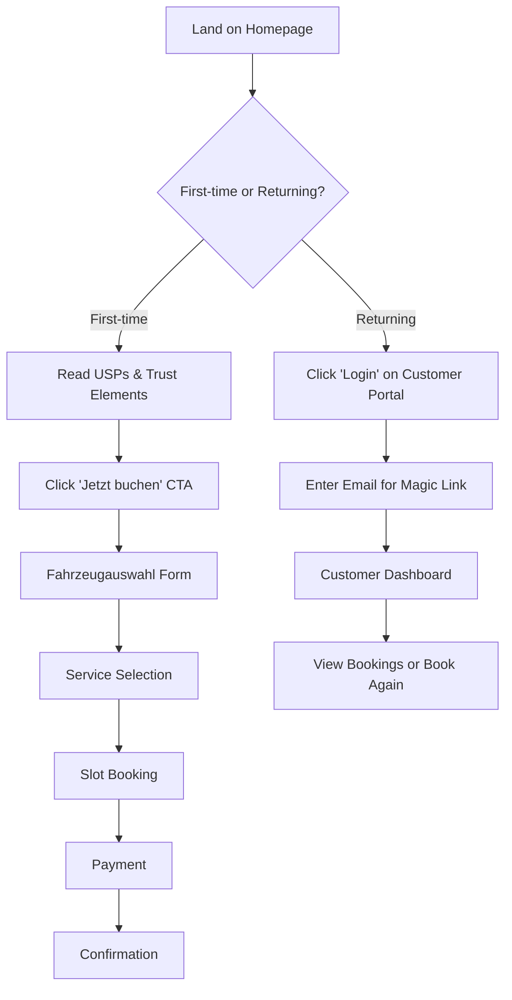
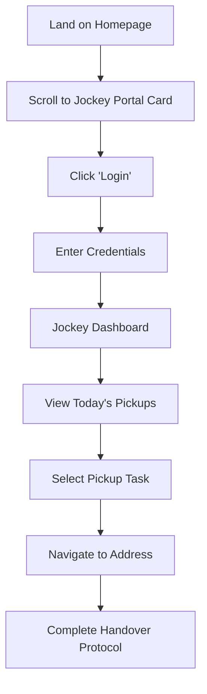

# Landing Page Design - B2C Autowartungs-App

**Version:** 1.0
**Datum:** 2026-02-01
**Status:** Ready for Development

---

## Design-Rationale

### User-Centered Goals

1. **Vertrauen aufbauen**: Automotive ist konservativ - Design muss professionell wirken
2. **Drei Zugänge klar trennen**: Kunde, Jockey, Werkstatt müssen sofort ihren Login finden
3. **Festpreis-USP kommunizieren**: "Garantierter Preis ohne Überraschungen"
4. **Mobile-First**: 70% der Buchungen erwarten wir mobil

### Business Goals

- **Conversion optimieren**: Klare CTAs für Kundenbuchung
- **Demo-Fähigkeit**: Alle drei Portale vom ersten Screen aus zugänglich
- **Trust Building**: Partnerlogos, Testimonials, USP-Kommunikation
- **SEO**: Strukturierte Inhalte für Google-Indexierung

---

## Information Architecture

### Sitemap

```
Landing Page (/)
├── Hero Section
│   ├── Value Proposition
│   ├── Primary CTA (Kunde)
│   └── Secondary CTA (Login)
├── Three Login Portals
│   ├── Kunden-Portal
│   ├── Jockey-Portal
│   └── Werkstatt-Portal
├── USPs Section
│   ├── Festpreis-Garantie
│   ├── Concierge-Service
│   └── Digitale Auftragserweiterung
├── How It Works
│   └── 4-Step Process
├── Trust Section
│   ├── Partner Logos
│   └── Testimonials
├── Services Overview
├── FAQ
└── Footer
    ├── Kontakt
    ├── Rechtliches
    └── Social Media
```

---

## Wireframes

### Desktop Layout (1440px)

```
┌─────────────────────────────────────────────────────────────┐
│  [LOGO]                                   [Kontakt] [FAQ]   │
└─────────────────────────────────────────────────────────────┘

╔═══════════════════════════════════════════════════════════════╗
║                         HERO SECTION                          ║
║                                                               ║
║         Autowartung ohne Überraschungen.                     ║
║         Festpreis. Concierge. Digital.                       ║
║                                                               ║
║    [Jetzt Service buchen →]  [Mehr erfahren]                ║
║                                                               ║
║    ✓ Garantierter Festpreis     ✓ Hol- und Bringservice     ║
║    ✓ Keine versteckten Kosten   ✓ Digitale Auftragserweiterung
╚═══════════════════════════════════════════════════════════════╝

┌─────────────────────────────────────────────────────────────┐
│                  DREI LOGIN-BEREICHE                         │
├─────────────────┬─────────────────┬────────────────────────┤
│                 │                 │                         │
│    [👤 Icon]    │   [🚗 Icon]     │    [🔧 Icon]          │
│                 │                 │                         │
│  Kunden-Portal  │  Jockey-Portal  │  Werkstatt-Portal     │
│                 │                 │                         │
│  Buchen Sie     │  Abholungen &   │  Aufträge &            │
│  Ihre Service-  │  Rückgaben      │  Angebote              │
│  Termine und    │  verwalten      │  verwalten             │
│  verwalten Sie  │                 │                         │
│  Ihre Buchungen │                 │                         │
│                 │                 │                         │
│ [Jetzt buchen →]│  [Login →]      │  [Login →]            │
│ [Login]         │                 │                         │
│                 │                 │                         │
└─────────────────┴─────────────────┴────────────────────────┘

╔═══════════════════════════════════════════════════════════════╗
║                     UNSERE VORTEILE                           ║
╠═══════════════════════════════════════════════════════════════╣
║                                                               ║
║  ┌────────────┐  ┌────────────┐  ┌────────────┐            ║
║  │ [💰 Icon]  │  │ [🚗 Icon]  │  │ [📱 Icon]  │            ║
║  │            │  │            │  │            │            ║
║  │ Festpreis  │  │ Concierge  │  │ Digital    │            ║
║  │ Garantie   │  │ Service    │  │ transparent│            ║
║  │            │  │            │  │            │            ║
║  │ Sie zahlen │  │ Wir holen  │  │ Zusätzliche│            ║
║  │ nur das,   │  │ Ihr Auto   │  │ Arbeiten   │            ║
║  │ was Sie    │  │ ab und     │  │ werden     │            ║
║  │ buchen.    │  │ bringen es │  │ digital    │            ║
║  │ Garantiert.│  │ zurück.    │  │ angeboten. │            ║
║  │            │  │ Mit Ersatz-│  │ Sie        │            ║
║  │            │  │ fahrzeug.  │  │ entscheiden│            ║
║  └────────────┘  └────────────┘  └────────────┘            ║
║                                                               ║
╚═══════════════════════════════════════════════════════════════╝

┌─────────────────────────────────────────────────────────────┐
│                   SO FUNKTIONIERT'S                          │
├─────────────────────────────────────────────────────────────┤
│                                                              │
│  1 ───────→  2 ───────→  3 ───────→  4                     │
│                                                              │
│  Fahrzeug    Service     Termin      Bezahlen &             │
│  auswählen   wählen      buchen      fertig!                │
│                                                              │
│  [Illustration: Marke/Modell → Service-Liste → Kalender → ✓]│
│                                                              │
└─────────────────────────────────────────────────────────────┘

╔═══════════════════════════════════════════════════════════════╗
║              UNSERE PARTNER & KUNDEN                          ║
╠═══════════════════════════════════════════════════════════════╣
║                                                               ║
║  [Logo MHC]  [Logo Shell]  [Logo Partner 3]  [Logo Partner 4]║
║                                                               ║
║  ┌────────────────────────────────────────────────────────┐ ║
║  │ "Endlich eine digitale Lösung für Autowartung.         │ ║
║  │  Transparent, bequem, und der Preis stimmt!"           │ ║
║  │                                    - Max Mustermann     │ ║
║  │                                      ⭐⭐⭐⭐⭐ 5.0/5.0  │ ║
║  └────────────────────────────────────────────────────────┘ ║
║                                                               ║
╚═══════════════════════════════════════════════════════════════╝

┌─────────────────────────────────────────────────────────────┐
│                    UNSERE SERVICES                           │
├───────────────┬───────────────┬───────────────┬────────────┤
│ Inspektion/   │ TÜV / HU      │ Bremsservice  │ Klimaservice│
│ Wartung       │               │               │             │
│               │               │               │             │
│ ab 179 EUR    │ ab 89 EUR     │ ab 149 EUR    │ ab 99 EUR   │
└───────────────┴───────────────┴───────────────┴────────────┘

╔═══════════════════════════════════════════════════════════════╗
║                 HÄUFIG GESTELLTE FRAGEN                       ║
╠═══════════════════════════════════════════════════════════════╣
║  ▼ Wie funktioniert der Festpreis?                           ║
║  ▼ Was ist im Service enthalten?                             ║
║  ▼ Wie läuft der Hol- und Bringservice ab?                  ║
║  ▼ Was passiert bei zusätzlichen Reparaturen?               ║
╚═══════════════════════════════════════════════════════════════╝

┌─────────────────────────────────────────────────────────────┐
│                         FOOTER                               │
├─────────────────────────────────────────────────────────────┤
│ [LOGO]                                                       │
│                                                              │
│ Über uns        Services         Rechtliches                │
│ Kontakt         Preise           Impressum                  │
│ FAQ             Witten           Datenschutz                │
│                                  AGB                         │
│                                                              │
│ [Facebook] [Instagram] [LinkedIn]                           │
│                                                              │
│ © 2026 B2C Autowartungs-App. Alle Rechte vorbehalten.      │
└─────────────────────────────────────────────────────────────┘
```

### Mobile Layout (375px)

```
┌────────────────────────┐
│ [☰]  [LOGO]      [FAQ] │
└────────────────────────┘

╔════════════════════════╗
║    HERO SECTION        ║
║                        ║
║  Autowartung ohne      ║
║  Überraschungen.       ║
║                        ║
║  Festpreis.            ║
║  Concierge.            ║
║  Digital.              ║
║                        ║
║  [Jetzt buchen →]      ║
║  [Mehr erfahren]       ║
║                        ║
║  ✓ Festpreis-Garantie  ║
║  ✓ Hol- & Bringservice ║
║  ✓ Digital transparent ║
╚════════════════════════╝

┌────────────────────────┐
│   KUNDEN-PORTAL        │
├────────────────────────┤
│    [👤 Icon]           │
│                        │
│  Buchen Sie Ihre       │
│  Service-Termine       │
│                        │
│  [Jetzt buchen →]      │
│  [Login]               │
└────────────────────────┘

┌────────────────────────┐
│   JOCKEY-PORTAL        │
├────────────────────────┤
│    [🚗 Icon]           │
│                        │
│  Abholungen &          │
│  Rückgaben verwalten   │
│                        │
│  [Login →]             │
└────────────────────────┘

┌────────────────────────┐
│  WERKSTATT-PORTAL      │
├────────────────────────┤
│    [🔧 Icon]           │
│                        │
│  Aufträge & Angebote   │
│  verwalten             │
│                        │
│  [Login →]             │
└────────────────────────┘

╔════════════════════════╗
║   UNSERE VORTEILE      ║
╠════════════════════════╣
║  ┌──────────────────┐ ║
║  │ [💰] Festpreis   │ ║
║  │ Garantie         │ ║
║  │                  │ ║
║  │ Sie zahlen nur   │ ║
║  │ das, was Sie     │ ║
║  │ buchen.          │ ║
║  └──────────────────┘ ║
║                        ║
║  ┌──────────────────┐ ║
║  │ [🚗] Concierge   │ ║
║  │ Service          │ ║
║  │                  │ ║
║  │ Wir holen Ihr    │ ║
║  │ Auto ab und      │ ║
║  │ bringen es zurück│ ║
║  └──────────────────┘ ║
║                        ║
║  ┌──────────────────┐ ║
║  │ [📱] Digital     │ ║
║  │ transparent      │ ║
║  │                  │ ║
║  │ Zusätzliche      │ ║
║  │ Arbeiten digital │ ║
║  │ freigeben.       │ ║
║  └──────────────────┘ ║
╚════════════════════════╝

[... Rest der Sections ...]

└────────────────────────┘
```

---

## Component Specifications

### Hero Section

```tsx
<section className="
  relative
  bg-gradient-to-br from-primary-600 via-primary-700 to-primary-900
  py-20 px-4
  md:py-32 md:px-8
  lg:py-40
">
  {/* Background Pattern */}
  <div className="absolute inset-0 opacity-10">
    {/* Subtle car pattern or grid */}
  </div>

  <div className="max-w-7xl mx-auto relative z-10">
    <div className="text-center text-white">
      {/* Pre-Headline */}
      <p className="
        text-base md:text-lg
        font-medium
        text-primary-100
        mb-4
        tracking-wide
        uppercase
      ">
        Deutschlands transparenteste Autowartung
      </p>

      {/* Headline */}
      <h1 className="
        text-4xl md:text-5xl lg:text-6xl
        font-bold
        leading-tight
        mb-6
      ">
        Autowartung ohne Überraschungen.
        <br />
        <span className="text-accent-300">
          Festpreis. Concierge. Digital.
        </span>
      </h1>

      {/* Subheadline */}
      <p className="
        text-lg md:text-xl
        text-primary-100
        max-w-3xl mx-auto
        mb-10
      ">
        Buchen Sie Ihre nächste Inspektion online zu garantierten Festpreisen.
        Wir holen Ihr Auto ab und bringen es zurück - mit Ersatzfahrzeug.
      </p>

      {/* CTAs */}
      <div className="
        flex flex-col sm:flex-row
        gap-4
        justify-center
        mb-12
      ">
        <button className="
          px-8 py-4
          text-lg font-semibold
          text-primary-900
          bg-white
          rounded-lg
          shadow-lg
          hover:bg-primary-50
          transform hover:scale-105
          transition-all duration-200
        ">
          Jetzt Service buchen →
        </button>

        <button className="
          px-8 py-4
          text-lg font-semibold
          text-white
          bg-primary-700/50
          border-2 border-white
          rounded-lg
          hover:bg-primary-600/50
          transition-colors duration-200
        ">
          Mehr erfahren
        </button>
      </div>

      {/* Trust Indicators */}
      <div className="
        flex flex-wrap
        justify-center
        gap-6 md:gap-12
        text-sm md:text-base
        text-primary-100
      ">
        <div className="flex items-center gap-2">
          <CheckIcon className="w-5 h-5 text-success-300" />
          <span>Garantierter Festpreis</span>
        </div>
        <div className="flex items-center gap-2">
          <CheckIcon className="w-5 h-5 text-success-300" />
          <span>Hol- und Bringservice</span>
        </div>
        <div className="flex items-center gap-2">
          <CheckIcon className="w-5 h-5 text-success-300" />
          <span>Keine versteckten Kosten</span>
        </div>
        <div className="flex items-center gap-2">
          <CheckIcon className="w-5 h-5 text-success-300" />
          <span>Digitale Freigabe</span>
        </div>
      </div>
    </div>
  </div>
</section>
```

**Design Decisions:**

- **Gradient Background**: Vertrauenswürdig, modern, nicht zu verspielt
- **White CTA**: Maximaler Kontrast für Conversion
- **Trust Indicators**: Sofort sichtbar, reduziert Skepsis
- **Responsive Typography**: Lesbar auf allen Geräten

---

### Three Login Portals Section

```tsx
<section className="
  py-16 px-4
  md:py-24 md:px-8
  bg-neutral-50
">
  <div className="max-w-7xl mx-auto">
    {/* Section Header */}
    <div className="text-center mb-12">
      <h2 className="
        text-3xl md:text-4xl
        font-bold
        text-neutral-900
        mb-4
      ">
        Wählen Sie Ihren Zugang
      </h2>
      <p className="
        text-lg
        text-neutral-600
        max-w-2xl mx-auto
      ">
        Ob Kunde, Fahrer oder Werkstatt - jeder hat seinen eigenen Bereich.
      </p>
    </div>

    {/* Three Cards */}
    <div className="
      grid
      grid-cols-1 gap-6
      md:grid-cols-3 md:gap-8
    ">
      {/* Kunden-Portal Card */}
      <div className="
        bg-white
        border-2 border-primary-200
        rounded-2xl
        p-8
        text-center
        shadow-sm
        hover:shadow-xl
        hover:border-primary-400
        transition-all duration-300
        transform hover:-translate-y-1
      ">
        {/* Icon */}
        <div className="
          w-20 h-20
          mx-auto mb-6
          bg-primary-100
          rounded-full
          flex items-center justify-center
        ">
          <UserIcon className="w-10 h-10 text-primary-600" />
        </div>

        {/* Title */}
        <h3 className="
          text-2xl font-bold
          text-neutral-900
          mb-3
        ">
          Kunden-Portal
        </h3>

        {/* Description */}
        <p className="
          text-base
          text-neutral-600
          mb-6
        ">
          Buchen Sie Ihre Service-Termine und verwalten Sie Ihre Buchungen.
        </p>

        {/* Features List */}
        <ul className="
          text-sm text-left
          text-neutral-700
          space-y-2
          mb-8
        ">
          <li className="flex items-start gap-2">
            <CheckIcon className="w-5 h-5 text-success-500 flex-shrink-0 mt-0.5" />
            <span>Online buchen & bezahlen</span>
          </li>
          <li className="flex items-start gap-2">
            <CheckIcon className="w-5 h-5 text-success-500 flex-shrink-0 mt-0.5" />
            <span>Buchungen verwalten</span>
          </li>
          <li className="flex items-start gap-2">
            <CheckIcon className="w-5 h-5 text-success-500 flex-shrink-0 mt-0.5" />
            <span>Angebote freigeben</span>
          </li>
        </ul>

        {/* Primary CTA */}
        <button className="
          w-full
          px-6 py-3
          text-base font-semibold
          text-white
          bg-primary-600
          rounded-lg
          hover:bg-primary-700
          transition-colors duration-200
          mb-3
        ">
          Jetzt buchen →
        </button>

        {/* Secondary Link */}
        <a href="#" className="
          text-sm
          text-primary-600
          hover:underline
        ">
          Bereits Kunde? Login
        </a>
      </div>

      {/* Jockey-Portal Card */}
      <div className="
        bg-white
        border-2 border-neutral-200
        rounded-2xl
        p-8
        text-center
        shadow-sm
        hover:shadow-xl
        hover:border-neutral-400
        transition-all duration-300
        transform hover:-translate-y-1
      ">
        {/* Icon */}
        <div className="
          w-20 h-20
          mx-auto mb-6
          bg-neutral-100
          rounded-full
          flex items-center justify-center
        ">
          <TruckIcon className="w-10 h-10 text-neutral-600" />
        </div>

        {/* Title */}
        <h3 className="
          text-2xl font-bold
          text-neutral-900
          mb-3
        ">
          Jockey-Portal
        </h3>

        {/* Description */}
        <p className="
          text-base
          text-neutral-600
          mb-6
        ">
          Verwalten Sie Ihre Abholungen und Rückgaben effizient.
        </p>

        {/* Features List */}
        <ul className="
          text-sm text-left
          text-neutral-700
          space-y-2
          mb-8
        ">
          <li className="flex items-start gap-2">
            <CheckIcon className="w-5 h-5 text-neutral-500 flex-shrink-0 mt-0.5" />
            <span>Heutige Touren anzeigen</span>
          </li>
          <li className="flex items-start gap-2">
            <CheckIcon className="w-5 h-5 text-neutral-500 flex-shrink-0 mt-0.5" />
            <span>Übergabeprotokoll digital</span>
          </li>
          <li className="flex items-start gap-2">
            <CheckIcon className="w-5 h-5 text-neutral-500 flex-shrink-0 mt-0.5" />
            <span>Fotos hochladen</span>
          </li>
        </ul>

        {/* Login Button */}
        <button className="
          w-full
          px-6 py-3
          text-base font-semibold
          text-neutral-700
          bg-neutral-100
          border border-neutral-300
          rounded-lg
          hover:bg-neutral-200
          transition-colors duration-200
        ">
          Login →
        </button>
      </div>

      {/* Werkstatt-Portal Card */}
      <div className="
        bg-white
        border-2 border-neutral-200
        rounded-2xl
        p-8
        text-center
        shadow-sm
        hover:shadow-xl
        hover:border-neutral-400
        transition-all duration-300
        transform hover:-translate-y-1
      ">
        {/* Icon */}
        <div className="
          w-20 h-20
          mx-auto mb-6
          bg-neutral-100
          rounded-full
          flex items-center justify-center
        ">
          <WrenchIcon className="w-10 h-10 text-neutral-600" />
        </div>

        {/* Title */}
        <h3 className="
          text-2xl font-bold
          text-neutral-900
          mb-3
        ">
          Werkstatt-Portal
        </h3>

        {/* Description */}
        <p className="
          text-base
          text-neutral-600
          mb-6
        ">
          Verwalten Sie Aufträge und erstellen Sie digitale Angebote.
        </p>

        {/* Features List */}
        <ul className="
          text-sm text-left
          text-neutral-700
          space-y-2
          mb-8
        ">
          <li className="flex items-start gap-2">
            <CheckIcon className="w-5 h-5 text-neutral-500 flex-shrink-0 mt-0.5" />
            <span>Aufträge einsehen</span>
          </li>
          <li className="flex items-start gap-2">
            <CheckIcon className="w-5 h-5 text-neutral-500 flex-shrink-0 mt-0.5" />
            <span>Angebote erstellen</span>
          </li>
          <li className="flex items-start gap-2">
            <CheckIcon className="w-5 h-5 text-neutral-500 flex-shrink-0 mt-0.5" />
            <span>Status-Updates senden</span>
          </li>
        </ul>

        {/* Login Button */}
        <button className="
          w-full
          px-6 py-3
          text-base font-semibold
          text-neutral-700
          bg-neutral-100
          border border-neutral-300
          rounded-lg
          hover:bg-neutral-200
          transition-colors duration-200
        ">
          Login →
        </button>
      </div>
    </div>
  </div>
</section>
```

**Design Decisions:**

- **Visual Hierarchy**: Kunden-Portal hervorgehoben (Primary CTA, colored border)
- **Consistent Layout**: Alle drei Cards gleiche Struktur für Klarheit
- **Hover States**: Lift-Effekt für Interaktivität
- **Icons**: Heroicons für professionelles Look & Feel
- **Spacing**: Großzügig für Touch-Friendly mobile Nutzung

---

### USPs Section

```tsx
<section className="
  py-16 px-4
  md:py-24 md:px-8
  bg-white
">
  <div className="max-w-7xl mx-auto">
    {/* Section Header */}
    <div className="text-center mb-16">
      <h2 className="
        text-3xl md:text-4xl
        font-bold
        text-neutral-900
        mb-4
      ">
        Warum wir anders sind
      </h2>
      <p className="
        text-lg
        text-neutral-600
        max-w-2xl mx-auto
      ">
        Drei Versprechen, die wir garantieren.
      </p>
    </div>

    {/* Three USP Cards */}
    <div className="
      grid
      grid-cols-1 gap-8
      md:grid-cols-3 md:gap-12
    ">
      {/* USP 1: Festpreis */}
      <div className="text-center">
        {/* Icon */}
        <div className="
          w-24 h-24
          mx-auto mb-6
          bg-gradient-to-br from-success-400 to-success-600
          rounded-2xl
          flex items-center justify-center
          shadow-lg
          transform hover:scale-110
          transition-transform duration-300
        ">
          <svg className="w-12 h-12 text-white" fill="none" viewBox="0 0 24 24" stroke="currentColor">
            <path strokeLinecap="round" strokeLinejoin="round" strokeWidth={2}
              d="M12 8c-1.657 0-3 .895-3 2s1.343 2 3 2 3 .895 3 2-1.343 2-3 2m0-8c1.11 0 2.08.402 2.599 1M12 8V7m0 1v8m0 0v1m0-1c-1.11 0-2.08-.402-2.599-1M21 12a9 9 0 11-18 0 9 9 0 0118 0z"
            />
          </svg>
        </div>

        <h3 className="
          text-2xl font-bold
          text-neutral-900
          mb-3
        ">
          Festpreis-Garantie
        </h3>

        <p className="
          text-base
          text-neutral-600
          mb-6
        ">
          Sie zahlen exakt das, was Sie buchen. Keine Überraschungen,
          keine versteckten Kosten. Wie bei Amazon - nur für Ihr Auto.
        </p>

        <div className="
          bg-success-50
          border border-success-200
          rounded-lg
          p-4
          text-left
        ">
          <p className="text-sm text-success-800 font-medium mb-2">
            So funktioniert's:
          </p>
          <ul className="text-sm text-success-700 space-y-1">
            <li>✓ Preis online sehen</li>
            <li>✓ Buchen & bezahlen</li>
            <li>✓ Garantiert - ohne Nachzahlung</li>
          </ul>
        </div>
      </div>

      {/* USP 2: Concierge */}
      <div className="text-center">
        {/* Icon */}
        <div className="
          w-24 h-24
          mx-auto mb-6
          bg-gradient-to-br from-primary-400 to-primary-600
          rounded-2xl
          flex items-center justify-center
          shadow-lg
          transform hover:scale-110
          transition-transform duration-300
        ">
          <TruckIcon className="w-12 h-12 text-white" />
        </div>

        <h3 className="
          text-2xl font-bold
          text-neutral-900
          mb-3
        ">
          Concierge-Service
        </h3>

        <p className="
          text-base
          text-neutral-600
          mb-6
        ">
          Wir holen Ihr Auto ab und bringen es zurück. Sie erhalten ein
          Ersatzfahrzeug und bleiben mobil - ohne Stress.
        </p>

        <div className="
          bg-primary-50
          border border-primary-200
          rounded-lg
          p-4
          text-left
        ">
          <p className="text-sm text-primary-800 font-medium mb-2">
            Inklusive:
          </p>
          <ul className="text-sm text-primary-700 space-y-1">
            <li>✓ Abholung & Rückgabe</li>
            <li>✓ Ersatzfahrzeug gestellt</li>
            <li>✓ Kostenlose Autowäsche</li>
          </ul>
        </div>
      </div>

      {/* USP 3: Digital */}
      <div className="text-center">
        {/* Icon */}
        <div className="
          w-24 h-24
          mx-auto mb-6
          bg-gradient-to-br from-accent-400 to-accent-600
          rounded-2xl
          flex items-center justify-center
          shadow-lg
          transform hover:scale-110
          transition-transform duration-300
        ">
          <svg className="w-12 h-12 text-white" fill="none" viewBox="0 0 24 24" stroke="currentColor">
            <path strokeLinecap="round" strokeLinejoin="round" strokeWidth={2}
              d="M12 18h.01M8 21h8a2 2 0 002-2V5a2 2 0 00-2-2H8a2 2 0 00-2 2v14a2 2 0 002 2z"
            />
          </svg>
        </div>

        <h3 className="
          text-2xl font-bold
          text-neutral-900
          mb-3
        ">
          Digital transparent
        </h3>

        <p className="
          text-base
          text-neutral-600
          mb-6
        ">
          Zusätzliche Arbeiten? Sie erhalten ein digitales Angebot mit
          Fotos und entscheiden per Klick. Voll transparent.
        </p>

        <div className="
          bg-accent-50
          border border-accent-200
          rounded-lg
          p-4
          text-left
        ">
          <p className="text-sm text-accent-800 font-medium mb-2">
            Ihre Kontrolle:
          </p>
          <ul className="text-sm text-accent-700 space-y-1">
            <li>✓ Angebot mit Fotos</li>
            <li>✓ Festpreis pro Arbeit</li>
            <li>✓ Freigabe per Klick</li>
          </ul>
        </div>
      </div>
    </div>
  </div>
</section>
```

**Design Decisions:**

- **Gradient Icons**: Eye-catching, moderne Ästhetik
- **Color-Coding**: Unterschiedliche Farben für Differenzierung
- **Info Boxes**: Konkrete Details statt nur Marketing-Floskeln
- **Hover Animation**: Scale-Effekt auf Icons für Interaktivität

---

### How It Works Section

```tsx
<section className="
  py-16 px-4
  md:py-24 md:px-8
  bg-neutral-50
">
  <div className="max-w-7xl mx-auto">
    {/* Section Header */}
    <div className="text-center mb-16">
      <h2 className="
        text-3xl md:text-4xl
        font-bold
        text-neutral-900
        mb-4
      ">
        So einfach geht's
      </h2>
      <p className="
        text-lg
        text-neutral-600
      ">
        In vier Schritten zur stressfreien Autowartung
      </p>
    </div>

    {/* Timeline - Desktop */}
    <div className="hidden md:block">
      <div className="relative">
        {/* Timeline Line */}
        <div className="
          absolute top-20 left-0 right-0
          h-1
          bg-gradient-to-r from-primary-200 via-primary-400 to-primary-600
        "></div>

        {/* Steps */}
        <div className="
          grid grid-cols-4 gap-8
          relative z-10
        ">
          {/* Step 1 */}
          <div className="text-center">
            <div className="
              w-16 h-16
              mx-auto mb-4
              bg-primary-600
              rounded-full
              flex items-center justify-center
              text-white text-2xl font-bold
              shadow-lg
            ">
              1
            </div>
            <h4 className="text-lg font-semibold text-neutral-900 mb-2">
              Fahrzeug auswählen
            </h4>
            <p className="text-sm text-neutral-600">
              Marke, Modell, Baujahr und Kilometerstand eingeben
            </p>
          </div>

          {/* Step 2 */}
          <div className="text-center">
            <div className="
              w-16 h-16
              mx-auto mb-4
              bg-primary-600
              rounded-full
              flex items-center justify-center
              text-white text-2xl font-bold
              shadow-lg
            ">
              2
            </div>
            <h4 className="text-lg font-semibold text-neutral-900 mb-2">
              Service wählen
            </h4>
            <p className="text-sm text-neutral-600">
              Inspektion, TÜV, Bremsen oder andere Services
            </p>
          </div>

          {/* Step 3 */}
          <div className="text-center">
            <div className="
              w-16 h-16
              mx-auto mb-4
              bg-primary-600
              rounded-full
              flex items-center justify-center
              text-white text-2xl font-bold
              shadow-lg
            ">
              3
            </div>
            <h4 className="text-lg font-semibold text-neutral-900 mb-2">
              Termin buchen
            </h4>
            <p className="text-sm text-neutral-600">
              Hol- und Rückgabezeitpunkt wählen
            </p>
          </div>

          {/* Step 4 */}
          <div className="text-center">
            <div className="
              w-16 h-16
              mx-auto mb-4
              bg-success-600
              rounded-full
              flex items-center justify-center
              text-white text-2xl font-bold
              shadow-lg
            ">
              ✓
            </div>
            <h4 className="text-lg font-semibold text-neutral-900 mb-2">
              Bezahlen & fertig
            </h4>
            <p className="text-sm text-neutral-600">
              Online bezahlen und auf die Abholung warten
            </p>
          </div>
        </div>
      </div>
    </div>

    {/* Mobile: Vertical Steps */}
    <div className="md:hidden space-y-8">
      {[1, 2, 3, 4].map((step) => (
        <div key={step} className="flex gap-4">
          <div className="flex-shrink-0">
            <div className="
              w-12 h-12
              bg-primary-600
              rounded-full
              flex items-center justify-center
              text-white text-lg font-bold
            ">
              {step === 4 ? '✓' : step}
            </div>
          </div>
          <div>
            <h4 className="text-base font-semibold text-neutral-900 mb-1">
              {/* Step titles */}
            </h4>
            <p className="text-sm text-neutral-600">
              {/* Step descriptions */}
            </p>
          </div>
        </div>
      ))}
    </div>

    {/* CTA */}
    <div className="text-center mt-12">
      <button className="
        px-8 py-4
        text-lg font-semibold
        text-white
        bg-primary-600
        rounded-lg
        shadow-lg
        hover:bg-primary-700
        transform hover:scale-105
        transition-all duration-200
      ">
        Jetzt loslegen →
      </button>
    </div>
  </div>
</section>
```

---

## Responsive Behavior

### Breakpoint Strategy

```css
/* Mobile First: 320px - 767px */
- Single column layout
- Full-width buttons
- Stacked login portals
- Vertical timeline

/* Tablet: 768px - 1023px */
- Two-column grid for USPs
- Three-column for login portals
- Maintain mobile spacing

/* Desktop: 1024px+ */
- Three-column grid everywhere
- Horizontal timeline
- Max-width container: 1280px
- Side padding: 80px
```

### Touch Target Optimization

```css
/* Minimum Touch Targets (WCAG 2.1) */
- Buttons: min 48px height
- Links: min 44px height
- Icons: min 44x44px clickable area
- Form inputs: min 48px height
```

### Performance Considerations

- **Image Optimization**: Use Next.js Image component with lazy loading
- **Above-the-Fold**: Hero + Three Portals inline CSS
- **Below-the-Fold**: Lazy load USPs, Testimonials, FAQ
- **Font Loading**: font-display: swap for Inter

---

## Accessibility (WCAG 2.1 AA)

### Keyboard Navigation

```tsx
/* Tab Order */
1. Skip to Main Content link
2. Logo (home link)
3. Navigation links
4. Hero CTA buttons
5. Login portal cards (tab through)
6. All interactive elements in order
```

### Screen Reader Support

```tsx
<section aria-labelledby="usps-heading">
  <h2 id="usps-heading" className="...">
    Warum wir anders sind
  </h2>
  {/* Content */}
</section>

<button aria-label="Kunde registrieren und Service buchen">
  Jetzt buchen →
</button>
```

### Color Contrast

- Text on white: neutral-700 (7.48:1) ✓
- Buttons: white on primary-600 (4.77:1) ✓
- Links: primary-600 on white (4.77:1) ✓
- Success badges: success-700 on success-100 (4.5:1) ✓

---

## User Flows

### Customer Journey: Landing → Booking



### Jockey Journey: Landing → Portal



---

## SEO Optimization

### Meta Tags

```html
<head>
  <title>Autowartung mit Festpreis & Concierge-Service | B2C Auto</title>
  <meta name="description" content="Buchen Sie Ihre nächste Inspektion online zu garantierten Festpreisen. Hol- und Bringservice inklusive. Keine versteckten Kosten." />
  <meta name="keywords" content="Autowartung, Inspektion, Festpreis, Concierge, Witten, TÜV, Ölwechsel" />

  <!-- Open Graph -->
  <meta property="og:title" content="Autowartung ohne Überraschungen" />
  <meta property="og:description" content="Festpreis. Concierge. Digital." />
  <meta property="og:image" content="/og-image.jpg" />

  <!-- Structured Data -->
  <script type="application/ld+json">
  {
    "@context": "https://schema.org",
    "@type": "AutoRepair",
    "name": "B2C Autowartungs-App",
    "description": "Digitale Autowartung mit Festpreis-Garantie",
    "areaServed": "Witten, Deutschland",
    "priceRange": "€€"
  }
  </script>
</head>
```

---

## Next Steps

1. **Prototype in Figma**: Clickable prototype für Stakeholder-Demo
2. **A/B Testing**: Hero CTA ("Jetzt buchen" vs. "Service berechnen")
3. **Content Writing**: Finaler Copy für USPs und FAQ
4. **Photography**: Hochwertige Bilder für Trust-Building
5. **Development**: Next.js Implementation mit Design System

---

**Version History:**

- 1.0 (2026-02-01): Initial Landing Page Design
