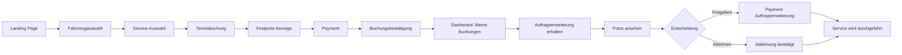
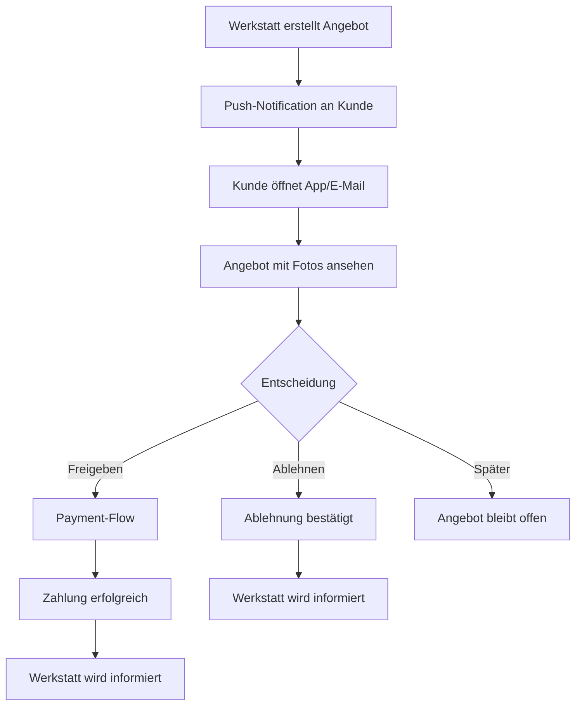

# Customer Portal Wireframes - B2C Autowartungs-App

**Version:** 1.0
**Datum:** 2026-02-01
**Status:** Ready for Development

---

## User Journey Overview



---

## 1. Fahrzeugauswahl-Formular

### Design Rationale

**User Need**: Kunde ohne technisches Autowissen muss einfach sein Fahrzeug eingeben können
**Business Goal**: Alle Pflichtfelder (Marke, Modell, Baujahr, Kilometerstand) erfassen für präzise Preiskalkulation

### Wireframe - Desktop (1024px+)

```
┌──────────────────────────────────────────────────────────────┐
│  [< Zurück]                               [Hilfe ?]           │
└──────────────────────────────────────────────────────────────┘

╔══════════════════════════════════════════════════════════════╗
║                   SCHRITT 1 VON 4                            ║
║                Ihr Fahrzeug auswählen                        ║
╚══════════════════════════════════════════════════════════════╝

┌──────────────────────────────────────────────────────────────┐
│  Progress Bar:  [████████░░░░░░░░░░░░░░░░]  25%              │
└──────────────────────────────────────────────────────────────┘

┌──────────────────────────────────────────────────────────────┐
│                                                               │
│  Fahrzeugmarke *                                             │
│  ┌────────────────────────────────────────────────────────┐ │
│  │ 🔍 Marke suchen... (z.B. Volkswagen, BMW, Mercedes)  ▼│ │
│  └────────────────────────────────────────────────────────┘ │
│                                                               │
│  Fahrzeugmodell *                                            │
│  ┌────────────────────────────────────────────────────────┐ │
│  │ Modell auswählen...                                   ▼│ │
│  └────────────────────────────────────────────────────────┘ │
│  └─ Hinweis: Bitte zuerst Marke auswählen                   │
│                                                               │
│  Baujahr *                                                   │
│  ┌────────────────────────────────────────────────────────┐ │
│  │ Jahr auswählen...                                     ▼│ │
│  └────────────────────────────────────────────────────────┘ │
│  └─ z.B. 2015, 2018, 2021                                   │
│                                                               │
│  Kilometerstand *                                            │
│  ┌────────────────────────────────────────────────────────┐ │
│  │ 75000                                         km        │ │
│  └────────────────────────────────────────────────────────┘ │
│  └─ Ihr aktueller Kilometerstand (für Wartungsempfehlung)  │
│                                                               │
│  ┌────────────────────────────────────────────────────────┐ │
│  │ ℹ️ Warum fragen wir das?                               │ │
│  │                                                         │ │
│  │ Diese Daten helfen uns, den richtigen Service und      │ │
│  │ einen fairen Festpreis für Ihr Fahrzeug zu berechnen.  │ │
│  └────────────────────────────────────────────────────────┘ │
│                                                               │
│           [Weiter zur Service-Auswahl →]                     │
│                                                               │
└──────────────────────────────────────────────────────────────┘
```

### Wireframe - Mobile (375px)

```
┌─────────────────────────┐
│ [<]  Fahrzeug auswählen │
└─────────────────────────┘

╔═════════════════════════╗
║   SCHRITT 1 VON 4       ║
║   Ihr Fahrzeug          ║
╚═════════════════════════╝

┌─────────────────────────┐
│ [████░░░░░░░░] 25%      │
└─────────────────────────┘

┌─────────────────────────┐
│                         │
│ Marke *                 │
│ ┌─────────────────────┐ │
│ │ 🔍 Suchen...      ▼ │ │
│ └─────────────────────┘ │
│                         │
│ Modell *                │
│ ┌─────────────────────┐ │
│ │ Auswählen...      ▼ │ │
│ └─────────────────────┘ │
│                         │
│ Baujahr *               │
│ ┌─────────────────────┐ │
│ │ Jahr wählen...    ▼ │ │
│ └─────────────────────┘ │
│                         │
│ Kilometerstand *        │
│ ┌─────────────────────┐ │
│ │ 75000         km    │ │
│ └─────────────────────┘ │
│                         │
│ ┌─────────────────────┐ │
│ │ ℹ️ Diese Daten für  │ │
│ │ präzise Preis-      │ │
│ │ berechnung          │ │
│ └─────────────────────┘ │
│                         │
│ [Weiter →]              │
│                         │
└─────────────────────────┘
```

### Component Specification

```tsx
'use client'

import { useState } from 'react'
import { ChevronDownIcon, MagnifyingGlassIcon } from '@heroicons/react/24/outline'

export default function VehicleSelectionForm() {
  const [formData, setFormData] = useState({
    brand: '',
    model: '',
    year: '',
    mileage: ''
  })

  const [errors, setErrors] = useState({})

  return (
    <div className="max-w-2xl mx-auto px-4 py-8">
      {/* Progress Bar */}
      <div className="mb-8">
        <div className="flex items-center justify-between mb-2">
          <span className="text-sm font-medium text-neutral-700">
            Schritt 1 von 4
          </span>
          <span className="text-sm text-neutral-500">25%</span>
        </div>
        <div className="w-full bg-neutral-200 rounded-full h-2">
          <div
            className="bg-primary-600 h-2 rounded-full transition-all duration-300"
            style={{ width: '25%' }}
          />
        </div>
      </div>

      {/* Form Header */}
      <div className="text-center mb-8">
        <h1 className="text-3xl md:text-4xl font-bold text-neutral-900 mb-2">
          Ihr Fahrzeug auswählen
        </h1>
        <p className="text-base text-neutral-600">
          Für einen präzisen Festpreis benötigen wir einige Details
        </p>
      </div>

      {/* Form */}
      <form className="space-y-6">
        {/* Marke */}
        <div>
          <label
            htmlFor="brand"
            className="block text-sm font-medium text-neutral-700 mb-2"
          >
            Fahrzeugmarke *
          </label>
          <div className="relative">
            <MagnifyingGlassIcon className="
              absolute left-4 top-1/2 -translate-y-1/2
              w-5 h-5 text-neutral-400
            "/>
            <select
              id="brand"
              required
              className="
                w-full
                pl-12 pr-12 py-3
                text-base text-neutral-900
                bg-white
                border-2 border-neutral-300
                rounded-lg
                appearance-none
                focus:outline-none focus:ring-2 focus:ring-primary-500 focus:border-transparent
                transition-colors duration-200
              "
            >
              <option value="">Marke suchen... (z.B. Volkswagen, BMW)</option>
              <option value="vw">Volkswagen</option>
              <option value="bmw">BMW</option>
              <option value="mercedes">Mercedes-Benz</option>
              <option value="audi">Audi</option>
              {/* ... more options */}
            </select>
            <ChevronDownIcon className="
              absolute right-4 top-1/2 -translate-y-1/2
              w-5 h-5 text-neutral-400
              pointer-events-none
            "/>
          </div>
        </div>

        {/* Modell */}
        <div>
          <label
            htmlFor="model"
            className="block text-sm font-medium text-neutral-700 mb-2"
          >
            Fahrzeugmodell *
          </label>
          <select
            id="model"
            required
            disabled={!formData.brand}
            className="
              w-full
              px-4 py-3
              text-base text-neutral-900
              bg-white
              border-2 border-neutral-300
              rounded-lg
              disabled:bg-neutral-100 disabled:cursor-not-allowed
              focus:outline-none focus:ring-2 focus:ring-primary-500 focus:border-transparent
            "
          >
            <option value="">Modell auswählen...</option>
            {/* Dynamic based on brand */}
          </select>
          {!formData.brand && (
            <p className="text-sm text-neutral-500 mt-1">
              Bitte zuerst Marke auswählen
            </p>
          )}
        </div>

        {/* Baujahr */}
        <div>
          <label
            htmlFor="year"
            className="block text-sm font-medium text-neutral-700 mb-2"
          >
            Baujahr *
          </label>
          <select
            id="year"
            required
            className="
              w-full
              px-4 py-3
              text-base text-neutral-900
              bg-white
              border-2 border-neutral-300
              rounded-lg
              focus:outline-none focus:ring-2 focus:ring-primary-500 focus:border-transparent
            "
          >
            <option value="">Jahr auswählen...</option>
            {Array.from({ length: 30 }, (_, i) => 2026 - i).map(year => (
              <option key={year} value={year}>{year}</option>
            ))}
          </select>
          <p className="text-sm text-neutral-500 mt-1">
            z.B. 2015, 2018, 2021
          </p>
        </div>

        {/* Kilometerstand */}
        <div>
          <label
            htmlFor="mileage"
            className="block text-sm font-medium text-neutral-700 mb-2"
          >
            Kilometerstand *
          </label>
          <div className="relative">
            <input
              type="number"
              id="mileage"
              required
              min="0"
              max="500000"
              placeholder="75000"
              className="
                w-full
                px-4 py-3 pr-16
                text-base text-neutral-900
                bg-white
                border-2 border-neutral-300
                rounded-lg
                focus:outline-none focus:ring-2 focus:ring-primary-500 focus:border-transparent
              "
            />
            <span className="
              absolute right-4 top-1/2 -translate-y-1/2
              text-sm text-neutral-500
            ">
              km
            </span>
          </div>
          <p className="text-sm text-neutral-500 mt-1">
            Ihr aktueller Kilometerstand (für Wartungsempfehlung)
          </p>
        </div>

        {/* Info Box */}
        <div className="
          bg-info-50
          border border-info-200
          rounded-lg
          p-4
          flex gap-3
        ">
          <svg className="w-5 h-5 text-info-600 flex-shrink-0 mt-0.5" fill="currentColor" viewBox="0 0 20 20">
            <path fillRule="evenodd" d="M18 10a8 8 0 11-16 0 8 8 0 0116 0zm-7-4a1 1 0 11-2 0 1 1 0 012 0zM9 9a1 1 0 000 2v3a1 1 0 001 1h1a1 1 0 100-2v-3a1 1 0 00-1-1H9z" clipRule="evenodd" />
          </svg>
          <div>
            <p className="text-sm font-medium text-info-800 mb-1">
              Warum fragen wir das?
            </p>
            <p className="text-sm text-info-700">
              Diese Daten helfen uns, den richtigen Service und einen fairen
              Festpreis für Ihr Fahrzeug zu berechnen. Ihre Daten werden gemäß
              DSGVO geschützt.
            </p>
          </div>
        </div>

        {/* Submit Button */}
        <button
          type="submit"
          className="
            w-full
            px-6 py-4
            text-base font-semibold
            text-white
            bg-primary-600
            rounded-lg
            shadow-sm
            hover:bg-primary-700
            focus:outline-none focus:ring-2 focus:ring-offset-2 focus:ring-primary-500
            disabled:opacity-50 disabled:cursor-not-allowed
            transition-colors duration-200
          "
        >
          Weiter zur Service-Auswahl →
        </button>
      </form>
    </div>
  )
}
```

### Interaction States

**Default State:**
- All fields empty
- Model dropdown disabled until brand selected
- Submit button enabled (will validate on submit)

**Validation State:**
- Empty required field → Red border + error message below
- Invalid mileage (>500,000 km) → Warning message
- All valid → Green checkmarks next to labels

**Loading State (on submit):**
- Submit button shows spinner: "Preis wird berechnet..."
- Form fields disabled

---

## 2. Service-Auswahl

### Design Rationale

**User Need**: Kunde ohne Autowissen muss verstehen, welchen Service er braucht
**Business Goal**: Inspektion/Wartung als Hauptprodukt pushen, andere Services als Add-Ons

### Wireframe - Desktop

```
┌──────────────────────────────────────────────────────────────┐
│  [< Zurück]                  SCHRITT 2 VON 4                  │
└──────────────────────────────────────────────────────────────┘

╔══════════════════════════════════════════════════════════════╗
║                   Service auswählen                          ║
║           Welchen Service benötigen Sie?                     ║
╚══════════════════════════════════════════════════════════════╝

┌──────────────────────────────────────────────────────────────┐
│  Progress Bar:  [████████████░░░░░░░░░░░░]  50%              │
└──────────────────────────────────────────────────────────────┘

┌──────────────────────────────────────────────────────────────┐
│  Ihr Fahrzeug: VW Golf 7, Baujahr 2015, 75.000 km           │
│  [Ändern]                                                     │
└──────────────────────────────────────────────────────────────┘

╔══════════════════════════════════════════════════════════════╗
║                   EMPFOHLEN FÜR SIE                          ║
╠══════════════════════════════════════════════════════════════╣
║  ┌────────────────────────────────────────────────────────┐ ║
║  │  [✓] AUSGEWÄHLT                                        │ ║
║  │                                                         │ ║
║  │  🔧 Inspektion / Wartung                     EMPFOHLEN│ ║
║  │                                                         │ ║
║  │  ✓ Motoröl ablassen + Ölfilter wechseln               │ ║
║  │  ✓ Service-Intervall zurücksetzen                     │ ║
║  │  ✓ Fahrzeugprüfung nach 75.000 km                     │ ║
║  │  ✓ Eintrag ins Serviceheft                            │ ║
║  │  ✓ Sichtprüfung Verschleißteile                       │ ║
║  │                                                         │ ║
║  │  💰 219,00 EUR                                         │ ║
║  │  inkl. MwSt. | Festpreis-Garantie                     │ ║
║  │                                                         │ ║
║  │  [Ausgewählt ✓]                                        │ ║
║  └────────────────────────────────────────────────────────┘ ║
╚══════════════════════════════════════════════════════════════╝

┌──────────────────────────────────────────────────────────────┐
│               WEITERE SERVICES                                │
├──────────────┬──────────────┬──────────────┬────────────────┤
│              │              │              │                │
│  🔍 TÜV/HU   │  🛑 Bremse   │  ❄️  Klima   │  ✨ Aufber.   │
│              │              │              │                │
│  Haupt-      │  Beläge &    │  Service     │  Innen-        │
│  unter-      │  Scheiben    │  & Desin-    │  reinigung     │
│  suchung     │  wechseln    │  fektion     │                │
│              │              │              │                │
│  ab 89 EUR   │  ab 149 EUR  │  ab 99 EUR   │  ab 79 EUR    │
│              │              │              │                │
│  [Auswählen] │  [Auswählen] │  [Auswählen] │  [Auswählen]  │
│              │              │              │                │
└──────────────┴──────────────┴──────────────┴────────────────┘

┌──────────────────────────────────────────────────────────────┐
│  ℹ️ Hinweis: Zusätzliche Reparaturen                         │
│                                                               │
│  Sollten bei der Inspektion zusätzliche Arbeiten nötig sein  │
│  (z.B. Bremsbeläge, Luftfilter), erhalten Sie ein digitales │
│  Angebot mit Fotos. Sie entscheiden dann, ob die Arbeit     │
│  durchgeführt werden soll. Keine Überraschungen!            │
└──────────────────────────────────────────────────────────────┘

┌──────────────────────────────────────────────────────────────┐
│                   [Weiter zur Terminbuchung →]               │
└──────────────────────────────────────────────────────────────┘
```

### Wireframe - Mobile

```
┌─────────────────────────┐
│ [<]  Service wählen     │
└─────────────────────────┘

┌─────────────────────────┐
│ [████████░░░░] 50%      │
└─────────────────────────┘

┌─────────────────────────┐
│ VW Golf 7, 2015         │
│ 75.000 km               │
│ [Ändern]                │
└─────────────────────────┘

╔═════════════════════════╗
║   EMPFOHLEN             ║
╠═════════════════════════╣
║ ┌─────────────────────┐ ║
║ │ [✓] AUSGEWÄHLT      │ ║
║ │                     │ ║
║ │ 🔧 Inspektion/      │ ║
║ │    Wartung          │ ║
║ │                     │ ║
║ │ ✓ Öl + Filter       │ ║
║ │ ✓ Service-Reset     │ ║
║ │ ✓ Prüfung 75k km    │ ║
║ │ ✓ Serviceheft       │ ║
║ │                     │ ║
║ │ 💰 219,00 EUR       │ ║
║ │ Festpreis           │ ║
║ │                     │ ║
║ │ [Ausgewählt ✓]      │ ║
║ └─────────────────────┘ ║
╚═════════════════════════╝

┌─────────────────────────┐
│  WEITERE SERVICES       │
├─────────────────────────┤
│ 🔍 TÜV/HU               │
│ Hauptuntersuchung       │
│ ab 89 EUR               │
│ [Auswählen]             │
├─────────────────────────┤
│ 🛑 Bremsservice         │
│ Beläge & Scheiben       │
│ ab 149 EUR              │
│ [Auswählen]             │
├─────────────────────────┤
│ ❄️ Klimaservice         │
│ Service & Desinfektion  │
│ ab 99 EUR               │
│ [Auswählen]             │
└─────────────────────────┘

┌─────────────────────────┐
│ ℹ️ Zusatzarbeiten       │
│ werden separat          │
│ angeboten. Sie          │
│ entscheiden!            │
└─────────────────────────┘

┌─────────────────────────┐
│ [Weiter →]              │
└─────────────────────────┘
```

### Component Specification

```tsx
'use client'

import { useState } from 'react'
import { CheckIcon } from '@heroicons/react/24/solid'

interface Service {
  id: string
  name: string
  icon: string
  description: string
  features: string[]
  price: number
  recommended?: boolean
}

const services: Service[] = [
  {
    id: 'inspection',
    name: 'Inspektion / Wartung',
    icon: '🔧',
    description: 'Umfassende Wartung nach Herstellervorgaben',
    features: [
      'Motoröl ablassen + Ölfilter wechseln',
      'Service-Intervall zurücksetzen',
      'Fahrzeugprüfung nach 75.000 km',
      'Eintrag ins Serviceheft',
      'Sichtprüfung Verschleißteile'
    ],
    price: 219,
    recommended: true
  },
  // ... more services
]

export default function ServiceSelection() {
  const [selectedServices, setSelectedServices] = useState(['inspection'])

  const toggleService = (serviceId: string) => {
    setSelectedServices(prev =>
      prev.includes(serviceId)
        ? prev.filter(id => id !== serviceId)
        : [...prev, serviceId]
    )
  }

  const totalPrice = services
    .filter(s => selectedServices.includes(s.id))
    .reduce((sum, s) => sum + s.price, 0)

  return (
    <div className="max-w-4xl mx-auto px-4 py-8">
      {/* Progress Bar */}
      <div className="mb-8">
        <div className="w-full bg-neutral-200 rounded-full h-2">
          <div
            className="bg-primary-600 h-2 rounded-full"
            style={{ width: '50%' }}
          />
        </div>
      </div>

      {/* Vehicle Summary */}
      <div className="
        bg-neutral-50
        border border-neutral-200
        rounded-lg
        p-4
        mb-8
        flex justify-between items-center
      ">
        <div>
          <p className="text-base font-medium text-neutral-900">
            Ihr Fahrzeug: VW Golf 7, Baujahr 2015, 75.000 km
          </p>
        </div>
        <button className="text-sm text-primary-600 hover:underline">
          Ändern
        </button>
      </div>

      {/* Recommended Service */}
      <div className="mb-8">
        <h2 className="text-2xl font-bold text-neutral-900 mb-4">
          Empfohlen für Sie
        </h2>

        <button
          onClick={() => toggleService('inspection')}
          className={`
            w-full
            border-2 rounded-xl
            p-6
            text-left
            transition-all duration-200
            ${selectedServices.includes('inspection')
              ? 'border-primary-500 bg-primary-50 ring-2 ring-primary-200'
              : 'border-neutral-200 bg-white hover:border-primary-300'
            }
          `}
        >
          {/* Selected Badge */}
          {selectedServices.includes('inspection') && (
            <div className="
              inline-flex items-center gap-2
              px-3 py-1
              bg-success-600
              text-white text-xs font-semibold
              rounded-full
              mb-4
            ">
              <CheckIcon className="w-4 h-4" />
              AUSGEWÄHLT
            </div>
          )}

          {/* Recommended Badge */}
          <div className="
            inline-flex items-center
            px-3 py-1
            bg-accent-100
            text-accent-800 text-xs font-semibold
            rounded-full
            mb-4
            ml-2
          ">
            EMPFOHLEN
          </div>

          {/* Service Title */}
          <h3 className="text-2xl font-bold text-neutral-900 mb-4">
            🔧 Inspektion / Wartung
          </h3>

          {/* Features */}
          <ul className="space-y-2 mb-6">
            {services[0].features.map((feature, index) => (
              <li key={index} className="flex items-start gap-2">
                <CheckIcon className="w-5 h-5 text-success-600 flex-shrink-0 mt-0.5" />
                <span className="text-sm text-neutral-700">{feature}</span>
              </li>
            ))}
          </ul>

          {/* Price */}
          <div className="
            border-t border-neutral-200
            pt-4
            flex justify-between items-center
          ">
            <div>
              <p className="text-3xl font-bold text-neutral-900">
                219,00 EUR
              </p>
              <p className="text-sm text-neutral-500">
                inkl. MwSt. | Festpreis-Garantie
              </p>
            </div>

            <div className={`
              px-6 py-3
              rounded-lg
              font-semibold
              ${selectedServices.includes('inspection')
                ? 'bg-success-600 text-white'
                : 'bg-primary-600 text-white'
              }
            `}>
              {selectedServices.includes('inspection') ? 'Ausgewählt ✓' : 'Auswählen'}
            </div>
          </div>
        </button>
      </div>

      {/* Additional Services */}
      <div className="mb-8">
        <h2 className="text-2xl font-bold text-neutral-900 mb-4">
          Weitere Services
        </h2>

        <div className="
          grid
          grid-cols-1 gap-4
          sm:grid-cols-2
          lg:grid-cols-4
        ">
          {/* Service Cards */}
          {/* ... similar structure for other services */}
        </div>
      </div>

      {/* Info Box */}
      <div className="
        bg-info-50
        border border-info-200
        rounded-lg
        p-4
        mb-8
      ">
        <p className="text-sm font-medium text-info-800 mb-2">
          ℹ️ Hinweis: Zusätzliche Reparaturen
        </p>
        <p className="text-sm text-info-700">
          Sollten bei der Inspektion zusätzliche Arbeiten nötig sein
          (z.B. Bremsbeläge, Luftfilter), erhalten Sie ein digitales
          Angebot mit Fotos. Sie entscheiden dann, ob die Arbeit
          durchgeführt werden soll. Keine Überraschungen!
        </p>
      </div>

      {/* Submit Button */}
      <button className="
        w-full
        px-6 py-4
        text-base font-semibold
        text-white
        bg-primary-600
        rounded-lg
        hover:bg-primary-700
        transition-colors duration-200
      ">
        Weiter zur Terminbuchung →
      </button>

      {/* Floating Price Summary (Mobile) */}
      <div className="
        md:hidden
        fixed bottom-0 left-0 right-0
        bg-white
        border-t border-neutral-200
        p-4
        shadow-lg
      ">
        <div className="flex justify-between items-center mb-3">
          <span className="text-sm text-neutral-600">
            {selectedServices.length} Service(s) gewählt
          </span>
          <span className="text-2xl font-bold text-neutral-900">
            {totalPrice.toFixed(2)} EUR
          </span>
        </div>
        <button className="
          w-full
          px-6 py-3
          text-base font-semibold
          text-white
          bg-primary-600
          rounded-lg
        ">
          Weiter →
        </button>
      </div>
    </div>
  )
}
```

---

## 3. Terminbuchung (Slot Selection)

### Wireframe - Desktop

```
┌──────────────────────────────────────────────────────────────┐
│  [< Zurück]                  SCHRITT 3 VON 4                  │
└──────────────────────────────────────────────────────────────┘

╔══════════════════════════════════════════════════════════════╗
║               Hol- und Bringzeitpunkt wählen                 ║
╚══════════════════════════════════════════════════════════════╝

┌──────────────────────────────────────────────────────────────┐
│  Progress Bar:  [████████████████░░░░░░░░]  75%              │
└──────────────────────────────────────────────────────────────┘

┌──────────────────────────────────────────────────────────────┐
│  WANN DÜRFEN WIR IHR AUTO ABHOLEN?                           │
├──────────────────────────────────────────────────────────────┤
│                                                               │
│  Kalender:                                                    │
│  ┌────────────────────────────────────────────────────────┐ │
│  │  Februar 2026                              [< >]        │ │
│  ├────────────────────────────────────────────────────────┤ │
│  │  Mo   Di   Mi   Do   Fr   Sa   So                      │ │
│  │                                                         │ │
│  │  --   --   --   --   1    2    3                       │ │
│  │  4    5    [6]  7    8    9    10   ← Ausgewählt      │ │
│  │  11   12   13   14   15   16   17                      │ │
│  │  18   19   20   21   22   23   24                      │ │
│  │                                                         │ │
│  └────────────────────────────────────────────────────────┘ │
│                                                               │
│  Verfügbare Zeitfenster für Donnerstag, 06.02.2026:         │
│  ┌──────────────┬──────────────┬──────────────┐            │
│  │ ○ 08:00-10:00│ ○ 10:00-12:00│ ○ 14:00-16:00│            │
│  │              │              │              │            │
│  │ 3 Slots frei │ 1 Slot frei  │ 5 Slots frei │            │
│  └──────────────┴──────────────┴──────────────┘            │
│                                                               │
│  ┌──────────────┬──────────────┐                            │
│  │ ○ 16:00-18:00│ ⊗ 18:00-20:00│ (ausgegraut = ausgebucht) │
│  │              │  Ausgebucht   │                            │
│  │ 2 Slots frei │              │                            │
│  └──────────────┴──────────────┘                            │
└──────────────────────────────────────────────────────────────┘

┌──────────────────────────────────────────────────────────────┐
│  WO DÜRFEN WIR ABHOLEN?                                      │
├──────────────────────────────────────────────────────────────┤
│                                                               │
│  Abholadresse *                                              │
│  ┌────────────────────────────────────────────────────────┐ │
│  │ Straße und Hausnummer                                   │ │
│  └────────────────────────────────────────────────────────┘ │
│                                                               │
│  ┌──────────────┬────────────────────────────────────────┐ │
│  │ PLZ          │ Ort                                     │ │
│  └──────────────┴────────────────────────────────────────┘ │
│                                                               │
│  Rückgabeadresse                                             │
│  [ ] Gleiche Adresse wie Abholung (vorausgewählt)          │
│  [ ] Andere Adresse (expandiert Formular)                   │
│                                                               │
│  Telefonnummer *                                             │
│  ┌────────────────────────────────────────────────────────┐ │
│  │ +49                                                     │ │
│  └────────────────────────────────────────────────────────┘ │
│  └─ Für Rückfragen des Jockeys                              │
│                                                               │
│  Besondere Hinweise (optional)                               │
│  ┌────────────────────────────────────────────────────────┐ │
│  │ z.B. Klingel, Parkposition, Zugang...                  │ │
│  │                                                         │ │
│  └────────────────────────────────────────────────────────┘ │
│                                                               │
└──────────────────────────────────────────────────────────────┘

┌──────────────────────────────────────────────────────────────┐
│                 [Weiter zur Bezahlung →]                     │
└──────────────────────────────────────────────────────────────┘
```

### Component Specification

```tsx
'use client'

import { useState } from 'react'
import { Calendar } from '@/components/ui/calendar'

export default function SlotBooking() {
  const [selectedDate, setSelectedDate] = useState<Date | null>(null)
  const [selectedSlot, setSelectedSlot] = useState<string | null>(null)
  const [sameAddress, setSameAddress] = useState(true)

  const timeSlots = [
    { id: '08-10', time: '08:00-10:00', available: 3 },
    { id: '10-12', time: '10:00-12:00', available: 1 },
    { id: '14-16', time: '14:00-16:00', available: 5 },
    { id: '16-18', time: '16:00-18:00', available: 2 },
    { id: '18-20', time: '18:00-20:00', available: 0 },
  ]

  return (
    <div className="max-w-4xl mx-auto px-4 py-8">
      {/* Progress */}
      <div className="mb-8">
        <div className="w-full bg-neutral-200 rounded-full h-2">
          <div
            className="bg-primary-600 h-2 rounded-full"
            style={{ width: '75%' }}
          />
        </div>
      </div>

      {/* Date Selection */}
      <div className="mb-12">
        <h2 className="text-2xl font-bold text-neutral-900 mb-6">
          Wann dürfen wir Ihr Auto abholen?
        </h2>

        {/* Calendar */}
        <div className="bg-white border border-neutral-200 rounded-xl p-6 mb-6">
          <Calendar
            mode="single"
            selected={selectedDate}
            onSelect={setSelectedDate}
            disabled={(date) => date < new Date()}
            className="mx-auto"
          />
        </div>

        {/* Time Slots */}
        {selectedDate && (
          <div>
            <p className="text-sm font-medium text-neutral-700 mb-4">
              Verfügbare Zeitfenster für {selectedDate.toLocaleDateString('de-DE', {
                weekday: 'long',
                year: 'numeric',
                month: '2-digit',
                day: '2-digit'
              })}:
            </p>

            <div className="
              grid
              grid-cols-2 gap-4
              md:grid-cols-3
            ">
              {timeSlots.map(slot => (
                <button
                  key={slot.id}
                  disabled={slot.available === 0}
                  onClick={() => setSelectedSlot(slot.id)}
                  className={`
                    p-4
                    border-2 rounded-lg
                    text-center
                    transition-all duration-200
                    ${slot.available === 0
                      ? 'border-neutral-200 bg-neutral-50 cursor-not-allowed opacity-50'
                      : selectedSlot === slot.id
                        ? 'border-primary-500 bg-primary-50 ring-2 ring-primary-200'
                        : 'border-neutral-300 bg-white hover:border-primary-300'
                    }
                  `}
                >
                  <div className="
                    w-5 h-5
                    mx-auto mb-2
                    rounded-full
                    border-2
                    flex items-center justify-center
                    ${selectedSlot === slot.id
                      ? 'border-primary-600 bg-primary-600'
                      : 'border-neutral-400'
                    }
                  ">
                    {selectedSlot === slot.id && (
                      <div className="w-2 h-2 bg-white rounded-full" />
                    )}
                  </div>

                  <p className="text-base font-semibold text-neutral-900 mb-1">
                    {slot.time}
                  </p>

                  <p className={`text-xs ${
                    slot.available === 0
                      ? 'text-neutral-500'
                      : slot.available <= 2
                        ? 'text-warning-600'
                        : 'text-success-600'
                  }`}>
                    {slot.available === 0
                      ? 'Ausgebucht'
                      : `${slot.available} ${slot.available === 1 ? 'Slot' : 'Slots'} frei`
                    }
                  </p>
                </button>
              ))}
            </div>
          </div>
        )}
      </div>

      {/* Address Form */}
      <div className="mb-12">
        <h2 className="text-2xl font-bold text-neutral-900 mb-6">
          Wo dürfen wir abholen?
        </h2>

        <div className="space-y-6">
          {/* Pickup Address */}
          <div>
            <label className="block text-sm font-medium text-neutral-700 mb-2">
              Abholadresse *
            </label>
            <input
              type="text"
              placeholder="Straße und Hausnummer"
              className="
                w-full
                px-4 py-3
                border-2 border-neutral-300
                rounded-lg
                focus:outline-none focus:ring-2 focus:ring-primary-500
              "
            />
          </div>

          <div className="grid grid-cols-1 md:grid-cols-3 gap-4">
            <input
              type="text"
              placeholder="PLZ"
              className="
                px-4 py-3
                border-2 border-neutral-300
                rounded-lg
                focus:outline-none focus:ring-2 focus:ring-primary-500
              "
            />
            <input
              type="text"
              placeholder="Ort"
              className="
                md:col-span-2
                px-4 py-3
                border-2 border-neutral-300
                rounded-lg
                focus:outline-none focus:ring-2 focus:ring-primary-500
              "
            />
          </div>

          {/* Return Address Toggle */}
          <div>
            <label className="block text-sm font-medium text-neutral-700 mb-2">
              Rückgabeadresse
            </label>
            <label className="flex items-center gap-3 cursor-pointer">
              <input
                type="checkbox"
                checked={sameAddress}
                onChange={(e) => setSameAddress(e.target.checked)}
                className="
                  w-5 h-5
                  text-primary-600
                  border-neutral-300
                  rounded
                  focus:ring-2 focus:ring-primary-500
                "
              />
              <span className="text-base text-neutral-700">
                Gleiche Adresse wie Abholung
              </span>
            </label>
          </div>

          {/* Phone */}
          <div>
            <label className="block text-sm font-medium text-neutral-700 mb-2">
              Telefonnummer *
            </label>
            <input
              type="tel"
              placeholder="+49"
              className="
                w-full
                px-4 py-3
                border-2 border-neutral-300
                rounded-lg
                focus:outline-none focus:ring-2 focus:ring-primary-500
              "
            />
            <p className="text-sm text-neutral-500 mt-1">
              Für Rückfragen des Jockeys
            </p>
          </div>

          {/* Special Instructions */}
          <div>
            <label className="block text-sm font-medium text-neutral-700 mb-2">
              Besondere Hinweise (optional)
            </label>
            <textarea
              rows={3}
              placeholder="z.B. Klingel, Parkposition, Zugang..."
              className="
                w-full
                px-4 py-3
                border-2 border-neutral-300
                rounded-lg
                focus:outline-none focus:ring-2 focus:ring-primary-500
              "
            />
          </div>
        </div>
      </div>

      {/* Submit */}
      <button className="
        w-full
        px-6 py-4
        text-base font-semibold
        text-white
        bg-primary-600
        rounded-lg
        hover:bg-primary-700
        transition-colors duration-200
      ">
        Weiter zur Bezahlung →
      </button>
    </div>
  )
}
```

---

## 4. Festpreis-Anzeige & Payment

### Wireframe - Desktop

```
┌──────────────────────────────────────────────────────────────┐
│  [< Zurück]                  SCHRITT 4 VON 4                  │
└──────────────────────────────────────────────────────────────┘

╔══════════════════════════════════════════════════════════════╗
║                  Buchung abschließen                         ║
╚══════════════════════════════════════════════════════════════╝

┌──────────────────────────────────────────────────────────────┐
│  Progress Bar:  [████████████████████████]  100%             │
└──────────────────────────────────────────────────────────────┘

┌─────────────────────────────────┬────────────────────────────┐
│  IHRE BUCHUNG                   │   IHR FESTPREIS            │
├─────────────────────────────────┼────────────────────────────┤
│                                 │                            │
│  Fahrzeug                       │  ╔══════════════════════╗ │
│  VW Golf 7, Baujahr 2015        │  ║                      ║ │
│  75.000 km                      │  ║   💰 219,00 EUR      ║ │
│  [Ändern]                       │  ║                      ║ │
│                                 │  ║   inkl. MwSt.        ║ │
│  Service                        │  ║                      ║ │
│  ✓ Inspektion / Wartung         │  ╚══════════════════════╝ │
│  [Ändern]                       │                            │
│                                 │  ✓ Festpreis-Garantie      │
│  Termin                         │  ✓ Hol- und Bringservice   │
│  Do, 06.02.2026                 │     inklusive              │
│  08:00-10:00 Uhr                │  ✓ Ersatzfahrzeug          │
│  [Ändern]                       │     während Service        │
│                                 │  ✓ Autowäsche inklusive    │
│  Abholadresse                   │                            │
│  Musterstraße 123               │  ┌──────────────────────┐ │
│  58453 Witten                   │  │ Gesamtpreis:         │ │
│  [Ändern]                       │  │                      │ │
│                                 │  │ 219,00 EUR           │ │
│  Telefon                        │  │                      │ │
│  +49 123 456789                 │  │ Keine Nachzahlung    │ │
│                                 │  │ bei Abholung!        │ │
│                                 │  └──────────────────────┘ │
└─────────────────────────────────┴────────────────────────────┘

┌──────────────────────────────────────────────────────────────┐
│  ZAHLUNGSMETHODE WÄHLEN                                      │
├──────────────────────────────────────────────────────────────┤
│                                                               │
│  ┌──────────────┐  ┌──────────────┐  ┌──────────────┐      │
│  │ ○ Kreditkarte│  │ ○ PayPal     │  │ ○ Google Pay │      │
│  │              │  │              │  │              │      │
│  │ [💳]         │  │ [P]          │  │ [G]          │      │
│  └──────────────┘  └──────────────┘  └──────────────┘      │
│                                                               │
│  Stripe Checkout (Secure Payment)                           │
│  ┌────────────────────────────────────────────────────────┐ │
│  │  Kartennummer                                           │ │
│  │  ┌──────────────────────────────────────────────────┐  │ │
│  │  │ 4242 4242 4242 4242                              │  │ │
│  │  └──────────────────────────────────────────────────┘  │ │
│  │                                                         │ │
│  │  ┌──────────────┬──────────────┬───────────────────┐  │ │
│  │  │ Ablaufdatum  │ CVV          │ PLZ               │  │ │
│  │  │ MM / YY      │ 123          │ 58453             │  │ │
│  │  └──────────────┴──────────────┴───────────────────┘  │ │
│  │                                                         │ │
│  │  [√] Zahlungsdaten für nächste Buchung speichern      │ │
│  │                                                         │ │
│  └────────────────────────────────────────────────────────┘ │
│                                                               │
└──────────────────────────────────────────────────────────────┘

┌──────────────────────────────────────────────────────────────┐
│  E-MAIL FÜR BUCHUNGSBESTÄTIGUNG                              │
├──────────────────────────────────────────────────────────────┤
│  E-Mail-Adresse *                                            │
│  ┌────────────────────────────────────────────────────────┐ │
│  │ max@mustermann.de                                       │ │
│  └────────────────────────────────────────────────────────┘ │
│  └─ Sie erhalten Rechnung und Buchungsbestätigung per E-Mail│
└──────────────────────────────────────────────────────────────┘

┌──────────────────────────────────────────────────────────────┐
│  [ ] Ich akzeptiere die AGB und Datenschutzbestimmungen *   │
│                                                               │
│  [ ] Ich möchte den Newsletter erhalten (optional)           │
└──────────────────────────────────────────────────────────────┘

┌──────────────────────────────────────────────────────────────┐
│            [Zahlungspflichtig buchen - 219,00 EUR]           │
│                                                               │
│  🔒 Sichere Bezahlung via Stripe | SSL-verschlüsselt        │
└──────────────────────────────────────────────────────────────┘
```

---

## 5. Buchungsbestätigung

### Wireframe

```
╔══════════════════════════════════════════════════════════════╗
║                         ✓ ERFOLG!                            ║
║             Ihre Buchung wurde bestätigt                     ║
╚══════════════════════════════════════════════════════════════╝

┌──────────────────────────────────────────────────────────────┐
│                                                               │
│  [✓ Animation: Checkmark]                                    │
│                                                               │
│  Buchungsnummer: #B2C-2026-0001                              │
│                                                               │
│  Wir haben Ihnen eine Bestätigung an max@mustermann.de      │
│  gesendet. Bitte prüfen Sie auch Ihren Spam-Ordner.         │
│                                                               │
└──────────────────────────────────────────────────────────────┘

┌──────────────────────────────────────────────────────────────┐
│  WAS PASSIERT ALS NÄCHSTES?                                  │
├──────────────────────────────────────────────────────────────┤
│                                                               │
│  1️⃣ 24h vor Termin                                           │
│     Sie erhalten eine Erinnerung per E-Mail                  │
│                                                               │
│  2️⃣ Am Abholtag (06.02.2026, 08:00-10:00)                   │
│     Unser Jockey kommt zu Ihrer Adresse                     │
│     und bringt ein Ersatzfahrzeug mit                        │
│                                                               │
│  3️⃣ Während des Service                                      │
│     Sollten zusätzliche Arbeiten nötig sein,                │
│     erhalten Sie ein digitales Angebot mit Fotos            │
│                                                               │
│  4️⃣ Rückgabe                                                 │
│     Ihr Auto wird gewaschen zurückgebracht                   │
│                                                               │
└──────────────────────────────────────────────────────────────┘

┌──────────────────────────────────────────────────────────────┐
│              [Buchung im Dashboard ansehen]                  │
│              [Weitere Buchung starten]                       │
└──────────────────────────────────────────────────────────────┘
```

---

## 6. Dashboard: Meine Buchungen

### Wireframe

```
┌──────────────────────────────────────────────────────────────┐
│  [Logo]                     Hallo, Max! [Profil ▼] [Logout]  │
└──────────────────────────────────────────────────────────────┘

╔══════════════════════════════════════════════════════════════╗
║                    Meine Buchungen                           ║
╚══════════════════════════════════════════════════════════════╝

┌──────────────────────────────────────────────────────────────┐
│  [Neue Buchung erstellen +]                                  │
└──────────────────────────────────────────────────────────────┘

┌──────────────────────────────────────────────────────────────┐
│  AKTUELLE BUCHUNGEN                                          │
├──────────────────────────────────────────────────────────────┤
│  ┌────────────────────────────────────────────────────────┐ │
│  │  [🔵] In Bearbeitung           #B2C-2026-0001          │ │
│  │                                                         │ │
│  │  VW Golf 7, 2015                                       │ │
│  │  Inspektion / Wartung                                  │ │
│  │                                                         │ │
│  │  📅 Do, 06.02.2026, 08:00-10:00                        │ │
│  │  📍 Musterstraße 123, 58453 Witten                     │ │
│  │                                                         │ │
│  │  💰 219,00 EUR (bezahlt ✓)                             │ │
│  │                                                         │ │
│  │  [Details ansehen]  [Termin ändern]  [Stornieren]     │ │
│  └────────────────────────────────────────────────────────┘ │
│                                                               │
└──────────────────────────────────────────────────────────────┘

┌──────────────────────────────────────────────────────────────┐
│  VERGANGENE BUCHUNGEN                                        │
├──────────────────────────────────────────────────────────────┤
│  ┌────────────────────────────────────────────────────────┐ │
│  │  [✓] Abgeschlossen              #B2C-2025-0123         │ │
│  │                                                         │ │
│  │  VW Golf 7, 2015                                       │ │
│  │  Inspektion / Wartung                                  │ │
│  │  Durchgeführt: 05.12.2025                              │ │
│  │                                                         │ │
│  │  [Rechnung herunterladen]  [Erneut buchen]            │ │
│  └────────────────────────────────────────────────────────┘ │
└──────────────────────────────────────────────────────────────┘
```

---

## 7. Auftragserweiterung freigeben

### User Flow



### Wireframe - Angebot ansehen

```
╔══════════════════════════════════════════════════════════════╗
║              📧 Neue Nachricht von Ihrer Werkstatt           ║
╚══════════════════════════════════════════════════════════════╝

┌──────────────────────────────────────────────────────────────┐
│  ZUSÄTZLICHE ARBEITEN VORGESCHLAGEN                          │
│  Buchung #B2C-2026-0001                                      │
├──────────────────────────────────────────────────────────────┤
│                                                               │
│  Bei der Inspektion Ihres VW Golf haben wir folgendes       │
│  festgestellt:                                               │
│                                                               │
│  ┌────────────────────────────────────────────────────────┐ │
│  │  Bremsbeläge vorne stark abgenutzt                     │ │
│  │                                                         │ │
│  │  Unsere Empfehlung:                                    │ │
│  │  Bremsbeläge und Bremsscheiben vorne erneuern          │ │
│  │                                                         │ │
│  │  [Foto-Galerie: 4 Fotos]                               │ │
│  │  ┌──────┐  ┌──────┐  ┌──────┐  ┌──────┐              │ │
│  │  │ Foto1│  │ Foto2│  │ Foto3│  │ Foto4│              │ │
│  │  │[Zoom]│  │[Zoom]│  │[Zoom]│  │[Zoom]│              │ │
│  │  └──────┘  └──────┘  └──────┘  └──────┘              │ │
│  │                                                         │ │
│  │  Festpreis für diese Arbeit:                           │ │
│  │  💰 349,00 EUR (inkl. MwSt., inkl. Material)           │ │
│  │                                                         │ │
│  │  ⚠️ Sicherheitshinweis:                                │ │
│  │  Bei weniger als 3mm Restbelag besteht Unfallgefahr.  │ │
│  │  Aktuell: 2mm Restbelag.                               │ │
│  │                                                         │ │
│  └────────────────────────────────────────────────────────┘ │
│                                                               │
└──────────────────────────────────────────────────────────────┘

┌──────────────────────────────────────────────────────────────┐
│  WAS MÖCHTEN SIE TUN?                                        │
├──────────────────────────────────────────────────────────────┤
│                                                               │
│  [ Freigeben und bezahlen (349,00 EUR) ]                    │
│                                                               │
│  [ Ablehnen ]                                                │
│                                                               │
│  Kommentar hinzufügen (optional):                           │
│  ┌────────────────────────────────────────────────────────┐ │
│  │ z.B. "Bitte beim nächsten Service erledigen"           │ │
│  └────────────────────────────────────────────────────────┘ │
│                                                               │
└──────────────────────────────────────────────────────────────┘

┌──────────────────────────────────────────────────────────────┐
│  ℹ️ Hinweis:                                                 │
│  Wenn Sie ablehnen, wird nur der ursprünglich gebuchte      │
│  Service durchgeführt (Inspektion / Wartung).              │
│  Sie können diese Arbeit auch bei der nächsten Buchung      │
│  durchführen lassen.                                         │
└──────────────────────────────────────────────────────────────┘
```

### Foto-Galerie Component

```tsx
'use client'

import { useState } from 'react'
import Image from 'next/image'
import { XMarkIcon, ChevronLeftIcon, ChevronRightIcon } from '@heroicons/react/24/outline'

interface Photo {
  id: string
  url: string
  caption?: string
}

interface PhotoGalleryProps {
  photos: Photo[]
}

export function PhotoGallery({ photos }: PhotoGalleryProps) {
  const [selectedPhoto, setSelectedPhoto] = useState<number | null>(null)

  return (
    <div>
      {/* Thumbnail Grid */}
      <div className="grid grid-cols-4 gap-2">
        {photos.map((photo, index) => (
          <button
            key={photo.id}
            onClick={() => setSelectedPhoto(index)}
            className="
              relative
              aspect-square
              rounded-lg
              overflow-hidden
              border-2 border-neutral-200
              hover:border-primary-400
              transition-colors duration-200
            "
          >
            <Image
              src={photo.url}
              alt={photo.caption || `Foto ${index + 1}`}
              fill
              className="object-cover"
            />
            <div className="
              absolute inset-0
              bg-black/0
              hover:bg-black/10
              transition-colors duration-200
              flex items-center justify-center
            ">
              <span className="
                text-white text-sm font-medium
                opacity-0 group-hover:opacity-100
              ">
                Zoom
              </span>
            </div>
          </button>
        ))}
      </div>

      {/* Lightbox */}
      {selectedPhoto !== null && (
        <div className="
          fixed inset-0
          bg-black/90
          z-50
          flex items-center justify-center
          p-4
        ">
          {/* Close Button */}
          <button
            onClick={() => setSelectedPhoto(null)}
            className="
              absolute top-4 right-4
              w-10 h-10
              bg-white/10
              rounded-full
              flex items-center justify-center
              hover:bg-white/20
              transition-colors duration-200
            "
          >
            <XMarkIcon className="w-6 h-6 text-white" />
          </button>

          {/* Previous Button */}
          {selectedPhoto > 0 && (
            <button
              onClick={() => setSelectedPhoto(selectedPhoto - 1)}
              className="
                absolute left-4
                w-10 h-10
                bg-white/10
                rounded-full
                flex items-center justify-center
                hover:bg-white/20
              "
            >
              <ChevronLeftIcon className="w-6 h-6 text-white" />
            </button>
          )}

          {/* Image */}
          <div className="relative w-full max-w-4xl aspect-video">
            <Image
              src={photos[selectedPhoto].url}
              alt={photos[selectedPhoto].caption || ''}
              fill
              className="object-contain"
            />
          </div>

          {/* Next Button */}
          {selectedPhoto < photos.length - 1 && (
            <button
              onClick={() => setSelectedPhoto(selectedPhoto + 1)}
              className="
                absolute right-4
                w-10 h-10
                bg-white/10
                rounded-full
                flex items-center justify-center
                hover:bg-white/20
              "
            >
              <ChevronRightIcon className="w-6 h-6 text-white" />
            </button>
          )}

          {/* Caption */}
          {photos[selectedPhoto].caption && (
            <div className="
              absolute bottom-4 left-1/2 -translate-x-1/2
              bg-black/70
              px-6 py-3
              rounded-lg
            ">
              <p className="text-white text-sm">
                {photos[selectedPhoto].caption}
              </p>
            </div>
          )}

          {/* Counter */}
          <div className="
            absolute top-4 left-1/2 -translate-x-1/2
            bg-black/70
            px-4 py-2
            rounded-lg
          ">
            <p className="text-white text-sm">
              {selectedPhoto + 1} / {photos.length}
            </p>
          </div>
        </div>
      )}
    </div>
  )
}
```

---

## Mobile Optimizations

### Key Considerations

1. **Touch Targets**: Minimum 44x44px for all interactive elements
2. **Thumb Zones**: Primary CTAs in easy-to-reach areas
3. **One-Handed Use**: Important actions accessible with thumb
4. **Simplified Forms**: Fewer fields visible at once, progressive disclosure
5. **Fixed Bottom CTAs**: Sticky buttons for checkout/payment

### Mobile-Specific Components

```tsx
/* Floating Bottom CTA for Mobile */
<div className="
  md:hidden
  fixed bottom-0 left-0 right-0
  bg-white
  border-t border-neutral-200
  p-4
  shadow-lg
  z-40
">
  <div className="flex justify-between items-center mb-3">
    <span className="text-sm text-neutral-600">Gesamtpreis:</span>
    <span className="text-2xl font-bold text-neutral-900">219,00 EUR</span>
  </div>
  <button className="w-full px-6 py-3 bg-primary-600 text-white rounded-lg">
    Weiter →
  </button>
</div>
```

---

## Accessibility Features

1. **Keyboard Navigation**: Full tab order, focus indicators
2. **Screen Reader**: ARIA labels, semantic HTML
3. **Color Contrast**: WCAG AA compliant (4.5:1 minimum)
4. **Form Validation**: Clear error messages, inline validation
5. **Loading States**: Spinner with SR text ("Loading...")

---

## Performance Optimization

1. **Image Lazy Loading**: Below-the-fold images
2. **Code Splitting**: Route-based chunks
3. **Font Loading**: font-display: swap
4. **Payment iframe**: Preload Stripe SDK

---

**Version History:**

- 1.0 (2026-02-01): Complete Customer Portal Wireframes
