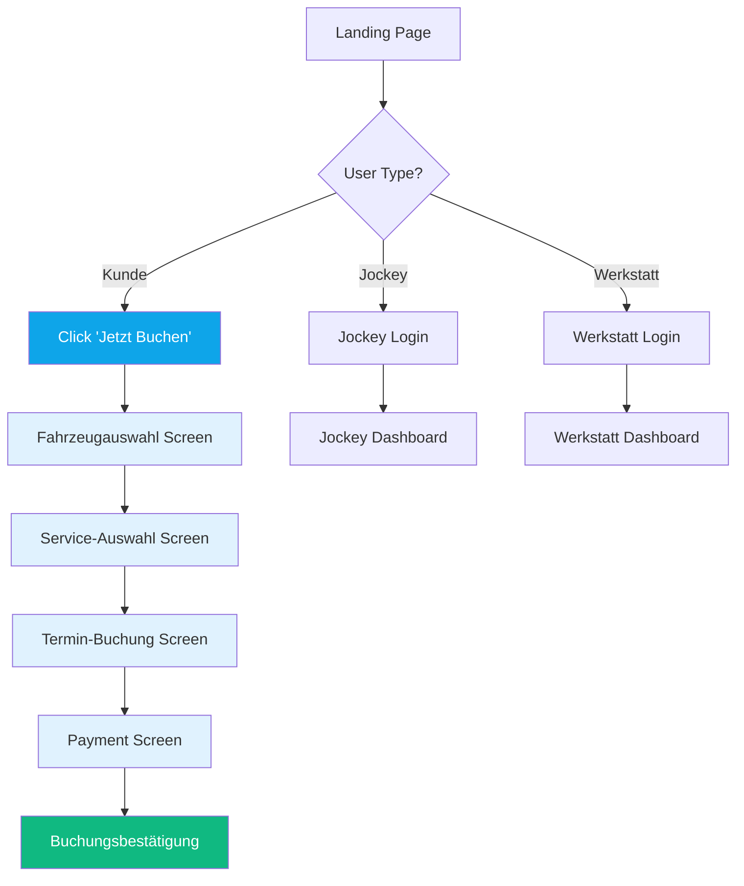
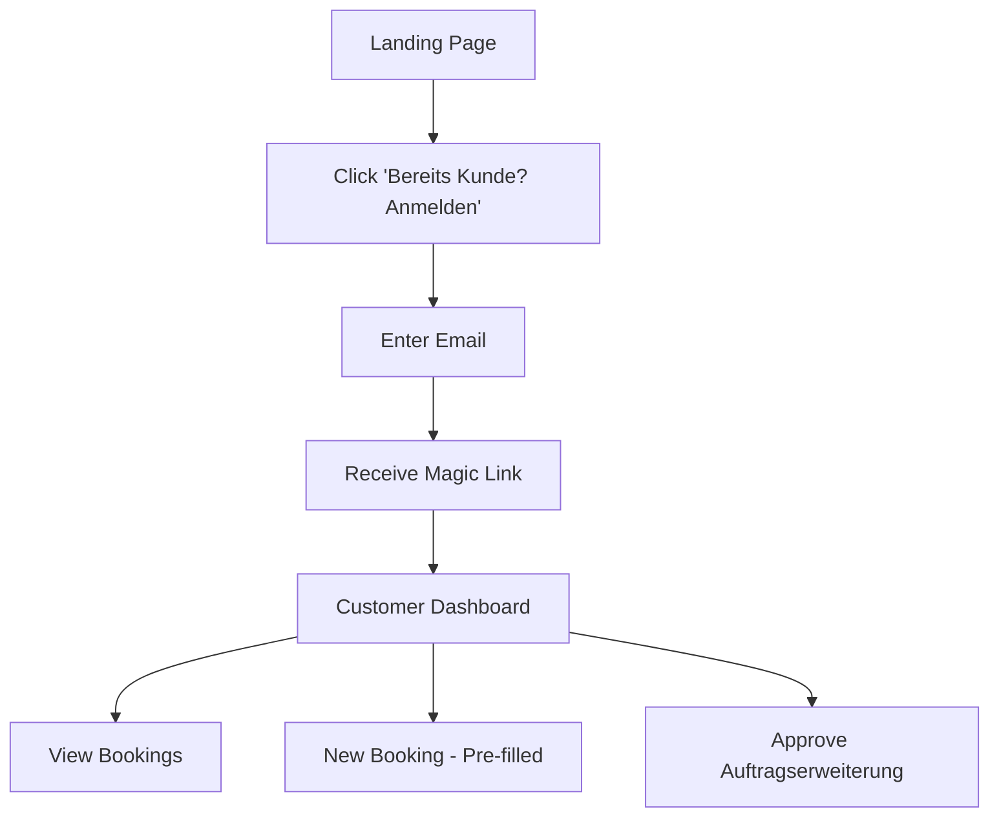

# Landing Page Design - B2C Autowartungs-App

**Version:** 1.0
**Datum:** 2026-02-01
**Status:** Design Specification Ready for Implementation

---

## Inhaltsverzeichnis

1. [Design Rationale](#design-rationale)
2. [Layout Architecture](#layout-architecture)
3. [Component Specifications](#component-specifications)
4. [Responsive Behavior](#responsive-behavior)
5. [Implementation Details](#implementation-details)
6. [User Flow](#user-flow)

---

## Design Rationale

### Design Goals
1. **Clarity Over Confusion**: Drei Login-Bereiche müssen sofort erkennbar und unterscheidbar sein
2. **Trust Building**: Erste Impression muss Vertrauen schaffen (Festpreisgarantie, Testimonials)
3. **Mobile-First**: 70%+ der Nutzer werden mobil zugreifen
4. **Conversion Focus**: Primäre CTA (Kunde: "Jetzt buchen") muss dominant sein
5. **Professional Yet Approachable**: Premium-Service, aber nicht einschüchternd

### UX Principles Applied
- **Jakob's Law**: Nutzer erwarten Layouts wie bei bekannten Plattformen (Amazon-ähnliche Struktur)
- **Fitts's Law**: Große klickbare Bereiche (min. 44x44px) für drei Login-Zonen
- **Visual Hierarchy**: Kunde-Login dominant, Jockey/Werkstatt sekundär
- **Progressive Disclosure**: Komplexität wird erst nach Login sichtbar

---

## Layout Architecture

### Hero Section (Above the Fold)

```
+---------------------------------------------------------------+
|  [LOGO: AutoCare]                      [Login-Status Badge]   |
+---------------------------------------------------------------+
|                                                               |
|          AUTOWARTUNG EINFACH. TRANSPARENT. FAIR.              |
|                                                               |
|      Festpreis-Garantie • Hol- & Bringservice • Digital      |
|                                                               |
|  +----------------+  +----------------+  +------------------+ |
|  |  KUNDE         |  |  JOCKEY        |  |  WERKSTATT       | |
|  |  [Icon: User]  |  |  [Icon: Car]   |  |  [Icon: Wrench] | |
|  |                |  |                |  |                  | |
|  | Jetzt buchen   |  | Fahrer-Login   |  | Werkstatt-Login | |
|  |                |  |                |  |                  | |
|  | [CTA Button]   |  | [Login Link]   |  | [Login Link]    | |
|  +----------------+  +----------------+  +------------------+ |
|                                                               |
+---------------------------------------------------------------+
```

### Desktop Layout (1440px)

```
+---------------------------------------------------------------+
|  Logo                    Navigation                    Login  |
+---------------------------------------------------------------+
|                          HERO SECTION                         |
|                      Three Login Zones (Cards)                |
+---------------------------------------------------------------+
|                                                               |
|  +----------------------------------------------------------+ |
|  |              VALUE PROPOSITION SECTION                    | |
|  |                                                           | |
|  |  [Icon] Festpreis      [Icon] Concierge    [Icon] Digital| |
|  |  Garantiert kein       Auto wird           Transparente  | |
|  |  Aufpreis              abgeholt            Freigabe      | |
|  +----------------------------------------------------------+ |
|                                                               |
|  +----------------------------------------------------------+ |
|  |                    SO FUNKTIONIERT'S                      | |
|  |  1. Fahrzeug wählen → 2. Termin buchen → 3. Bezahlen    | |
|  +----------------------------------------------------------+ |
|                                                               |
|  +----------------------------------------------------------+ |
|  |                    TRUST BUILDING                         | |
|  |  [Partner-Logos]   [Testimonials]   [Trustpilot 4.8★]   | |
|  +----------------------------------------------------------+ |
|                                                               |
|  +----------------------------------------------------------+ |
|  |  FOOTER: Impressum | Datenschutz | Kontakt | Social     | |
|  +----------------------------------------------------------+ |
+---------------------------------------------------------------+
```

---

## Component Specifications

### 1. Navigation Bar

**Desktop (1440px)**
```
Height: 80px
Background: bg-white border-b border-gray-200
Padding: px-8 py-4

Layout:
+----------------------------------------------------------------+
| [Logo: 180x50px]          [Nav Links]          [Login Badge]  |
+----------------------------------------------------------------+

Components:
- Logo: max-w-[180px] h-auto
- Nav Links (Hidden in MVP, for post-launch):
  - "So funktioniert's" | "Preise" | "Über uns"
  - text-sm font-medium text-gray-700 hover:text-primary-600
  - Spacing: gap-8

- Login Badge (right-aligned):
  - bg-gray-50 rounded-full px-4 py-2
  - text-sm text-gray-600
  - "Bereits Kunde? Anmelden →"
```

**Mobile (375px)**
```
Height: 64px
Background: bg-white border-b border-gray-200
Padding: px-4 py-3

Layout:
+--------------------------------+
| [Logo: 120x36px]    [☰ Menu]  |
+--------------------------------+

- Mobile Menu Trigger: w-10 h-10 tap target
- Hamburger Menu (hidden by default)
```

**Tailwind CSS Implementation:**
```jsx
<nav className="sticky top-0 z-50 bg-white border-b border-gray-200">
  <div className="max-w-7xl mx-auto px-4 sm:px-6 lg:px-8">
    <div className="flex justify-between items-center h-16 lg:h-20">
      {/* Logo */}
      <div className="flex-shrink-0">
        
      </div>

      {/* Desktop Nav - Hidden in MVP */}
      <div className="hidden md:flex items-center gap-8">
        {/* Future nav items */}
      </div>

      {/* Login Badge */}
      <div className="hidden md:block">
        <button className="bg-gray-50 hover:bg-gray-100 rounded-full px-4 py-2 text-sm font-medium text-gray-700 transition-colors">
          Bereits Kunde? Anmelden →
        </button>
      </div>

      {/* Mobile Menu Button */}
      <button className="md:hidden p-2 rounded-md text-gray-700">
        <svg className="h-6 w-6" /* hamburger icon */ />
      </button>
    </div>
  </div>
</nav>
```

---

### 2. Hero Section

**Layout:**
```
Container: max-w-7xl mx-auto px-4 py-12 lg:py-20
Background: bg-gradient-to-br from-primary-50 via-white to-blue-50

+---------------------------------------------------------------+
|                                                               |
|                   H1: HEADLINE (Center-aligned)               |
|                   H2: Subheadline (Center-aligned)            |
|                                                               |
|              [Feature Badge] [Feature Badge] [Feature Badge]  |
|                                                               |
+---------------------------------------------------------------+
```

**Typography:**
```
H1 (Headline):
- Desktop: text-5xl lg:text-6xl font-bold tracking-tight
- Mobile: text-4xl
- Color: text-gray-900
- Text: "Autowartung einfach. Transparent. Fair."
- Line-height: leading-tight
- Max-width: max-w-4xl mx-auto

H2 (Subheadline):
- Desktop: text-xl lg:text-2xl
- Mobile: text-lg
- Color: text-gray-600
- Font-weight: font-medium
- Text: "Festpreis-Garantie ohne böse Überraschungen"
- Margin-top: mt-4
- Max-width: max-w-3xl mx-auto

Feature Badges (below headline):
- Display: flex gap-4 justify-center flex-wrap
- Background: bg-white border border-gray-200 rounded-full
- Padding: px-4 py-2
- Text: text-sm font-medium text-gray-700
- Shadow: shadow-sm
```

**Tailwind Implementation:**
```jsx
<section className="bg-gradient-to-br from-primary-50 via-white to-blue-50 py-12 lg:py-20">
  <div className="max-w-7xl mx-auto px-4 sm:px-6 lg:px-8">
    <div className="text-center">
      {/* Headline */}
      <h1 className="text-4xl lg:text-6xl font-bold tracking-tight text-gray-900 max-w-4xl mx-auto leading-tight">
        Autowartung einfach.<br />
        Transparent. Fair.
      </h1>

      {/* Subheadline */}
      <p className="mt-4 text-lg lg:text-2xl font-medium text-gray-600 max-w-3xl mx-auto">
        Festpreis-Garantie ohne böse Überraschungen
      </p>

      {/* Feature Badges */}
      <div className="mt-8 flex flex-wrap justify-center gap-3 lg:gap-4">
        <span className="inline-flex items-center gap-2 bg-white border border-gray-200 rounded-full px-4 py-2 text-sm font-medium text-gray-700 shadow-sm">
          <svg className="w-5 h-5 text-green-500" /* checkmark icon */ />
          Festpreis-Garantie
        </span>
        <span className="inline-flex items-center gap-2 bg-white border border-gray-200 rounded-full px-4 py-2 text-sm font-medium text-gray-700 shadow-sm">
          <svg className="w-5 h-5 text-blue-500" /* car icon */ />
          Hol- & Bringservice
        </span>
        <span className="inline-flex items-center gap-2 bg-white border border-gray-200 rounded-full px-4 py-2 text-sm font-medium text-gray-700 shadow-sm">
          <svg className="w-5 h-5 text-purple-500" /* mobile icon */ />
          100% digital
        </span>
      </div>
    </div>
  </div>
</section>
```

---

### 3. Three Login Zones (Primary Component)

**Layout Strategy:**
- Desktop (≥1024px): 3 columns side-by-side
- Tablet (768px-1023px): 3 columns with smaller gaps
- Mobile (<768px): Stacked cards, Kunde prominent

**Card Specifications:**

```
KUNDE CARD (Primary - Dominant)
+--------------------------------+
| [Icon: User - Large]           |
| Size: w-16 h-16               |
|                                |
| H3: FÜR KUNDEN                 |
| text-2xl font-bold             |
|                                |
| Description:                   |
| "Wartung buchen und bezahlen"  |
| text-gray-600 text-base        |
|                                |
| Features:                      |
| ✓ Festpreis-Garantie          |
| ✓ Online bezahlen             |
| ✓ Buchungen verwalten         |
|                                |
| [CTA: JETZT BUCHEN]            |
| (Large, Primary Button)        |
|                                |
+--------------------------------+

Styling:
- Background: bg-white hover:bg-gray-50
- Border: border-2 border-primary-500
- Shadow: shadow-xl hover:shadow-2xl
- Rounded: rounded-2xl
- Padding: p-8
- Transform: hover:scale-105 transition-all duration-300
- Ring: focus-within:ring-4 ring-primary-200
```

```
JOCKEY CARD (Secondary)
+--------------------------------+
| [Icon: Car - Medium]           |
| Size: w-12 h-12               |
|                                |
| H3: FÜR FAHRER                 |
| text-xl font-bold              |
|                                |
| Description:                   |
| "Abholungen & Rückgaben"       |
|                                |
| [Link: FAHRER-LOGIN →]         |
| (Text link, less prominent)    |
|                                |
+--------------------------------+

Styling:
- Background: bg-gray-50 hover:bg-gray-100
- Border: border border-gray-300
- Shadow: shadow-md hover:shadow-lg
- Rounded: rounded-xl
- Padding: p-6
- Transform: hover:scale-102 transition-all duration-200
```

```
WERKSTATT CARD (Secondary)
+--------------------------------+
| [Icon: Wrench - Medium]        |
| Size: w-12 h-12               |
|                                |
| H3: FÜR WERKSTÄTTEN            |
| text-xl font-bold              |
|                                |
| Description:                   |
| "Aufträge & Angebote"          |
|                                |
| [Link: WERKSTATT-LOGIN →]      |
| (Text link, less prominent)    |
|                                |
+--------------------------------+

Styling: Same as Jockey Card
```

**Tailwind Implementation:**
```jsx
<section className="py-12 lg:py-16">
  <div className="max-w-7xl mx-auto px-4 sm:px-6 lg:px-8">
    <div className="grid grid-cols-1 md:grid-cols-3 gap-6 lg:gap-8">

      {/* KUNDE CARD - Primary */}
      <div className="bg-white border-2 border-primary-500 rounded-2xl p-8 shadow-xl hover:shadow-2xl hover:scale-105 transition-all duration-300 focus-within:ring-4 ring-primary-200">
        <div className="text-center">
          {/* Icon */}
          <div className="mx-auto w-16 h-16 bg-primary-100 rounded-full flex items-center justify-center mb-6">
            <svg className="w-8 h-8 text-primary-600" /* user icon */ />
          </div>

          {/* Heading */}
          <h3 className="text-2xl font-bold text-gray-900 mb-2">
            FÜR KUNDEN
          </h3>

          {/* Description */}
          <p className="text-gray-600 text-base mb-6">
            Wartung buchen und bezahlen
          </p>

          {/* Features List */}
          <ul className="text-left space-y-3 mb-8">
            <li className="flex items-start gap-2">
              <svg className="w-5 h-5 text-green-500 mt-0.5" /* check icon */ />
              <span className="text-sm text-gray-700">Festpreis-Garantie</span>
            </li>
            <li className="flex items-start gap-2">
              <svg className="w-5 h-5 text-green-500 mt-0.5" />
              <span className="text-sm text-gray-700">Online bezahlen</span>
            </li>
            <li className="flex items-start gap-2">
              <svg className="w-5 h-5 text-green-500 mt-0.5" />
              <span className="text-sm text-gray-700">Buchungen verwalten</span>
            </li>
          </ul>

          {/* CTA Button */}
          <button className="w-full bg-primary-600 hover:bg-primary-700 text-white font-semibold py-4 px-6 rounded-xl shadow-lg hover:shadow-xl transition-all duration-200 transform hover:scale-105">
            JETZT BUCHEN
          </button>

          {/* Secondary Action */}
          <a href="/customer-login" className="mt-4 inline-block text-sm text-primary-600 hover:text-primary-700 font-medium">
            Bereits gebucht? Anmelden →
          </a>
        </div>
      </div>

      {/* JOCKEY CARD - Secondary */}
      <div className="bg-gray-50 border border-gray-300 rounded-xl p-6 shadow-md hover:shadow-lg hover:scale-102 transition-all duration-200">
        <div className="text-center">
          {/* Icon */}
          <div className="mx-auto w-12 h-12 bg-gray-200 rounded-full flex items-center justify-center mb-4">
            <svg className="w-6 h-6 text-gray-600" /* car icon */ />
          </div>

          {/* Heading */}
          <h3 className="text-xl font-bold text-gray-900 mb-2">
            FÜR FAHRER
          </h3>

          {/* Description */}
          <p className="text-gray-600 text-sm mb-6">
            Abholungen & Rückgaben verwalten
          </p>

          {/* Login Link */}
          <a href="/jockey-login" className="inline-flex items-center gap-2 text-gray-700 hover:text-gray-900 font-medium text-sm transition-colors">
            Fahrer-Login
            <svg className="w-4 h-4" /* arrow icon */ />
          </a>
        </div>
      </div>

      {/* WERKSTATT CARD - Secondary */}
      <div className="bg-gray-50 border border-gray-300 rounded-xl p-6 shadow-md hover:shadow-lg hover:scale-102 transition-all duration-200">
        <div className="text-center">
          {/* Icon */}
          <div className="mx-auto w-12 h-12 bg-gray-200 rounded-full flex items-center justify-center mb-4">
            <svg className="w-6 h-6 text-gray-600" /* wrench icon */ />
          </div>

          {/* Heading */}
          <h3 className="text-xl font-bold text-gray-900 mb-2">
            FÜR WERKSTÄTTEN
          </h3>

          {/* Description */}
          <p className="text-gray-600 text-sm mb-6">
            Aufträge & Angebote erstellen
          </p>

          {/* Login Link */}
          <a href="/workshop-login" className="inline-flex items-center gap-2 text-gray-700 hover:text-gray-900 font-medium text-sm transition-colors">
            Werkstatt-Login
            <svg className="w-4 h-4" /* arrow icon */ />
          </a>
        </div>
      </div>

    </div>
  </div>
</section>
```

---

### 4. Value Proposition Section

**Purpose:** Reinforce the three USPs after login zones

```
+---------------------------------------------------------------+
|               WARUM KUNDEN UNS LIEBEN                         |
|                                                               |
|  +---------------+  +----------------+  +------------------+  |
|  | [Icon: €]     |  | [Icon: Car]    |  | [Icon: Mobile]  |  |
|  | Festpreis     |  | Concierge      |  | Digital         |  |
|  | Garantiert    |  | Auto wird      |  | Transparente    |  |
|  | kein Aufpreis |  | abgeholt       |  | Freigabe        |  |
|  +---------------+  +----------------+  +------------------+  |
+---------------------------------------------------------------+
```

**Tailwind Implementation:**
```jsx
<section className="py-16 bg-white">
  <div className="max-w-7xl mx-auto px-4 sm:px-6 lg:px-8">
    <h2 className="text-3xl lg:text-4xl font-bold text-center text-gray-900 mb-12">
      Warum Kunden uns lieben
    </h2>

    <div className="grid grid-cols-1 md:grid-cols-3 gap-8 lg:gap-12">
      {/* USP 1 */}
      <div className="text-center">
        <div className="mx-auto w-16 h-16 bg-green-100 rounded-full flex items-center justify-center mb-4">
          <svg className="w-8 h-8 text-green-600" /* euro icon */ />
        </div>
        <h3 className="text-xl font-bold text-gray-900 mb-2">
          Festpreis-Garantie
        </h3>
        <p className="text-gray-600">
          Du zahlst nur das, was du buchst. Keine versteckten Kosten, keine bösen Überraschungen.
        </p>
      </div>

      {/* USP 2 */}
      <div className="text-center">
        <div className="mx-auto w-16 h-16 bg-blue-100 rounded-full flex items-center justify-center mb-4">
          <svg className="w-8 h-8 text-blue-600" /* car icon */ />
        </div>
        <h3 className="text-xl font-bold text-gray-900 mb-2">
          Hol- & Bringservice
        </h3>
        <p className="text-gray-600">
          Wir holen dein Auto ab, bringen ein Ersatzfahrzeug und liefern es gewaschen zurück.
        </p>
      </div>

      {/* USP 3 */}
      <div className="text-center">
        <div className="mx-auto w-16 h-16 bg-purple-100 rounded-full flex items-center justify-center mb-4">
          <svg className="w-8 h-8 text-purple-600" /* mobile icon */ />
        </div>
        <h3 className="text-xl font-bold text-gray-900 mb-2">
          100% Digital
        </h3>
        <p className="text-gray-600">
          Zusätzliche Arbeiten gibst du digital mit Fotos frei. Volle Kontrolle, keine Telefonate.
        </p>
      </div>
    </div>
  </div>
</section>
```

---

### 5. How It Works Section

**Purpose:** Show simple 3-step process

```
+---------------------------------------------------------------+
|                    SO FUNKTIONIERT'S                          |
|                                                               |
|  1 → Fahrzeug    2 → Termin      3 → Bezahlen                |
|      wählen          buchen           & fertig                |
|  [Icon: Car]     [Icon: Calendar] [Icon: Card]               |
+---------------------------------------------------------------+
```

**Tailwind Implementation:**
```jsx
<section className="py-16 bg-gray-50">
  <div className="max-w-7xl mx-auto px-4 sm:px-6 lg:px-8">
    <h2 className="text-3xl lg:text-4xl font-bold text-center text-gray-900 mb-12">
      So funktioniert's
    </h2>

    <div className="grid grid-cols-1 md:grid-cols-3 gap-8">
      {/* Step 1 */}
      <div className="relative">
        <div className="flex flex-col items-center text-center">
          <div className="w-16 h-16 bg-primary-600 text-white rounded-full flex items-center justify-center text-2xl font-bold mb-4">
            1
          </div>
          <h3 className="text-xl font-bold text-gray-900 mb-2">
            Fahrzeug wählen
          </h3>
          <p className="text-gray-600">
            Marke, Modell, Kilometerstand eingeben und sofort deinen Festpreis sehen.
          </p>
        </div>
        {/* Arrow (hidden on mobile) */}
        <div className="hidden md:block absolute top-8 -right-4 text-gray-400">
          <svg className="w-8 h-8" /* arrow right icon */ />
        </div>
      </div>

      {/* Step 2 */}
      <div className="relative">
        <div className="flex flex-col items-center text-center">
          <div className="w-16 h-16 bg-primary-600 text-white rounded-full flex items-center justify-center text-2xl font-bold mb-4">
            2
          </div>
          <h3 className="text-xl font-bold text-gray-900 mb-2">
            Termin buchen
          </h3>
          <p className="text-gray-600">
            Wähle deinen Wunsch-Zeitpunkt für Abholung und Rückgabe.
          </p>
        </div>
        <div className="hidden md:block absolute top-8 -right-4 text-gray-400">
          <svg className="w-8 h-8" />
        </div>
      </div>

      {/* Step 3 */}
      <div className="flex flex-col items-center text-center">
        <div className="w-16 h-16 bg-primary-600 text-white rounded-full flex items-center justify-center text-2xl font-bold mb-4">
          3
        </div>
        <h3 className="text-xl font-bold text-gray-900 mb-2">
          Bezahlen & fertig
        </h3>
        <p className="text-gray-600">
          Online bezahlen und entspannt warten, bis wir dein Auto abholen.
        </p>
      </div>
    </div>
  </div>
</section>
```

---

### 6. Trust Building Section

**Purpose:** Social proof and trust signals

```
+---------------------------------------------------------------+
|                   VERTRAUT VON 500+ KUNDEN                    |
|                                                               |
|  [Partner Logo] [Partner Logo] [Partner Logo] [Partner Logo] |
|                                                               |
|  +----------------------------------------------------------+ |
|  | ⭐⭐⭐⭐⭐ 4.9/5.0                                           | |
|  | "Endlich ein Service, dem ich vertrauen kann!"           | |
|  | - Michael S., VW Golf Fahrer                             | |
|  +----------------------------------------------------------+ |
+---------------------------------------------------------------+
```

**Tailwind Implementation:**
```jsx
<section className="py-16 bg-white border-t border-gray-200">
  <div className="max-w-7xl mx-auto px-4 sm:px-6 lg:px-8">
    <div className="text-center mb-12">
      <p className="text-gray-500 text-sm uppercase tracking-wide font-semibold mb-4">
        Vertraut von 500+ Kunden in Witten
      </p>
      {/* Partner Logos (placeholder for now) */}
      <div className="flex justify-center items-center gap-8 opacity-50">
        <div className="w-24 h-12 bg-gray-200 rounded" />
        <div className="w-24 h-12 bg-gray-200 rounded" />
        <div className="w-24 h-12 bg-gray-200 rounded" />
      </div>
    </div>

    {/* Testimonial */}
    <div className="max-w-3xl mx-auto bg-gray-50 rounded-2xl p-8 shadow-md">
      <div className="flex justify-center mb-4">
        <div className="flex gap-1">
          {[1,2,3,4,5].map(star => (
            <svg key={star} className="w-6 h-6 text-yellow-400 fill-current" /* star icon */ />
          ))}
        </div>
      </div>
      <blockquote className="text-xl text-gray-900 text-center mb-4">
        "Endlich ein Service, dem ich vertrauen kann! Festpreis wie versprochen, und das Auto kam sauber zurück."
      </blockquote>
      <p className="text-center text-gray-600 font-medium">
        Michael S., VW Golf Fahrer
      </p>
    </div>
  </div>
</section>
```

---

### 7. Footer

**Tailwind Implementation:**
```jsx
<footer className="bg-gray-900 text-white py-12">
  <div className="max-w-7xl mx-auto px-4 sm:px-6 lg:px-8">
    <div className="grid grid-cols-1 md:grid-cols-4 gap-8">
      {/* Company */}
      <div>
        <h4 className="font-bold text-lg mb-4">AutoCare</h4>
        <p className="text-gray-400 text-sm">
          Autowartung neu gedacht. Transparent, digital, zuverlässig.
        </p>
      </div>

      {/* Links */}
      <div>
        <h4 className="font-semibold mb-4">Rechtliches</h4>
        <ul className="space-y-2 text-sm text-gray-400">
          <li><a href="/impressum" className="hover:text-white">Impressum</a></li>
          <li><a href="/datenschutz" className="hover:text-white">Datenschutz</a></li>
          <li><a href="/agb" className="hover:text-white">AGB</a></li>
        </ul>
      </div>

      {/* Contact */}
      <div>
        <h4 className="font-semibold mb-4">Kontakt</h4>
        <ul className="space-y-2 text-sm text-gray-400">
          <li>support@autocare.de</li>
          <li>+49 2302 12345</li>
          <li>Mo-Fr 9-18 Uhr</li>
        </ul>
      </div>

      {/* Social */}
      <div>
        <h4 className="font-semibold mb-4">Social Media</h4>
        <div className="flex gap-4">
          <a href="#" className="w-10 h-10 bg-gray-800 hover:bg-gray-700 rounded-full flex items-center justify-center">
            {/* Instagram icon */}
          </a>
          <a href="#" className="w-10 h-10 bg-gray-800 hover:bg-gray-700 rounded-full flex items-center justify-center">
            {/* Facebook icon */}
          </a>
        </div>
      </div>
    </div>

    <div className="mt-8 pt-8 border-t border-gray-800 text-center text-sm text-gray-400">
      © 2026 AutoCare. Alle Rechte vorbehalten.
    </div>
  </div>
</footer>
```

---

## Responsive Behavior

### Breakpoint Strategy

```
Mobile:    320px - 767px   (sm)
Tablet:    768px - 1023px  (md)
Desktop:   1024px - 1439px (lg)
Large:     1440px+         (xl)
```

### Mobile Layout (375px)

```
+---------------------------+
| [Logo]         [☰]        |
+---------------------------+
|                           |
|     HEADLINE (2 lines)    |
|     Subheadline           |
|                           |
|  [Badge] [Badge] [Badge]  |
|                           |
+---------------------------+
|  +---------------------+  |
|  | KUNDE CARD          |  |
|  | (Full width)        |  |
|  | Prominent           |  |
|  +---------------------+  |
|                           |
|  +---------------------+  |
|  | JOCKEY CARD         |  |
|  | (Full width)        |  |
|  +---------------------+  |
|                           |
|  +---------------------+  |
|  | WERKSTATT CARD      |  |
|  | (Full width)        |  |
|  +---------------------+  |
|                           |
+---------------------------+
```

**Key Mobile Adjustments:**
- Three cards stack vertically
- Kunde card remains most prominent (larger CTA)
- Typography scales down (text-4xl → text-3xl)
- Padding reduced (p-8 → p-6)
- Touch targets minimum 44x44px
- Thumb-zone optimization (CTA buttons bottom-aligned)

### Tablet Layout (768px)

```
+-------------------------------------------+
| [Logo]              [Nav]      [Login]   |
+-------------------------------------------+
|                                           |
|          HEADLINE (1-2 lines)             |
|          Subheadline                      |
|                                           |
|     [Badge] [Badge] [Badge]               |
|                                           |
+-------------------------------------------+
|  +-----------+ +-----------+ +---------+ |
|  | KUNDE     | | JOCKEY    | |WERKSTATT| |
|  | CARD      | | CARD      | | CARD    | |
|  | (33%)     | | (33%)     | | (33%)   | |
|  +-----------+ +-----------+ +---------+ |
|                                           |
+-------------------------------------------+
```

**Key Tablet Adjustments:**
- Three cards side-by-side in equal columns
- Reduced padding between cards (gap-6 instead of gap-8)
- Kunde card still has visual prominence through border color

---

## Implementation Details

### Color Palette

```css
/* Primary Colors */
--primary-50: #f0f9ff;
--primary-100: #e0f2fe;
--primary-500: #0ea5e9;
--primary-600: #0284c7;
--primary-700: #0369a1;

/* Gray Scale */
--gray-50: #f9fafb;
--gray-100: #f3f4f6;
--gray-200: #e5e7eb;
--gray-300: #d1d5db;
--gray-600: #4b5563;
--gray-700: #374151;
--gray-900: #111827;

/* Semantic Colors */
--success-500: #10b981; /* Green for checkmarks */
--warning-500: #f59e0b; /* Amber for alerts */
--error-500: #ef4444;   /* Red for errors */

/* Accent Colors */
--blue-500: #3b82f6;    /* For Jockey */
--purple-500: #a855f7;  /* For Digital features */
```

### Typography Scale

```css
/* Font Family */
font-family: 'Inter', -apple-system, BlinkMacSystemFont, 'Segoe UI', sans-serif;

/* Scale */
text-xs:   12px / 16px (0.75rem)
text-sm:   14px / 20px (0.875rem)
text-base: 16px / 24px (1rem)
text-lg:   18px / 28px (1.125rem)
text-xl:   20px / 28px (1.25rem)
text-2xl:  24px / 32px (1.5rem)
text-3xl:  30px / 36px (1.875rem)
text-4xl:  36px / 40px (2.25rem)
text-5xl:  48px / 1    (3rem)
text-6xl:  60px / 1    (3.75rem)

/* Font Weights */
font-medium:   500
font-semibold: 600
font-bold:     700
```

### Spacing System (8px Grid)

```
p-2:  8px
p-3:  12px
p-4:  16px
p-6:  24px
p-8:  32px
p-12: 48px
p-16: 64px
p-20: 80px

gap-3:  12px
gap-4:  16px
gap-6:  24px
gap-8:  32px
gap-12: 48px
```

### Shadow System

```css
shadow-sm:  0 1px 2px 0 rgb(0 0 0 / 0.05)
shadow-md:  0 4px 6px -1px rgb(0 0 0 / 0.1)
shadow-lg:  0 10px 15px -3px rgb(0 0 0 / 0.1)
shadow-xl:  0 20px 25px -5px rgb(0 0 0 / 0.1)
shadow-2xl: 0 25px 50px -12px rgb(0 0 0 / 0.25)
```

### Animation Timing

```css
transition-all duration-200: Fast interactions (hover states)
transition-all duration-300: Standard transitions (scale, shadow)
transition-all duration-500: Slow, meaningful animations

/* Easing Functions */
ease-out: Entrances (elements appearing)
ease-in:  Exits (elements leaving)
ease-in-out: Bidirectional (toggles)
```

### Icon System

**Recommendation:** Use Heroicons v2 (MIT License)
- Outline style for secondary elements
- Solid style for filled backgrounds
- Size: 16px (w-4 h-4), 20px (w-5 h-5), 24px (w-6 h-6)

**Required Icons:**
- User (Kunde)
- Car/Truck (Jockey)
- Wrench (Werkstatt)
- Check/Checkmark (Features)
- Arrow Right (Links)
- Menu/Hamburger (Mobile nav)
- Euro Sign (Pricing)
- Calendar (Booking)
- Credit Card (Payment)
- Star (Ratings)

---

## User Flow

### Landing → Kunde Booking Flow



### Landing → Return User Flow



---

## Accessibility Considerations

### WCAG 2.1 AA Compliance

**Color Contrast:**
- Text on white background: minimum 4.5:1 ratio
- Large text (18px+): minimum 3:1 ratio
- Primary CTA: 7:1 ratio (AAA level)

**Keyboard Navigation:**
- All interactive elements focusable
- Focus indicators visible (ring-4 ring-primary-200)
- Tab order logical (left-to-right, top-to-bottom)
- Skip to content link for screen readers

**Screen Reader Support:**
```jsx
{/* Example */}
<button
  className="..."
  aria-label="Jetzt als Kunde buchen"
>
  JETZT BUCHEN
</button>

<nav aria-label="Hauptnavigation">
  {/* ... */}
</nav>

<section aria-labelledby="login-zones-heading">
  <h2 id="login-zones-heading" className="sr-only">
    Anmeldeoptionen für Kunden, Fahrer und Werkstätten
  </h2>
  {/* Three cards */}
</section>
```

**Touch Targets:**
- Minimum 44x44px for all interactive elements
- Adequate spacing between touch targets (min 8px gap)

---

## Performance Optimization

### Critical Rendering Path
1. Inline critical CSS (above-the-fold styles)
2. Defer non-critical JavaScript
3. Lazy load images below the fold
4. Preload web fonts

### Image Optimization
```jsx
<Image
  src="/hero-image.jpg"
  alt="Auto Service"
  width={1200}
  height={600}
  priority // Above the fold
  quality={85}
  placeholder="blur"
/>
```

### Bundle Size Targets
- Initial JS bundle: <100KB gzipped
- CSS bundle: <30KB gzipped
- Total page weight: <500KB
- Time to Interactive: <3 seconds (3G)

---

## Testing Checklist

### Functional Testing
- [ ] All three login zones are clickable
- [ ] "Jetzt Buchen" navigates to booking flow
- [ ] Jockey/Werkstatt links navigate to respective logins
- [ ] Mobile menu opens/closes correctly
- [ ] Responsive layout works 320px-1920px
- [ ] All animations perform smoothly (60fps)

### Visual Testing
- [ ] Hero gradient renders correctly
- [ ] Kunde card is visually dominant
- [ ] Hover states work on all interactive elements
- [ ] Focus states are visible
- [ ] Typography scales properly on mobile

### Accessibility Testing
- [ ] Keyboard navigation works throughout
- [ ] Screen reader announces all content correctly
- [ ] Color contrast passes WCAG AA
- [ ] Touch targets are minimum 44x44px
- [ ] Form labels are properly associated

### Performance Testing
- [ ] Lighthouse score >90 on mobile
- [ ] First Contentful Paint <1.5s
- [ ] Largest Contentful Paint <2.5s
- [ ] Cumulative Layout Shift <0.1

---

## Next Steps

1. **Design Approval**: Stakeholder review of wireframes
2. **Asset Creation**: Logos, icons, images
3. **Component Development**: Build reusable React components
4. **Integration**: Connect to authentication system
5. **User Testing**: A/B test different CTA variations

---

**Document Owner:** UX/UI Design Team
**Last Updated:** 2026-02-01
**Status:** Ready for Implementation
