# Customer Portal Wireframes - B2C Autowartungs-App

**Version:** 1.0
**Datum:** 2026-02-01
**Status:** Design Specification Ready for Implementation

---

## Inhaltsverzeichnis

1. [Customer Journey Overview](#customer-journey-overview)
2. [Screen 1: Fahrzeugauswahl](#screen-1-fahrzeugauswahl)
3. [Screen 2: Service-Auswahl](#screen-2-service-auswahl)
4. [Screen 3: Terminbuchung](#screen-3-terminbuchung)
5. [Screen 4: Payment](#screen-4-payment)
6. [Screen 5: Buchungsbestätigung](#screen-5-buchungsbestätigung)
7. [Screen 6: Customer Dashboard](#screen-6-customer-dashboard)
8. [Screen 7: Auftragserweiterung Freigabe](#screen-7-auftragserweiterung-freigabe)

---

## Customer Journey Overview

```mermaid
graph LR
    A[Landing Page] --> B[Fahrzeugauswahl]
    B --> C[Service-Auswahl]
    C --> D[Terminbuchung]
    D --> E[Payment]
    E --> F[Bestätigung]
    F --> G[Magic Link Login]
    G --> H[Dashboard]
    H --> I[Auftragserweiterung]
    I --> H
    H --> J[Wiederbuchung]

    style A fill:#f0f9ff
    style B fill:#e0f2fe
    style C fill:#e0f2fe
    style D fill:#e0f2fe
    style E fill:#fef3c7
    style F fill:#d1fae5
    style H fill:#ddd6fe
    style I fill:#fed7aa
```



### Key User Flow Principles
- **Progressive Disclosure**: Show only necessary information at each step
- **Autosave Progress**: Local storage saves form data between steps
- **Mobile-First**: 320px minimum, optimized for one-handed use
- **Clear Exit Points**: Back button always visible
- **Trust Signals**: Show security badges, testimonials at payment step

---

## Screen 1: Fahrzeugauswahl

### Purpose
Capture mandatory vehicle data (Marke, Modell, Baujahr, Kilometerstand) to calculate accurate fixed price.

### Layout (Mobile 375px)

```
+----------------------------------+
| [←] Fahrzeug auswählen      [?] |
+----------------------------------+
|                                  |
| Schritt 1 von 4                  |
| ████░░░░░░░░ 25%                 |
|                                  |
| Welches Auto möchten Sie         |
| warten lassen?                   |
|                                  |
| +-----------------------------+  |
| | Marke *                     |  |
| | [VW                    ▼]   |  |
| +-----------------------------+  |
|                                  |
| +-----------------------------+  |
| | Modell *                    |  |
| | [Golf                  ▼]   |  |
| +-----------------------------+  |
|                                  |
| +-----------------------------+  |
| | Baujahr *                   |  |
| | [2018                  ▼]   |  |
| +-----------------------------+  |
|                                  |
| +-----------------------------+  |
| | Kilometerstand *            |  |
| | [85.000] km                 |  |
| +-----------------------------+  |
|                                  |
| ℹ️ Warum brauchen wir das?      |
| Für präzise Wartungsplanung     |
|                                  |
| [WEITER ZU SERVICES →]          |
|                                  |
+----------------------------------+
```

### Desktop Layout (1440px)

```
+---------------------------------------------------------------+
| [Logo]                                            [Hilfe] [×] |
+---------------------------------------------------------------+
|                                                               |
|  Schritt 1 von 4: Fahrzeug auswählen                         |
|  ███████████░░░░░░░░░░░░░░░░░░░░░░░ 25%                      |
|                                                               |
|  +---------------------------+  +---------------------------+ |
|  | Fahrzeugdaten             |  | [Illustration: Car]       | |
|  |                           |  |                           | |
|  | Marke *                   |  | Ihre Daten werden         | |
|  | [VW              ▼]       |  | verschlüsselt übertragen  | |
|  |                           |  | und DSGVO-konform         | |
|  | Modell *                  |  | gespeichert.              | |
|  | [Golf            ▼]       |  |                           | |
|  |                           |  | 🔒 SSL-Verschlüsselt     | |
|  | Baujahr *                 |  |                           | |
|  | [2018            ▼]       |  +---------------------------+ |
|  |                           |                               |
|  | Kilometerstand *          |  Bereits 500+ zufriedene      |
|  | [85.000] km               |  Kunden in Witten             |
|  |                           |                               |
|  | ℹ️ Diese Angaben helfen   |  ⭐⭐⭐⭐⭐ 4.9/5.0            |
|  | uns, den passenden        |                               |
|  | Wartungsumfang und        |                               |
|  | Festpreis zu berechnen.   |                               |
|  |                           |                               |
|  | [← ZURÜCK]  [WEITER →]    |                               |
|  +---------------------------+                               |
+---------------------------------------------------------------+
```

### Component Specifications

**Progress Bar:**
```jsx
<div className="w-full bg-gray-200 rounded-full h-2 mb-8">
  <div
    className="bg-primary-600 h-2 rounded-full transition-all duration-300"
    style={{width: '25%'}}
    role="progressbar"
    aria-valuenow={25}
    aria-valuemin={0}
    aria-valuemax={100}
  />
</div>
```

**Form Field - Marke (Dropdown with Autocomplete):**
```jsx
<div className="mb-6">
  <label
    htmlFor="marke"
    className="block text-sm font-semibold text-gray-900 mb-2"
  >
    Marke *
  </label>
  <select
    id="marke"
    name="marke"
    required
    className="w-full px-4 py-3 border-2 border-gray-300 rounded-xl focus:border-primary-500 focus:ring-4 focus:ring-primary-200 text-base transition-all"
  >
    <option value="">Bitte wählen...</option>
    <option value="audi">Audi</option>
    <option value="bmw">BMW</option>
    <option value="mercedes">Mercedes-Benz</option>
    <option value="vw">Volkswagen</option>
    {/* ... more brands */}
  </select>
</div>
```

**Form Field - Kilometerstand (Numeric Input):**
```jsx
<div className="mb-6">
  <label
    htmlFor="km"
    className="block text-sm font-semibold text-gray-900 mb-2"
  >
    Kilometerstand *
  </label>
  <div className="relative">
    <input
      type="number"
      id="km"
      name="kilometerstand"
      required
      min="0"
      max="500000"
      step="1000"
      placeholder="z.B. 85000"
      className="w-full px-4 py-3 pr-12 border-2 border-gray-300 rounded-xl focus:border-primary-500 focus:ring-4 focus:ring-primary-200 text-base transition-all"
    />
    <span className="absolute right-4 top-3.5 text-gray-500 text-base">
      km
    </span>
  </div>
  <p className="mt-2 text-sm text-gray-600">
    Aktueller Tachostand Ihres Fahrzeugs
  </p>
</div>
```

**Info Box:**
```jsx
<div className="bg-blue-50 border border-blue-200 rounded-xl p-4 mb-6">
  <div className="flex gap-3">
    <svg className="w-5 h-5 text-blue-600 flex-shrink-0 mt-0.5" /* info icon */ />
    <div>
      <h4 className="font-semibold text-blue-900 mb-1">
        Warum brauchen wir diese Daten?
      </h4>
      <p className="text-sm text-blue-800">
        Marke, Modell, Baujahr und Kilometerstand helfen uns, den passenden Wartungsumfang zu bestimmen und Ihnen einen fairen Festpreis anzubieten.
      </p>
    </div>
  </div>
</div>
```

**Primary CTA Button:**
```jsx
<button
  type="submit"
  className="w-full bg-primary-600 hover:bg-primary-700 text-white font-semibold py-4 px-6 rounded-xl shadow-lg hover:shadow-xl transition-all duration-200 transform hover:scale-105 disabled:opacity-50 disabled:cursor-not-allowed"
  disabled={!isFormValid}
>
  WEITER ZU SERVICES →
</button>
```

### Validation Rules

**Client-Side Validation:**
```javascript
const validateVehicleForm = (formData) => {
  const errors = {};

  // Marke required
  if (!formData.marke) {
    errors.marke = 'Bitte wählen Sie eine Marke aus';
  }

  // Modell required
  if (!formData.modell) {
    errors.modell = 'Bitte wählen Sie ein Modell aus';
  }

  // Baujahr: 1994-2026
  const currentYear = new Date().getFullYear();
  if (!formData.baujahr || formData.baujahr < 1994 || formData.baujahr > currentYear) {
    errors.baujahr = `Baujahr muss zwischen 1994 und ${currentYear} liegen`;
  }

  // Kilometerstand: 0-500,000 km
  if (!formData.kilometerstand || formData.kilometerstand < 0 || formData.kilometerstand > 500000) {
    errors.kilometerstand = 'Bitte geben Sie einen realistischen Kilometerstand ein (0-500.000 km)';
  }

  return errors;
};
```

### State Management

**Local Storage Autosave:**
```javascript
// Save on every input change
const handleInputChange = (field, value) => {
  const formData = {
    ...currentFormData,
    [field]: value
  };
  setCurrentFormData(formData);

  // Autosave to localStorage
  localStorage.setItem('booking_step1', JSON.stringify(formData));
};

// Restore on component mount
useEffect(() => {
  const saved = localStorage.getItem('booking_step1');
  if (saved) {
    setCurrentFormData(JSON.parse(saved));
  }
}, []);
```

---

## Screen 2: Service-Auswahl

### Purpose
Display available services with clear explanations. Inspektion/Wartung is the main product.

### Layout (Mobile 375px)

```
+----------------------------------+
| [←] Service auswählen       [?]  |
+----------------------------------+
|                                  |
| Schritt 2 von 4                  |
| ████████░░░░ 50%                 |
|                                  |
| Welchen Service benötigen Sie?   |
|                                  |
| +-----------------------------+  |
| | ⚙️ INSPEKTION/WARTUNG       |  |
| |                             |  |
| | 60.000 km Inspektion        |  |
| | • Motoröl & Filter          |  |
| | • Service-Intervall reset   |  |
| | • Fahrzeugprüfung           |  |
| |                             |  |
| | ab 219 EUR                  |  |
| | [AUSWÄHLEN]          [Info] |  |
| +-----------------------------+  |
|                                  |
| +-----------------------------+  |
| | 🔧 ÖLSERVICE                |  |
| | Schneller Ölwechsel         |  |
| | ab 89 EUR                   |  |
| | [AUSWÄHLEN]                 |  |
| +-----------------------------+  |
|                                  |
| +-----------------------------+  |
| | 🔴 BREMSSERVICE             |  |
| | Beläge & Scheiben           |  |
| | ab 189 EUR                  |  |
| | [AUSWÄHLEN]                 |  |
| +-----------------------------+  |
|                                  |
| ℹ️ Unsicher? [Service-Guide]    |
|                                  |
+----------------------------------+
```

### Desktop Layout (1440px)

```
+---------------------------------------------------------------+
| [Logo]                                            [Hilfe] [×] |
+---------------------------------------------------------------+
|                                                               |
|  Schritt 2 von 4: Service auswählen                          |
|  ████████████████████████░░░░░░░░░░░░░░ 50%                  |
|                                                               |
|  Welchen Service benötigt Ihr VW Golf (2018, 85.000 km)?     |
|                                                               |
|  +------------------+  +------------------+  +--------------+ |
|  | ⚙️ EMPFOHLEN     |  | 🔧 ÖLSERVICE     |  | 🔴 BREMSEN  | |
|  |                  |  |                  |  |              | |
|  | Inspektion/      |  | Schneller        |  | Bremsbeläge | |
|  | Wartung          |  | Ölwechsel        |  | & Scheiben  | |
|  |                  |  |                  |  |              | |
|  | ✓ Motoröl        |  | • Motoröl        |  | • Vorderachs| |
|  | ✓ Ölfilter       |  | • Ölfilter       |  | • Hinterachs| |
|  | ✓ Service-Reset  |  | • Intervall-Rese | |  | • Prüfung   | |
|  | ✓ Fahrzeugprüfun |  |                  |  |              | |
|  |                  |  |                  |  |              | |
|  | ab 219 EUR       |  | ab 89 EUR        |  | ab 189 EUR  | |
|  |                  |  |                  |  |              | |
|  | [JETZT WÄHLEN]   |  | [WÄHLEN]         |  | [WÄHLEN]    | |
|  | [Mehr Info]      |  |                  |  |              | |
|  +------------------+  +------------------+  +--------------+ |
|                                                               |
|  +------------------+  +------------------+  +--------------+ |
|  | 🏁 TÜV/HU        |  | ❄️ KLIMASERVICE  |  | ✨ AUFBEREI | |
|  | Hauptuntersuchun |  | Klimaanlagen-    |  | TUNG        | |
|  | ab 89 EUR        |  | Desinfektion     |  | Innenreinigu| |
|  | [WÄHLEN]         |  | ab 129 EUR       |  | ab 79 EUR   | |
|  |                  |  | [WÄHLEN]         |  | [WÄHLEN]    | |
|  +------------------+  +------------------+  +--------------+ |
|                                                               |
|  ℹ️ Unsicher, welcher Service passt?                         |
|  [Service-Guide starten →]                                    |
|                                                               |
|  [← ZURÜCK]                               [WEITER ZUM TERMIN]|
+---------------------------------------------------------------+
```

### Service Card Component

**Primary Card (Inspektion - Recommended):**
```jsx
<div className="relative bg-white border-2 border-primary-500 rounded-2xl p-6 shadow-xl hover:shadow-2xl transition-all">
  {/* Recommended Badge */}
  <div className="absolute -top-3 left-1/2 transform -translate-x-1/2">
    <span className="bg-primary-600 text-white text-xs font-bold px-4 py-1 rounded-full shadow-lg">
      ⭐ EMPFOHLEN
    </span>
  </div>

  {/* Icon & Title */}
  <div className="text-center mb-4">
    <div className="inline-flex items-center justify-center w-16 h-16 bg-primary-100 rounded-full mb-3">
      <svg className="w-8 h-8 text-primary-600" /* gear icon */ />
    </div>
    <h3 className="text-xl font-bold text-gray-900">
      Inspektion/Wartung
    </h3>
    <p className="text-sm text-gray-600 mt-1">
      60.000 km Inspektion für Ihren VW Golf
    </p>
  </div>

  {/* Features List */}
  <ul className="space-y-2 mb-6">
    <li className="flex items-start gap-2">
      <svg className="w-5 h-5 text-green-500 flex-shrink-0 mt-0.5" /* check icon */ />
      <span className="text-sm text-gray-700">Motoröl ablassen & Ölfilter wechseln</span>
    </li>
    <li className="flex items-start gap-2">
      <svg className="w-5 h-5 text-green-500 flex-shrink-0 mt-0.5" />
      <span className="text-sm text-gray-700">Service-Intervall zurücksetzen</span>
    </li>
    <li className="flex items-start gap-2">
      <svg className="w-5 h-5 text-green-500 flex-shrink-0 mt-0.5" />
      <span className="text-sm text-gray-700">Fahrzeugprüfung nach Kilometerstand</span>
    </li>
    <li className="flex items-start gap-2">
      <svg className="w-5 h-5 text-green-500 flex-shrink-0 mt-0.5" />
      <span className="text-sm text-gray-700">Eintrag ins Serviceheft</span>
    </li>
  </ul>

  {/* Price */}
  <div className="border-t border-gray-200 pt-4 mb-4">
    <div className="flex items-baseline justify-center gap-2">
      <span className="text-3xl font-bold text-gray-900">219 EUR</span>
      <span className="text-sm text-gray-500">Festpreis</span>
    </div>
    <p className="text-xs text-center text-gray-600 mt-1">
      inkl. Hol- & Bringservice
    </p>
  </div>

  {/* CTA Buttons */}
  <button className="w-full bg-primary-600 hover:bg-primary-700 text-white font-semibold py-3 px-6 rounded-xl shadow-lg hover:shadow-xl transition-all mb-2">
    JETZT WÄHLEN
  </button>
  <button className="w-full text-primary-600 hover:text-primary-700 font-medium text-sm py-2">
    Mehr Details ansehen →
  </button>
</div>
```

**Secondary Card (Other Services):**
```jsx
<div className="bg-gray-50 border border-gray-300 rounded-xl p-6 shadow-md hover:shadow-lg transition-all">
  <div className="text-center mb-4">
    <div className="inline-flex items-center justify-center w-12 h-12 bg-gray-200 rounded-full mb-3">
      <svg className="w-6 h-6 text-gray-600" /* service icon */ />
    </div>
    <h3 className="text-lg font-bold text-gray-900">
      Ölservice
    </h3>
    <p className="text-sm text-gray-600 mt-1">
      Schneller Ölwechsel
    </p>
  </div>

  <div className="mb-4">
    <div className="text-center">
      <span className="text-2xl font-bold text-gray-900">89 EUR</span>
    </div>
  </div>

  <button className="w-full bg-white hover:bg-gray-100 border-2 border-gray-300 text-gray-900 font-semibold py-3 px-6 rounded-xl transition-all">
    WÄHLEN
  </button>
</div>
```

### Service Guide Modal

**Trigger:**
```jsx
<button
  onClick={() => setShowServiceGuide(true)}
  className="text-primary-600 hover:text-primary-700 font-medium text-sm flex items-center gap-2"
>
  <svg className="w-5 h-5" /* info icon */ />
  Unsicher, welcher Service passt? Service-Guide starten →
</button>
```

**Modal Content:**
```jsx
<Modal isOpen={showServiceGuide}>
  <div className="max-w-2xl mx-auto bg-white rounded-2xl p-8">
    <h2 className="text-2xl font-bold mb-6">Service-Guide</h2>

    <div className="space-y-6">
      {/* Question 1 */}
      <div>
        <p className="font-semibold text-gray-900 mb-3">
          Wann war Ihre letzte Wartung?
        </p>
        <div className="grid grid-cols-2 gap-3">
          <button className="border-2 border-gray-300 hover:border-primary-500 rounded-xl py-3 px-4 text-sm font-medium">
            Vor weniger als 1 Jahr
          </button>
          <button className="border-2 border-gray-300 hover:border-primary-500 rounded-xl py-3 px-4 text-sm font-medium">
            Vor 1-2 Jahren
          </button>
          <button className="border-2 border-gray-300 hover:border-primary-500 rounded-xl py-3 px-4 text-sm font-medium">
            Vor über 2 Jahren
          </button>
          <button className="border-2 border-gray-300 hover:border-primary-500 rounded-xl py-3 px-4 text-sm font-medium">
            Weiß ich nicht
          </button>
        </div>
      </div>

      {/* Recommendation based on km */}
      <div className="bg-primary-50 border border-primary-200 rounded-xl p-4">
        <h3 className="font-bold text-primary-900 mb-2">
          📊 Basierend auf Ihrem Kilometerstand (85.000 km):
        </h3>
        <p className="text-primary-800 text-sm">
          Wir empfehlen eine <strong>60.000-90.000 km Inspektion</strong>.
          Zusätzliche Verschleißteile werden nach der Prüfung digital angeboten.
        </p>
      </div>
    </div>

    <button className="mt-6 w-full bg-primary-600 text-white font-semibold py-3 rounded-xl">
      Inspektion auswählen
    </button>
  </div>
</Modal>
```

### Pricing Logic

**Dynamic Price Calculation:**
```javascript
const calculateServicePrice = (marke, modell, service, kilometerstand) => {
  // Base prices by service type
  const basePrices = {
    inspektion: {
      vw_golf: 219,
      vw_passat: 289,
      bmw_5er: 359,
      mercedes_e: 319
    },
    oelservice: {
      vw_golf: 89,
      vw_passat: 109,
      bmw_5er: 129,
      mercedes_e: 139
    }
  };

  // Adjust by kilometerstand
  let price = basePrices[service][`${marke}_${modell}`] || 199;

  // Add surcharge for high mileage
  if (kilometerstand > 100000) {
    price += 30; // Extra inspection needed
  }

  return price;
};
```

---

## Screen 3: Terminbuchung

### Purpose
Select pickup/return time slots and enter pickup address.

### Layout (Mobile 375px)

```
+----------------------------------+
| [←] Termin buchen           [?]  |
+----------------------------------+
|                                  |
| Schritt 3 von 4                  |
| ████████████░ 75%                |
|                                  |
| Wann sollen wir Ihr Auto abholen?|
|                                  |
| +-----------------------------+  |
| | Datum auswählen             |  |
| | [📅 Kalender]               |  |
| +-----------------------------+  |
|                                  |
| Ausgewähltes Datum:              |
| Dienstag, 15. Februar 2026       |
|                                  |
| Abholzeit:                       |
| +-----------------------------+  |
| | ⭕ 08:00 - 10:00 Uhr        |  |
| +-----------------------------+  |
| | ○  10:00 - 12:00 Uhr        |  |
| +-----------------------------+  |
| | ○  14:00 - 16:00 Uhr        |  |
| +-----------------------------+  |
| | ○  16:00 - 18:00 Uhr        |  |
| +-----------------------------+  |
|                                  |
| 📍 Abholadresse                  |
| +-----------------------------+  |
| | Straße & Hausnummer *       |  |
| | [                    ]       |  |
| +-----------------------------+  |
| +-----------------------------+  |
| | PLZ *           Ort *       |  |
| | [58453]  [Witten      ]     |  |
| +-----------------------------+  |
| +-----------------------------+  |
| | Telefon *                   |  |
| | [0172 1234567        ]      |  |
| +-----------------------------+  |
|                                  |
| ☑️ Rückgabe an gleiche Adresse  |
|                                  |
| [WEITER ZUR ZAHLUNG →]          |
|                                  |
+----------------------------------+
```

### Calendar Component

**Date Picker (Using shadcn/ui Calendar):**
```jsx
import { Calendar } from "@/components/ui/calendar";

<Calendar
  mode="single"
  selected={selectedDate}
  onSelect={setSelectedDate}
  disabled={(date) => {
    // Disable past dates
    const today = new Date();
    today.setHours(0, 0, 0, 0);
    if (date < today) return true;

    // Disable Sundays
    if (date.getDay() === 0) return true;

    // Disable holidays (example)
    const holidays = ['2026-02-16']; // Check against holiday list
    if (holidays.includes(date.toISOString().split('T')[0])) return true;

    return false;
  }}
  className="rounded-xl border-2 border-gray-300"
/>
```

### Time Slot Selection

**Slot Component:**
```jsx
const TimeSlot = ({ time, available, selected, onClick }) => (
  <button
    onClick={onClick}
    disabled={!available}
    className={`
      w-full p-4 rounded-xl border-2 text-left transition-all
      ${selected
        ? 'border-primary-500 bg-primary-50'
        : 'border-gray-300 bg-white hover:border-primary-300'
      }
      ${!available && 'opacity-50 cursor-not-allowed bg-gray-100'}
    `}
  >
    <div className="flex items-center justify-between">
      <div className="flex items-center gap-3">
        <div className={`w-6 h-6 rounded-full border-2 flex items-center justify-center ${selected ? 'border-primary-600 bg-primary-600' : 'border-gray-400'}`}>
          {selected && <div className="w-3 h-3 bg-white rounded-full" />}
        </div>
        <span className="font-semibold text-gray-900">{time}</span>
      </div>
      {!available && (
        <span className="text-xs text-gray-500 bg-gray-200 px-2 py-1 rounded">
          Ausgebucht
        </span>
      )}
    </div>
  </button>
);

// Usage
<div className="space-y-3">
  <TimeSlot
    time="08:00 - 10:00 Uhr"
    available={true}
    selected={selectedSlot === '08-10'}
    onClick={() => setSelectedSlot('08-10')}
  />
  <TimeSlot
    time="10:00 - 12:00 Uhr"
    available={false}
    selected={false}
    onClick={() => {}}
  />
  <TimeSlot
    time="14:00 - 16:00 Uhr"
    available={true}
    selected={selectedSlot === '14-16'}
    onClick={() => setSelectedSlot('14-16')}
  />
</div>
```

### Address Form

**Address Input Component:**
```jsx
<div className="space-y-4">
  {/* Street */}
  <div>
    <label className="block text-sm font-semibold text-gray-900 mb-2">
      Straße & Hausnummer *
    </label>
    <input
      type="text"
      required
      placeholder="z.B. Hauptstraße 123"
      className="w-full px-4 py-3 border-2 border-gray-300 rounded-xl focus:border-primary-500 focus:ring-4 focus:ring-primary-200"
    />
  </div>

  {/* ZIP & City */}
  <div className="grid grid-cols-2 gap-4">
    <div>
      <label className="block text-sm font-semibold text-gray-900 mb-2">
        PLZ *
      </label>
      <input
        type="text"
        required
        pattern="[0-9]{5}"
        placeholder="58453"
        maxLength="5"
        className="w-full px-4 py-3 border-2 border-gray-300 rounded-xl focus:border-primary-500 focus:ring-4 focus:ring-primary-200"
      />
    </div>
    <div>
      <label className="block text-sm font-semibold text-gray-900 mb-2">
        Ort *
      </label>
      <input
        type="text"
        required
        placeholder="Witten"
        className="w-full px-4 py-3 border-2 border-gray-300 rounded-xl focus:border-primary-500 focus:ring-4 focus:ring-primary-200"
      />
    </div>
  </div>

  {/* Phone */}
  <div>
    <label className="block text-sm font-semibold text-gray-900 mb-2">
      Telefonnummer *
    </label>
    <input
      type="tel"
      required
      placeholder="0172 1234567"
      className="w-full px-4 py-3 border-2 border-gray-300 rounded-xl focus:border-primary-500 focus:ring-4 focus:ring-primary-200"
    />
    <p className="text-sm text-gray-600 mt-2">
      Für Rückfragen durch unseren Fahrer
    </p>
  </div>

  {/* Return address toggle */}
  <label className="flex items-start gap-3 cursor-pointer">
    <input
      type="checkbox"
      checked={sameReturnAddress}
      onChange={(e) => setSameReturnAddress(e.target.checked)}
      className="w-5 h-5 mt-0.5 rounded border-gray-300 text-primary-600 focus:ring-primary-500"
    />
    <span className="text-sm text-gray-700">
      Rückgabe an die gleiche Adresse
    </span>
  </label>

  {/* Conditional: Different return address */}
  {!sameReturnAddress && (
    <div className="border-t border-gray-200 pt-4 space-y-4">
      <h4 className="font-semibold text-gray-900">Rückgabeadresse</h4>
      {/* Repeat address fields */}
    </div>
  )}
</div>
```

### Validation: Service Radius Check

```javascript
const checkServiceRadius = async (plz) => {
  // Witten PLZ: 58452-58456
  const serviceablePLZ = ['58452', '58453', '58454', '58455', '58456'];

  // Extended radius (Dortmund, Essen, etc.)
  const extendedPLZ = ['44...', '45...', '46...'];

  if (serviceablePLZ.includes(plz)) {
    return { available: true, message: 'Service verfügbar' };
  } else {
    return {
      available: false,
      message: 'Leider noch nicht in Ihrer Region verfügbar. Wir expandieren bald!'
    };
  }
};
```

---

## Screen 4: Payment

### Purpose
Secure payment via Stripe before service delivery.

### Layout (Mobile 375px)

```
+----------------------------------+
| [←] Zahlung                 [?]  |
+----------------------------------+
|                                  |
| Schritt 4 von 4                  |
| ████████████████ 100%            |
|                                  |
| Ihre Buchung                     |
|                                  |
| +-----------------------------+  |
| | VW Golf (2018)              |  |
| | Inspektion/Wartung          |  |
| | Di, 15. Feb • 08-10 Uhr     |  |
| |                             |  |
| | Service:          219,00 €  |  |
| | Hol-/Bringservice:  0,00 €  |  |
| | -------------------------   |  |
| | GESAMT:           219,00 €  |  |
| +-----------------------------+  |
|                                  |
| 💳 Zahlungsmethode               |
|                                  |
| +-----------------------------+  |
| | [💳] Kreditkarte            |  |
| +-----------------------------+  |
| | [P] PayPal                  |  |
| +-----------------------------+  |
| | [G] Google Pay              |  |
| +-----------------------------+  |
| | [A] Apple Pay               |  |
| +-----------------------------+  |
|                                  |
| 🔒 SSL-verschlüsselte Zahlung   |
| Powered by Stripe                |
|                                  |
| ☑️ Ich akzeptiere die AGB       |
|                                  |
| [JETZT BEZAHLEN: 219,00 €]      |
|                                  |
+----------------------------------+
```

### Booking Summary Component

```jsx
<div className="bg-gray-50 border border-gray-300 rounded-2xl p-6 mb-6">
  <h3 className="font-bold text-gray-900 mb-4">Ihre Buchung</h3>

  {/* Vehicle & Service */}
  <div className="space-y-2 mb-4">
    <div className="flex items-center gap-2">
      <svg className="w-5 h-5 text-gray-600" /* car icon */ />
      <span className="text-gray-900 font-medium">VW Golf (2018)</span>
    </div>
    <div className="flex items-center gap-2">
      <svg className="w-5 h-5 text-gray-600" /* gear icon */ />
      <span className="text-gray-700">Inspektion/Wartung (60.000 km)</span>
    </div>
    <div className="flex items-center gap-2">
      <svg className="w-5 h-5 text-gray-600" /* calendar icon */ />
      <span className="text-gray-700">Di, 15. Feb 2026 • 08:00-10:00 Uhr</span>
    </div>
    <div className="flex items-center gap-2">
      <svg className="w-5 h-5 text-gray-600" /* location icon */ />
      <span className="text-gray-700 text-sm">Hauptstraße 123, 58453 Witten</span>
    </div>
  </div>

  {/* Price Breakdown */}
  <div className="border-t border-gray-300 pt-4 space-y-2">
    <div className="flex justify-between text-sm">
      <span className="text-gray-700">Service</span>
      <span className="font-medium text-gray-900">219,00 €</span>
    </div>
    <div className="flex justify-between text-sm">
      <span className="text-gray-700">Hol- & Bringservice</span>
      <span className="font-medium text-green-600">INKLUSIVE</span>
    </div>
    <div className="border-t border-gray-300 pt-2 flex justify-between">
      <span className="font-bold text-gray-900">Gesamt</span>
      <span className="font-bold text-xl text-gray-900">219,00 €</span>
    </div>
  </div>

  {/* Guarantee Badge */}
  <div className="mt-4 bg-green-50 border border-green-200 rounded-lg p-3">
    <div className="flex items-center gap-2">
      <svg className="w-5 h-5 text-green-600" /* shield icon */ />
      <span className="text-sm font-semibold text-green-900">
        Festpreis-Garantie: Sie zahlen nur 219,00 €
      </span>
    </div>
  </div>
</div>
```

### Stripe Payment Element

```jsx
import { PaymentElement, useStripe, useElements } from '@stripe/react-stripe-js';

const PaymentForm = () => {
  const stripe = useStripe();
  const elements = useElements();
  const [loading, setLoading] = useState(false);

  const handleSubmit = async (e) => {
    e.preventDefault();

    if (!stripe || !elements) return;

    setLoading(true);

    const { error } = await stripe.confirmPayment({
      elements,
      confirmParams: {
        return_url: `${window.location.origin}/booking-confirmation`,
      },
    });

    if (error) {
      console.error(error.message);
      setLoading(false);
    }
  };

  return (
    <form onSubmit={handleSubmit}>
      <div className="mb-6">
        <h3 className="font-bold text-gray-900 mb-4">
          💳 Zahlungsmethode
        </h3>
        <PaymentElement
          options={{
            layout: 'tabs',
            defaultValues: {
              billingDetails: {
                address: {
                  postal_code: '58453',
                  country: 'DE',
                }
              }
            }
          }}
        />
      </div>

      {/* Security Badge */}
      <div className="flex items-center justify-center gap-2 text-sm text-gray-600 mb-6">
        <svg className="w-5 h-5 text-green-600" /* lock icon */ />
        <span>SSL-verschlüsselte Zahlung • Powered by Stripe</span>
      </div>

      {/* Terms Checkbox */}
      <label className="flex items-start gap-3 mb-6 cursor-pointer">
        <input
          type="checkbox"
          required
          className="w-5 h-5 mt-0.5 rounded border-gray-300 text-primary-600 focus:ring-primary-500"
        />
        <span className="text-sm text-gray-700">
          Ich akzeptiere die <a href="/agb" className="text-primary-600 hover:underline">AGB</a> und <a href="/datenschutz" className="text-primary-600 hover:underline">Datenschutzbestimmungen</a>
        </span>
      </label>

      {/* Submit Button */}
      <button
        type="submit"
        disabled={!stripe || loading}
        className="w-full bg-green-600 hover:bg-green-700 text-white font-bold py-4 px-6 rounded-xl shadow-lg hover:shadow-xl transition-all disabled:opacity-50 disabled:cursor-not-allowed"
      >
        {loading ? (
          <span className="flex items-center justify-center gap-2">
            <svg className="animate-spin h-5 w-5" /* spinner */ />
            Zahlung wird verarbeitet...
          </span>
        ) : (
          `JETZT BEZAHLEN: 219,00 €`
        )}
      </button>

      {/* Trust Signals */}
      <div className="mt-6 flex justify-center items-center gap-4 opacity-50">
        
        
        
      </div>
    </form>
  );
};
```

---

## Screen 5: Buchungsbestätigung

### Purpose
Confirm successful payment and booking, provide magic link for customer portal.

### Layout (Mobile 375px)

```
+----------------------------------+
| [×]                              |
+----------------------------------+
|                                  |
|        ✅ BUCHUNG BESTÄTIGT      |
|                                  |
| Vielen Dank für Ihre Buchung!    |
|                                  |
| +-----------------------------+  |
| | 📧 Bestätigung per E-Mail   |  |
| | gesendet an:                |  |
| | max@beispiel.de             |  |
| +-----------------------------+  |
|                                  |
| Ihre Buchungsnummer:             |
| #BK-2026-0215-1234               |
|                                  |
| +-----------------------------+  |
| | 📅 Di, 15. Feb 2026         |  |
| | 🕐 Abholung: 08:00-10:00    |  |
| |                             |  |
| | Unser Fahrer wird Sie       |  |
| | 30 Min vorher anrufen.      |  |
| +-----------------------------+  |
|                                  |
| Was passiert jetzt?              |
|                                  |
| 1️⃣ Sie erhalten eine E-Mail    |  |
|    mit allen Details            |  |
|                                  |
| 2️⃣ Unser Fahrer kommt zum      |  |
|    vereinbarten Termin          |  |
|                                  |
| 3️⃣ Sie erhalten ein            |  |
|    Ersatzfahrzeug               |  |
|                                  |
| [ZU MEINEN BUCHUNGEN]           |
|                                  |
| [NEUE BUCHUNG ERSTELLEN]        |
|                                  |
+----------------------------------+
```

### Confirmation Component

```jsx
<div className="min-h-screen bg-gradient-to-br from-green-50 via-white to-blue-50 py-12 px-4">
  <div className="max-w-2xl mx-auto">

    {/* Success Icon */}
    <div className="text-center mb-8">
      <div className="inline-flex items-center justify-center w-24 h-24 bg-green-100 rounded-full mb-6">
        <svg className="w-12 h-12 text-green-600" /* checkmark icon */ />
      </div>
      <h1 className="text-3xl lg:text-4xl font-bold text-gray-900 mb-2">
        Buchung bestätigt!
      </h1>
      <p className="text-lg text-gray-600">
        Vielen Dank für Ihr Vertrauen
      </p>
    </div>

    {/* Email Confirmation */}
    <div className="bg-white border border-gray-300 rounded-2xl p-6 mb-6 shadow-md">
      <div className="flex items-start gap-4">
        <div className="flex-shrink-0">
          <svg className="w-8 h-8 text-primary-600" /* email icon */ />
        </div>
        <div>
          <h3 className="font-bold text-gray-900 mb-1">
            Bestätigung per E-Mail gesendet
          </h3>
          <p className="text-gray-700">
            max.mustermann@beispiel.de
          </p>
          <p className="text-sm text-gray-600 mt-2">
            Bitte prüfen Sie auch Ihren Spam-Ordner.
          </p>
        </div>
      </div>
    </div>

    {/* Booking Reference */}
    <div className="bg-primary-50 border border-primary-200 rounded-xl p-4 mb-6">
      <p className="text-sm text-primary-700 mb-1">Ihre Buchungsnummer:</p>
      <p className="text-2xl font-mono font-bold text-primary-900">
        #BK-2026-0215-1234
      </p>
    </div>

    {/* Appointment Details */}
    <div className="bg-white border border-gray-300 rounded-2xl p-6 mb-6 shadow-md">
      <h3 className="font-bold text-gray-900 mb-4">Ihr Termin</h3>
      <div className="space-y-3">
        <div className="flex items-center gap-3">
          <svg className="w-6 h-6 text-gray-600" /* calendar */ />
          <span className="text-gray-900 font-medium">
            Dienstag, 15. Februar 2026
          </span>
        </div>
        <div className="flex items-center gap-3">
          <svg className="w-6 h-6 text-gray-600" /* clock */ />
          <span className="text-gray-900">
            Abholung: 08:00 - 10:00 Uhr
          </span>
        </div>
        <div className="flex items-center gap-3">
          <svg className="w-6 h-6 text-gray-600" /* location */ />
          <span className="text-gray-700 text-sm">
            Hauptstraße 123, 58453 Witten
          </span>
        </div>
      </div>
      <div className="mt-4 bg-blue-50 border border-blue-200 rounded-lg p-3">
        <p className="text-sm text-blue-900">
          💬 Unser Fahrer wird Sie ca. 30 Minuten vorher anrufen.
        </p>
      </div>
    </div>

    {/* Next Steps */}
    <div className="bg-white border border-gray-300 rounded-2xl p-6 mb-6 shadow-md">
      <h3 className="font-bold text-gray-900 mb-4">Was passiert jetzt?</h3>
      <div className="space-y-4">
        <div className="flex gap-4">
          <div className="flex-shrink-0 w-8 h-8 bg-primary-100 text-primary-700 rounded-full flex items-center justify-center font-bold">
            1
          </div>
          <div>
            <h4 className="font-semibold text-gray-900">
              E-Mail mit allen Details
            </h4>
            <p className="text-sm text-gray-600">
              Sie erhalten eine Bestätigung mit Rechnung und Zugangsdaten zu Ihrem Kundenportal.
            </p>
          </div>
        </div>
        <div className="flex gap-4">
          <div className="flex-shrink-0 w-8 h-8 bg-primary-100 text-primary-700 rounded-full flex items-center justify-center font-bold">
            2
          </div>
          <div>
            <h4 className="font-semibold text-gray-900">
              Unser Fahrer kommt
            </h4>
            <p className="text-sm text-gray-600">
              Zum vereinbarten Termin holt unser Fahrer Ihr Auto ab und bringt ein Ersatzfahrzeug.
            </p>
          </div>
        </div>
        <div className="flex gap-4">
          <div className="flex-shrink-0 w-8 h-8 bg-primary-100 text-primary-700 rounded-full flex items-center justify-center font-bold">
            3
          </div>
          <div>
            <h4 className="font-semibold text-gray-900">
              Service in der Werkstatt
            </h4>
            <p className="text-sm text-gray-600">
              Ihr Auto wird professionell gewartet. Bei zusätzlichen Arbeiten erhalten Sie eine digitale Freigabeanfrage.
            </p>
          </div>
        </div>
        <div className="flex gap-4">
          <div className="flex-shrink-0 w-8 h-8 bg-primary-100 text-primary-700 rounded-full flex items-center justify-center font-bold">
            4
          </div>
          <div>
            <h4 className="font-semibold text-gray-900">
              Rückgabe gewaschen
            </h4>
            <p className="text-sm text-gray-600">
              Ihr Auto wird gewaschen und zum Wunschtermin zurückgebracht.
            </p>
          </div>
        </div>
      </div>
    </div>

    {/* CTAs */}
    <div className="space-y-3">
      <button className="w-full bg-primary-600 hover:bg-primary-700 text-white font-semibold py-4 px-6 rounded-xl shadow-lg transition-all">
        ZU MEINEN BUCHUNGEN
      </button>
      <button className="w-full bg-white hover:bg-gray-50 border-2 border-gray-300 text-gray-900 font-semibold py-4 px-6 rounded-xl transition-all">
        NEUE BUCHUNG ERSTELLEN
      </button>
    </div>

    {/* Contact Support */}
    <div className="mt-8 text-center">
      <p className="text-gray-600 text-sm mb-2">
        Fragen zu Ihrer Buchung?
      </p>
      <a href="mailto:support@autocare.de" className="text-primary-600 hover:text-primary-700 font-medium">
        support@autocare.de
      </a>
      <span className="text-gray-400 mx-2">•</span>
      <a href="tel:+4923021234567" className="text-primary-600 hover:text-primary-700 font-medium">
        +49 2302 1234567
      </a>
    </div>

  </div>
</div>
```

---

## Screen 6: Customer Dashboard

### Purpose
Logged-in customers can view bookings, approve extensions, and create new bookings.

### Layout (Desktop 1440px)

```
+---------------------------------------------------------------+
| [Logo]  Meine Buchungen  Fahrzeuge  Profil       [👤 Max M.]|
+---------------------------------------------------------------+
|                                                               |
|  Willkommen zurück, Max! 👋                                   |
|                                                               |
|  +---------------------------+  +---------------------------+ |
|  | 🚗 AKTIVE BUCHUNG         |  | 📊 SCHNELLZUGRIFF         | |
|  |                           |  |                           | |
|  | VW Golf (2018)            |  | [+ Neue Buchung]          | |
|  | Inspektion/Wartung        |  | [Meine Fahrzeuge]         | |
|  |                           |  | [Rechnungen]              | |
|  | Status: In Bearbeitung    |  | [Support kontaktieren]    | |
|  | Voraussichtliche Rückgabe:|  |                           | |
|  | Heute, 18:00 Uhr          |  +---------------------------+ |
|  |                           |                               |
|  | [DETAILS ANSEHEN]         |                               |
|  +---------------------------+                               |
|                                                               |
|  ⚠️ FREIGABE ERFORDERLICH                                    |
|  +----------------------------------------------------------+ |
|  | 🔧 Auftragserweiterung • VW Golf                         | |
|  |                                                          | |
|  | Bremsbeläge vorne abgefahren (Restdicke 2mm)            | |
|  | Zusatzkosten: 189,00 EUR                                 | |
|  |                                                          | |
|  | [DETAILS & FOTOS]  [ABLEHNEN]  [FREIGEBEN: 189 EUR]    | |
|  +----------------------------------------------------------+ |
|                                                               |
|  BUCHUNGSVERLAUF                                              |
|  +---------------------------+  +---------------------------+ |
|  | ✅ 12.12.2025             |  | ✅ 15.08.2025             | |
|  | Inspektion/Wartung        |  | Ölservice                 | |
|  | 219,00 EUR                |  | 89,00 EUR                 | |
|  | [Rechnung]                |  | [Rechnung]                | |
|  +---------------------------+  +---------------------------+ |
|                                                               |
+---------------------------------------------------------------+
```

### Customer Dashboard Component

```jsx
const CustomerDashboard = () => {
  const [user, setUser] = useState(null);
  const [activeBookings, setActiveBookings] = useState([]);
  const [pendingApprovals, setPendingApprovals] = useState([]);

  return (
    <div className="min-h-screen bg-gray-50">
      {/* Header */}
      <header className="bg-white border-b border-gray-200">
        <div className="max-w-7xl mx-auto px-4 sm:px-6 lg:px-8 py-4">
          <div className="flex justify-between items-center">
            
            <nav className="hidden md:flex gap-8">
              <a href="/dashboard" className="text-gray-900 font-medium">
                Meine Buchungen
              </a>
              <a href="/vehicles" className="text-gray-600 hover:text-gray-900">
                Fahrzeuge
              </a>
              <a href="/profile" className="text-gray-600 hover:text-gray-900">
                Profil
              </a>
            </nav>
            <div className="flex items-center gap-4">
              <span className="text-sm text-gray-700">Max Mustermann</span>
              <button className="w-10 h-10 bg-gray-200 rounded-full flex items-center justify-center">
                👤
              </button>
            </div>
          </div>
        </div>
      </header>

      {/* Main Content */}
      <main className="max-w-7xl mx-auto px-4 sm:px-6 lg:px-8 py-8">

        {/* Welcome */}
        <h1 className="text-3xl font-bold text-gray-900 mb-8">
          Willkommen zurück, Max! 👋
        </h1>

        {/* Top Section: Active Booking + Quick Actions */}
        <div className="grid grid-cols-1 lg:grid-cols-3 gap-6 mb-8">

          {/* Active Booking */}
          <div className="lg:col-span-2 bg-white border border-gray-300 rounded-2xl p-6 shadow-md">
            <div className="flex items-start justify-between mb-4">
              <div>
                <h2 className="text-xl font-bold text-gray-900 mb-1">
                  🚗 Aktive Buchung
                </h2>
                <p className="text-gray-600">VW Golf (2018) • Inspektion/Wartung</p>
              </div>
              <span className="bg-yellow-100 text-yellow-800 text-xs font-semibold px-3 py-1 rounded-full">
                In Bearbeitung
              </span>
            </div>

            <div className="space-y-3 mb-6">
              <div className="flex items-center gap-3">
                <svg className="w-5 h-5 text-gray-600" /* calendar */ />
                <span className="text-gray-700">Abgeholt: Di, 15. Feb • 09:30 Uhr</span>
              </div>
              <div className="flex items-center gap-3">
                <svg className="w-5 h-5 text-gray-600" /* clock */ />
                <span className="text-gray-700">
                  Voraussichtliche Rückgabe: Heute, 18:00 Uhr
                </span>
              </div>
            </div>

            <button className="w-full md:w-auto bg-primary-600 hover:bg-primary-700 text-white font-semibold py-3 px-6 rounded-xl transition-all">
              DETAILS ANSEHEN
            </button>
          </div>

          {/* Quick Actions */}
          <div className="bg-white border border-gray-300 rounded-2xl p-6 shadow-md">
            <h3 className="font-bold text-gray-900 mb-4">📊 Schnellzugriff</h3>
            <div className="space-y-3">
              <button className="w-full bg-primary-600 hover:bg-primary-700 text-white font-medium py-3 px-4 rounded-xl text-left flex items-center gap-2">
                <span className="text-xl">+</span> Neue Buchung
              </button>
              <button className="w-full bg-gray-100 hover:bg-gray-200 text-gray-900 font-medium py-3 px-4 rounded-xl text-left">
                🚗 Meine Fahrzeuge
              </button>
              <button className="w-full bg-gray-100 hover:bg-gray-200 text-gray-900 font-medium py-3 px-4 rounded-xl text-left">
                📄 Rechnungen
              </button>
              <button className="w-full bg-gray-100 hover:bg-gray-200 text-gray-900 font-medium py-3 px-4 rounded-xl text-left">
                💬 Support kontaktieren
              </button>
            </div>
          </div>

        </div>

        {/* Pending Approval Alert */}
        {pendingApprovals.length > 0 && (
          <div className="bg-orange-50 border-2 border-orange-300 rounded-2xl p-6 mb-8">
            <div className="flex items-start gap-4">
              <svg className="w-8 h-8 text-orange-600 flex-shrink-0" /* alert icon */ />
              <div className="flex-1">
                <h3 className="text-xl font-bold text-orange-900 mb-2">
                  ⚠️ Freigabe erforderlich
                </h3>
                <p className="text-orange-800 mb-4">
                  Die Werkstatt hat zusätzliche Arbeiten vorgeschlagen.
                </p>
                <button className="bg-orange-600 hover:bg-orange-700 text-white font-semibold py-3 px-6 rounded-xl transition-all">
                  JETZT PRÜFEN
                </button>
              </div>
            </div>
          </div>
        )}

        {/* Booking History */}
        <div>
          <h2 className="text-2xl font-bold text-gray-900 mb-6">
            Buchungsverlauf
          </h2>
          <div className="grid grid-cols-1 md:grid-cols-2 lg:grid-cols-3 gap-6">

            {/* Past Booking Card */}
            <div className="bg-white border border-gray-300 rounded-xl p-6 shadow-sm hover:shadow-md transition-shadow">
              <div className="flex items-start justify-between mb-4">
                <div>
                  <span className="text-sm text-gray-500">12. Dezember 2025</span>
                  <h4 className="font-bold text-gray-900 mt-1">
                    Inspektion/Wartung
                  </h4>
                </div>
                <span className="text-green-600">✅</span>
              </div>
              <p className="text-gray-700 mb-4">VW Golf (2018)</p>
              <div className="flex items-center justify-between">
                <span className="font-bold text-gray-900">219,00 EUR</span>
                <button className="text-primary-600 hover:text-primary-700 text-sm font-medium">
                  Rechnung →
                </button>
              </div>
            </div>

            {/* Repeat for other bookings */}

          </div>
        </div>

      </main>
    </div>
  );
};
```

---

## Screen 7: Auftragserweiterung Freigabe

### Purpose
Customer reviews workshop's additional work proposal with photos and approves/declines.

### Layout (Mobile 375px)

```
+----------------------------------+
| [←] Auftragserweiterung     [?]  |
+----------------------------------+
|                                  |
| ⚠️ FREIGABE ERFORDERLICH         |
|                                  |
| VW Golf (2018) • Inspektion      |
| Buchung: #BK-2026-0215-1234      |
|                                  |
| +-----------------------------+  |
| | 🔧 Zusätzliche Arbeit       |  |
| +-----------------------------+  |
|                                  |
| Bremsbeläge vorne abgefahren     |
|                                  |
| Unsere Werkstatt hat             |
| festgestellt, dass Ihre          |
| Bremsbeläge vorne nur noch 2mm   |
| Restdicke haben (kritisch).      |
|                                  |
| Wir empfehlen dringend den       |
| Austausch aus Sicherheitsgründen.|
|                                  |
| 📸 FOTOS                         |
| +-----------------------------+  |
| | [Foto 1] [Foto 2] [Foto 3]  |  |
| +-----------------------------+  |
|                                  |
| 💰 KOSTEN                        |
| +-----------------------------+  |
| | Bremsbeläge vorne (Satz)    |  |
| | inkl. Einbau         189 EUR|  |
| +-----------------------------+  |
|                                  |
| ℹ️ Zahlung erfolgt sofort bei   |
| Freigabe über Ihre hinterlegte   |
| Zahlungsmethode.                 |
|                                  |
| [ABLEHNEN]     [FREIGEBEN]      |
|                                  |
+----------------------------------+
```

### Auftragserweiterung Component

```jsx
const ApprovalRequest = ({ request }) => {
  const [showPhotos, setShowPhotos] = useState(false);
  const [loading, setLoading] = useState(false);

  const handleApprove = async () => {
    setLoading(true);
    // Process payment and approval
    await approveExtension(request.id);
    // Redirect to dashboard
  };

  const handleDecline = async () => {
    // Decline extension
    await declineExtension(request.id);
  };

  return (
    <div className="min-h-screen bg-gray-50 py-8 px-4">
      <div className="max-w-2xl mx-auto">

        {/* Header */}
        <div className="mb-6">
          <button className="text-gray-600 hover:text-gray-900 mb-4">
            ← Zurück zum Dashboard
          </button>
          <div className="bg-orange-50 border border-orange-300 rounded-xl p-4 mb-4">
            <h1 className="text-xl font-bold text-orange-900 flex items-center gap-2">
              ⚠️ Freigabe erforderlich
            </h1>
          </div>
          <div className="text-gray-700">
            <p className="font-semibold">VW Golf (2018) • Inspektion/Wartung</p>
            <p className="text-sm text-gray-500">
              Buchung: #{request.bookingNumber}
            </p>
          </div>
        </div>

        {/* Main Content Card */}
        <div className="bg-white border border-gray-300 rounded-2xl p-6 shadow-md mb-6">

          {/* Title */}
          <div className="flex items-center gap-3 mb-4">
            <div className="w-12 h-12 bg-blue-100 rounded-full flex items-center justify-center">
              <svg className="w-6 h-6 text-blue-600" /* wrench icon */ />
            </div>
            <h2 className="text-xl font-bold text-gray-900">
              Zusätzliche Arbeit erforderlich
            </h2>
          </div>

          {/* Description */}
          <div className="mb-6">
            <h3 className="font-bold text-gray-900 mb-2">
              {request.title}
            </h3>
            <p className="text-gray-700 leading-relaxed">
              {request.description}
            </p>
          </div>

          {/* Photos */}
          <div className="mb-6">
            <h4 className="font-semibold text-gray-900 mb-3">
              📸 Fotos vom Zustand
            </h4>
            <div className="grid grid-cols-3 gap-3">
              {request.photos.map((photo, index) => (
                <button
                  key={index}
                  onClick={() => setShowPhotos(true)}
                  className="aspect-square rounded-lg overflow-hidden border-2 border-gray-300 hover:border-primary-500 transition-colors"
                >
                  
                </button>
              ))}
            </div>
            <button
              onClick={() => setShowPhotos(true)}
              className="mt-3 text-primary-600 hover:text-primary-700 text-sm font-medium"
            >
              Alle Fotos vergrößern →
            </button>
          </div>

          {/* Price Breakdown */}
          <div className="bg-gray-50 border border-gray-300 rounded-xl p-4 mb-6">
            <h4 className="font-semibold text-gray-900 mb-3">
              💰 Zusätzliche Kosten
            </h4>
            <div className="space-y-2">
              <div className="flex justify-between text-sm">
                <span className="text-gray-700">Bremsbeläge vorne (Satz)</span>
                <span className="font-medium text-gray-900">119,00 EUR</span>
              </div>
              <div className="flex justify-between text-sm">
                <span className="text-gray-700">Arbeitszeit (1,5 Std)</span>
                <span className="font-medium text-gray-900">70,00 EUR</span>
              </div>
              <div className="border-t border-gray-300 pt-2 mt-2 flex justify-between">
                <span className="font-bold text-gray-900">Gesamt</span>
                <span className="font-bold text-xl text-gray-900">189,00 EUR</span>
              </div>
            </div>
          </div>

          {/* Payment Info */}
          <div className="bg-blue-50 border border-blue-200 rounded-lg p-4 mb-6">
            <p className="text-sm text-blue-900 flex items-start gap-2">
              <svg className="w-5 h-5 flex-shrink-0 mt-0.5" /* info icon */ />
              <span>
                Bei Freigabe wird der Betrag sofort über Ihre hinterlegte Zahlungsmethode (Kreditkarte ••• 1234) belastet.
              </span>
            </p>
          </div>

        </div>

        {/* Action Buttons */}
        <div className="grid grid-cols-2 gap-4">
          <button
            onClick={handleDecline}
            className="bg-white hover:bg-gray-50 border-2 border-gray-300 text-gray-900 font-semibold py-4 px-6 rounded-xl transition-all"
          >
            ABLEHNEN
          </button>
          <button
            onClick={handleApprove}
            disabled={loading}
            className="bg-green-600 hover:bg-green-700 text-white font-semibold py-4 px-6 rounded-xl transition-all disabled:opacity-50 disabled:cursor-not-allowed"
          >
            {loading ? 'Wird verarbeitet...' : 'FREIGEBEN: 189 EUR'}
          </button>
        </div>

        {/* Alternative Actions */}
        <div className="mt-6 text-center">
          <p className="text-gray-600 text-sm mb-2">
            Fragen zur Auftragserweiterung?
          </p>
          <button className="text-primary-600 hover:text-primary-700 font-medium text-sm">
            📞 Werkstatt anrufen
          </button>
        </div>

      </div>

      {/* Photo Gallery Modal */}
      {showPhotos && (
        <PhotoGalleryModal
          photos={request.photos}
          onClose={() => setShowPhotos(false)}
        />
      )}

    </div>
  );
};
```

---

**Document Owner:** UX/UI Design Team
**Last Updated:** 2026-02-01
**Status:** Ready for Implementation
