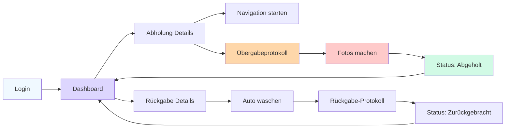

# Jockey Portal Wireframes - B2C Autowartungs-App

**Version:** 1.0
**Datum:** 2026-02-01
**Status:** Design Specification Ready for Implementation

---

## Inhaltsverzeichnis

1. [Jockey Journey Overview](#jockey-journey-overview)
2. [Screen 1: Login](#screen-1-login)
3. [Screen 2: Dashboard - Touren Übersicht](#screen-2-dashboard---touren-übersicht)
4. [Screen 3: Abholung Details](#screen-3-abholung-details)
5. [Screen 4: Übergabeprotokoll](#screen-4-übergabeprotokoll)
6. [Screen 5: Fotodokumentation](#screen-5-fotodokumentation)
7. [Screen 6: Status-Update](#screen-6-status-update)
8. [Screen 7: Rückgabe Checkliste](#screen-7-rückgabe-checkliste)

---

## Jockey Journey Overview



### Key Design Principles
- **Mobile-First**: Jockeys arbeiten ausschließlich mit Smartphones
- **Large Touch Targets**: Minimum 56x56px (größer als Standard 44px) für Handschuh-Bedienung
- **Quick Access**: Wichtigste Aktionen sofort erreichbar
- **Offline-Capable**: Formulare funktionieren auch ohne Internet (Post-MVP)
- **Photo-Optimized**: Kamera-Integration als Hauptfeature

---

## Screen 1: Login

### Purpose
Simple username/password authentication for drivers.

### Layout (Mobile 375px)

```
+----------------------------------+
|                                  |
|          [Logo: AutoCare]        |
|                                  |
|         FAHRER-LOGIN             |
|                                  |
| +-----------------------------+  |
| | Benutzername                |  |
| | [                    ]      |  |
| +-----------------------------+  |
|                                  |
| +-----------------------------+  |
| | Passwort                    |  |
| | [                    ] 👁   |  |
| +-----------------------------+  |
|                                  |
| ☑️ Angemeldet bleiben           |
|                                  |
| [ANMELDEN]                       |
|                                  |
| Passwort vergessen?              |
|                                  |
| +-----------------------------+  |
| | ℹ️ Neu als Fahrer?          |  |
| | Kontaktiere deinen Manager  |  |
| +-----------------------------+  |
|                                  |
+----------------------------------+
```

### Login Component

```jsx
const JockeyLogin = () => {
  const [username, setUsername] = useState('');
  const [password, setPassword] = useState('');
  const [showPassword, setShowPassword] = useState(false);
  const [rememberMe, setRememberMe] = useState(false);
  const [loading, setLoading] = useState(false);

  const handleLogin = async (e) => {
    e.preventDefault();
    setLoading(true);

    try {
      const response = await fetch('/api/auth/jockey-login', {
        method: 'POST',
        headers: { 'Content-Type': 'application/json' },
        body: JSON.stringify({ username, password, rememberMe })
      });

      if (response.ok) {
        const data = await response.json();
        localStorage.setItem('jockey_token', data.token);
        window.location.href = '/jockey/dashboard';
      } else {
        // Show error
        alert('Login fehlgeschlagen. Bitte prüfen Sie Ihre Zugangsdaten.');
      }
    } catch (error) {
      console.error('Login error:', error);
    } finally {
      setLoading(false);
    }
  };

  return (
    <div className="min-h-screen bg-gradient-to-br from-gray-100 to-gray-200 flex items-center justify-center px-4">
      <div className="w-full max-w-md">

        {/* Logo */}
        <div className="text-center mb-8">
          
          <h1 className="text-2xl font-bold text-gray-900">
            Fahrer-Login
          </h1>
        </div>

        {/* Login Form */}
        <form onSubmit={handleLogin} className="bg-white rounded-2xl shadow-xl p-8">

          {/* Username */}
          <div className="mb-6">
            <label className="block text-sm font-semibold text-gray-900 mb-2">
              Benutzername
            </label>
            <input
              type="text"
              value={username}
              onChange={(e) => setUsername(e.target.value)}
              required
              autoComplete="username"
              placeholder="fahrer123"
              className="w-full px-4 py-4 text-lg border-2 border-gray-300 rounded-xl focus:border-primary-500 focus:ring-4 focus:ring-primary-200 transition-all"
            />
          </div>

          {/* Password */}
          <div className="mb-6">
            <label className="block text-sm font-semibold text-gray-900 mb-2">
              Passwort
            </label>
            <div className="relative">
              <input
                type={showPassword ? 'text' : 'password'}
                value={password}
                onChange={(e) => setPassword(e.target.value)}
                required
                autoComplete="current-password"
                placeholder="••••••••"
                className="w-full px-4 py-4 pr-12 text-lg border-2 border-gray-300 rounded-xl focus:border-primary-500 focus:ring-4 focus:ring-primary-200 transition-all"
              />
              <button
                type="button"
                onClick={() => setShowPassword(!showPassword)}
                className="absolute right-4 top-4 text-gray-500 hover:text-gray-700"
              >
                {showPassword ? '👁' : '👁‍🗨'}
              </button>
            </div>
          </div>

          {/* Remember Me */}
          <label className="flex items-center gap-3 mb-6 cursor-pointer">
            <input
              type="checkbox"
              checked={rememberMe}
              onChange={(e) => setRememberMe(e.target.checked)}
              className="w-6 h-6 rounded border-gray-300 text-primary-600 focus:ring-primary-500"
            />
            <span className="text-sm text-gray-700">Angemeldet bleiben</span>
          </label>

          {/* Submit Button */}
          <button
            type="submit"
            disabled={loading}
            className="w-full bg-primary-600 hover:bg-primary-700 text-white font-bold py-4 px-6 rounded-xl shadow-lg hover:shadow-xl transition-all disabled:opacity-50 disabled:cursor-not-allowed"
          >
            {loading ? 'Anmeldung läuft...' : 'ANMELDEN'}
          </button>

          {/* Forgot Password */}
          <div className="mt-6 text-center">
            <a href="/jockey/forgot-password" className="text-primary-600 hover:text-primary-700 text-sm font-medium">
              Passwort vergessen?
            </a>
          </div>

        </form>

        {/* Info Box */}
        <div className="mt-6 bg-blue-50 border border-blue-200 rounded-xl p-4">
          <p className="text-sm text-blue-900 flex items-start gap-2">
            <svg className="w-5 h-5 flex-shrink-0 mt-0.5" /* info icon */ />
            <span>
              <strong>Neu als Fahrer?</strong><br />
              Kontaktiere deinen Manager für Zugangsdaten.
            </span>
          </p>
        </div>

      </div>
    </div>
  );
};
```

---

## Screen 2: Dashboard - Touren Übersicht

### Purpose
Overview of today's pickups and returns, sorted by time.

### Layout (Mobile 375px)

```
+----------------------------------+
| [☰] Touren      Heute  [🔔] [👤]|
+----------------------------------+
|                                  |
| Hallo, Michael! 👋               |
| Heute: 6 Abholungen, 4 Rückgaben|
|                                  |
| 📋 ABHOLUNGEN                    |
|                                  |
| +-----------------------------+  |
| | 🔴 08:00 - 10:00 DRINGEND   |  |
| |                             |  |
| | Max Mustermann              |  |
| | VW Golf (2018)              |  |
| | Hauptstraße 123, Witten     |  |
| |                             |  |
| | [NAVIGATION] [DETAILS]      |  |
| +-----------------------------+  |
|                                  |
| +-----------------------------+  |
| | ○  10:00 - 12:00            |  |
| |                             |  |
| | Lisa Schmidt                |  |
| | BMW 3er (2020)              |  |
| | Berliner Str. 45, Witten    |  |
| |                             |  |
| | [NAVIGATION] [DETAILS]      |  |
| +-----------------------------+  |
|                                  |
| +-----------------------------+  |
| | ○  14:00 - 16:00            |  |
| |                             |  |
| | Thomas Becker               |  |
| | Mercedes C-Klasse (2019)    |  |
| | Dortmunder Weg 12, Witten   |  |
| |                             |  |
| | [NAVIGATION] [DETAILS]      |  |
| +-----------------------------+  |
|                                  |
| 🚗 RÜCKGABEN                     |
|                                  |
| +-----------------------------+  |
| | ✅ 16:00 - 18:00            |  |
| |                             |  |
| | Anna Weber                  |  |
| | Audi A4 (2017)              |  |
| | Service abgeschlossen       |  |
| |                             |  |
| | [NAVIGATION] [DETAILS]      |  |
| +-----------------------------+  |
|                                  |
| [+ NOTFALL-ABHOLUNG]            |
|                                  |
+----------------------------------+
```

### Dashboard Component

```jsx
const JockeyDashboard = () => {
  const [pickups, setPickups] = useState([]);
  const [returns, setReturns] = useState([]);
  const [currentTime, setCurrentTime] = useState(new Date());

  useEffect(() => {
    // Fetch today's tours
    fetchTodaysTours();

    // Update time every minute
    const interval = setInterval(() => {
      setCurrentTime(new Date());
    }, 60000);

    return () => clearInterval(interval);
  }, []);

  const isUrgent = (timeSlot) => {
    const now = new Date();
    const slotStart = parseTimeSlot(timeSlot).start;
    const diff = (slotStart - now) / (1000 * 60); // Minutes difference
    return diff <= 30 && diff >= 0; // Urgent if within 30 min
  };

  return (
    <div className="min-h-screen bg-gray-50">

      {/* Header */}
      <header className="bg-white border-b border-gray-200 sticky top-0 z-50">
        <div className="px-4 py-4">
          <div className="flex justify-between items-center">
            <div className="flex items-center gap-4">
              <button className="p-2 hover:bg-gray-100 rounded-lg">
                <svg className="w-6 h-6" /* menu icon */ />
              </button>
              <div>
                <h1 className="font-bold text-gray-900">Touren</h1>
                <p className="text-sm text-gray-600">Heute, {formatDate(currentTime)}</p>
              </div>
            </div>
            <div className="flex items-center gap-3">
              <button className="relative p-2 hover:bg-gray-100 rounded-lg">
                <svg className="w-6 h-6" /* bell icon */ />
                <span className="absolute top-1 right-1 w-2 h-2 bg-red-500 rounded-full" />
              </button>
              <button className="w-10 h-10 bg-gray-200 rounded-full flex items-center justify-center">
                👤
              </button>
            </div>
          </div>
        </div>
      </header>

      {/* Main Content */}
      <main className="px-4 py-6">

        {/* Welcome */}
        <div className="mb-6">
          <h2 className="text-2xl font-bold text-gray-900 mb-1">
            Hallo, Michael! 👋
          </h2>
          <p className="text-gray-600">
            Heute: {pickups.length} Abholungen, {returns.length} Rückgaben
          </p>
        </div>

        {/* Pickups Section */}
        <div className="mb-8">
          <h3 className="font-bold text-gray-900 mb-4 flex items-center gap-2">
            📋 ABHOLUNGEN
          </h3>
          <div className="space-y-4">
            {pickups.map((pickup) => (
              <PickupCard
                key={pickup.id}
                pickup={pickup}
                isUrgent={isUrgent(pickup.timeSlot)}
              />
            ))}
          </div>
        </div>

        {/* Returns Section */}
        <div className="mb-8">
          <h3 className="font-bold text-gray-900 mb-4 flex items-center gap-2">
            🚗 RÜCKGABEN
          </h3>
          <div className="space-y-4">
            {returns.map((returnJob) => (
              <ReturnCard key={returnJob.id} returnJob={returnJob} />
            ))}
          </div>
        </div>

        {/* Emergency Pickup Button */}
        <button className="w-full bg-red-600 hover:bg-red-700 text-white font-bold py-4 px-6 rounded-xl shadow-lg flex items-center justify-center gap-2">
          <span className="text-xl">+</span>
          NOTFALL-ABHOLUNG
        </button>

      </main>

    </div>
  );
};
```

### Pickup Card Component

```jsx
const PickupCard = ({ pickup, isUrgent }) => {
  return (
    <div className={`
      bg-white rounded-xl border-2 p-5 shadow-md
      ${isUrgent ? 'border-red-500 bg-red-50' : 'border-gray-300'}
    `}>

      {/* Time Slot Header */}
      <div className="flex items-center justify-between mb-3">
        <div className="flex items-center gap-2">
          <div className={`w-3 h-3 rounded-full ${pickup.status === 'pending' ? 'bg-yellow-400' : 'bg-gray-300'}`} />
          <span className="font-bold text-gray-900">
            {pickup.timeSlot}
          </span>
        </div>
        {isUrgent && (
          <span className="bg-red-600 text-white text-xs font-bold px-3 py-1 rounded-full">
            DRINGEND
          </span>
        )}
      </div>

      {/* Customer Info */}
      <div className="mb-3">
        <h4 className="font-bold text-lg text-gray-900 mb-1">
          {pickup.customerName}
        </h4>
        <p className="text-gray-700 text-sm mb-1">
          {pickup.vehicleMake} {pickup.vehicleModel} ({pickup.vehicleYear})
        </p>
        <p className="text-gray-600 text-sm flex items-start gap-2">
          <svg className="w-4 h-4 flex-shrink-0 mt-0.5" /* location icon */ />
          {pickup.address}
        </p>
      </div>

      {/* Service Type */}
      <div className="mb-4">
        <span className="inline-block bg-blue-100 text-blue-800 text-xs font-semibold px-3 py-1 rounded-full">
          {pickup.serviceType}
        </span>
      </div>

      {/* Action Buttons */}
      <div className="grid grid-cols-2 gap-3">
        <button
          onClick={() => openNavigation(pickup.address)}
          className="bg-primary-600 hover:bg-primary-700 text-white font-semibold py-3 px-4 rounded-xl flex items-center justify-center gap-2"
        >
          <svg className="w-5 h-5" /* navigation icon */ />
          Navigation
        </button>
        <button
          onClick={() => openDetails(pickup.id)}
          className="bg-white hover:bg-gray-50 border-2 border-gray-300 text-gray-900 font-semibold py-3 px-4 rounded-xl"
        >
          Details
        </button>
      </div>

      {/* Customer Phone (Quick Action) */}
      <a
        href={`tel:${pickup.customerPhone}`}
        className="mt-3 w-full flex items-center justify-center gap-2 text-primary-600 hover:text-primary-700 font-medium text-sm py-2"
      >
        <svg className="w-4 h-4" /* phone icon */ />
        Kunde anrufen: {pickup.customerPhone}
      </a>

    </div>
  );
};
```

### Return Card Component

```jsx
const ReturnCard = ({ returnJob }) => {
  return (
    <div className="bg-white rounded-xl border-2 border-gray-300 p-5 shadow-md">

      {/* Time Slot Header */}
      <div className="flex items-center justify-between mb-3">
        <div className="flex items-center gap-2">
          <div className="w-3 h-3 rounded-full bg-green-500" />
          <span className="font-bold text-gray-900">
            {returnJob.timeSlot}
          </span>
        </div>
        <span className="bg-green-100 text-green-800 text-xs font-semibold px-3 py-1 rounded-full">
          ✅ Fertig
        </span>
      </div>

      {/* Customer Info */}
      <div className="mb-4">
        <h4 className="font-bold text-lg text-gray-900 mb-1">
          {returnJob.customerName}
        </h4>
        <p className="text-gray-700 text-sm mb-1">
          {returnJob.vehicleMake} {returnJob.vehicleModel} ({returnJob.vehicleYear})
        </p>
        <p className="text-gray-600 text-sm flex items-start gap-2">
          <svg className="w-4 h-4 flex-shrink-0 mt-0.5" /* location icon */ />
          {returnJob.address}
        </p>
        <p className="text-sm text-green-700 mt-2">
          ✓ Service abgeschlossen
        </p>
      </div>

      {/* Action Buttons */}
      <div className="grid grid-cols-2 gap-3">
        <button
          onClick={() => openNavigation(returnJob.address)}
          className="bg-primary-600 hover:bg-primary-700 text-white font-semibold py-3 px-4 rounded-xl flex items-center justify-center gap-2"
        >
          <svg className="w-5 h-5" /* navigation icon */ />
          Navigation
        </button>
        <button
          onClick={() => openDetails(returnJob.id)}
          className="bg-white hover:bg-gray-50 border-2 border-gray-300 text-gray-900 font-semibold py-3 px-4 rounded-xl"
        >
          Details
        </button>
      </div>

    </div>
  );
};
```

---

## Screen 3: Abholung Details

### Purpose
Detailed view of pickup job with customer info, vehicle data, and action buttons.

### Layout (Mobile 375px)

```
+----------------------------------+
| [←] Abholung Details        [☰] |
+----------------------------------+
|                                  |
| 📅 DI, 15. FEB • 08:00-10:00    |
|                                  |
| +-----------------------------+  |
| | 👤 KUNDE                    |  |
| |                             |  |
| | Max Mustermann              |  |
| | 📱 0172 1234567             |  |
| | [ANRUFEN]                   |  |
| +-----------------------------+  |
|                                  |
| +-----------------------------+  |
| | 📍 ABHOLADRESSE             |  |
| |                             |  |
| | Hauptstraße 123             |  |
| | 58453 Witten                |  |
| |                             |  |
| | [NAVIGATION STARTEN]        |  |
| +-----------------------------+  |
|                                  |
| +-----------------------------+  |
| | 🚗 FAHRZEUG                 |  |
| |                             |  |
| | VW Golf                     |  |
| | Baujahr: 2018               |  |
| | Farbe: Silber               |  |
| | Kennzeichen: WIT-AB 1234    |  |
| +-----------------------------+  |
|                                  |
| +-----------------------------+  |
| | 🔧 SERVICE                  |  |
| |                             |  |
| | Inspektion/Wartung          |  |
| | 60.000 km                   |  |
| +-----------------------------+  |
|                                  |
| +-----------------------------+  |
| | 📝 NOTIZEN                  |  |
| |                             |  |
| | Kunde hat Garage, bitte     |  |
| | klingeln.                   |  |
| +-----------------------------+  |
|                                  |
| [ÜBERGABE STARTEN]              |
|                                  |
+----------------------------------+
```

### Details Component

```jsx
const PickupDetails = ({ pickupId }) => {
  const [pickup, setPickup] = useState(null);

  useEffect(() => {
    fetchPickupDetails(pickupId);
  }, [pickupId]);

  if (!pickup) return <LoadingSpinner />;

  return (
    <div className="min-h-screen bg-gray-50">

      {/* Header */}
      <header className="bg-white border-b border-gray-200 sticky top-0 z-50">
        <div className="px-4 py-4 flex items-center justify-between">
          <button onClick={() => window.history.back()} className="p-2 hover:bg-gray-100 rounded-lg">
            <svg className="w-6 h-6" /* back arrow */ />
          </button>
          <h1 className="font-bold text-gray-900">Abholung Details</h1>
          <button className="p-2 hover:bg-gray-100 rounded-lg">
            <svg className="w-6 h-6" /* menu icon */ />
          </button>
        </div>
      </header>

      {/* Main Content */}
      <main className="px-4 py-6">

        {/* Time Slot */}
        <div className="mb-6 text-center">
          <p className="text-lg font-bold text-gray-900">
            📅 {formatDate(pickup.date)} • {pickup.timeSlot}
          </p>
        </div>

        {/* Customer Info */}
        <div className="bg-white rounded-xl border-2 border-gray-300 p-6 mb-4 shadow-md">
          <h3 className="font-bold text-gray-900 mb-4 flex items-center gap-2">
            👤 KUNDE
          </h3>
          <div className="space-y-3 mb-4">
            <p className="text-lg font-semibold text-gray-900">
              {pickup.customerName}
            </p>
            <a
              href={`tel:${pickup.customerPhone}`}
              className="flex items-center gap-2 text-gray-700"
            >
              <svg className="w-5 h-5" /* phone icon */ />
              {pickup.customerPhone}
            </a>
            {pickup.customerEmail && (
              <a
                href={`mailto:${pickup.customerEmail}`}
                className="flex items-center gap-2 text-gray-700 text-sm"
              >
                <svg className="w-5 h-5" /* email icon */ />
                {pickup.customerEmail}
              </a>
            )}
          </div>
          <button
            onClick={() => window.location.href = `tel:${pickup.customerPhone}`}
            className="w-full bg-primary-600 hover:bg-primary-700 text-white font-semibold py-3 px-4 rounded-xl flex items-center justify-center gap-2"
          >
            <svg className="w-5 h-5" /* phone icon */ />
            ANRUFEN
          </button>
        </div>

        {/* Address */}
        <div className="bg-white rounded-xl border-2 border-gray-300 p-6 mb-4 shadow-md">
          <h3 className="font-bold text-gray-900 mb-4 flex items-center gap-2">
            📍 ABHOLADRESSE
          </h3>
          <div className="mb-4">
            <p className="text-gray-900 font-medium">{pickup.street}</p>
            <p className="text-gray-700">{pickup.zip} {pickup.city}</p>
          </div>
          <button
            onClick={() => openNavigation(pickup.fullAddress)}
            className="w-full bg-green-600 hover:bg-green-700 text-white font-semibold py-3 px-4 rounded-xl flex items-center justify-center gap-2"
          >
            <svg className="w-5 h-5" /* navigation icon */ />
            NAVIGATION STARTEN
          </button>
        </div>

        {/* Vehicle Info */}
        <div className="bg-white rounded-xl border-2 border-gray-300 p-6 mb-4 shadow-md">
          <h3 className="font-bold text-gray-900 mb-4 flex items-center gap-2">
            🚗 FAHRZEUG
          </h3>
          <div className="space-y-2">
            <div className="flex justify-between">
              <span className="text-gray-600">Marke & Modell:</span>
              <span className="font-semibold text-gray-900">
                {pickup.vehicleMake} {pickup.vehicleModel}
              </span>
            </div>
            <div className="flex justify-between">
              <span className="text-gray-600">Baujahr:</span>
              <span className="font-semibold text-gray-900">{pickup.vehicleYear}</span>
            </div>
            <div className="flex justify-between">
              <span className="text-gray-600">Farbe:</span>
              <span className="font-semibold text-gray-900">{pickup.vehicleColor || 'Silber'}</span>
            </div>
            {pickup.licensePlate && (
              <div className="flex justify-between">
                <span className="text-gray-600">Kennzeichen:</span>
                <span className="font-mono font-bold text-gray-900">
                  {pickup.licensePlate}
                </span>
              </div>
            )}
          </div>
        </div>

        {/* Service Info */}
        <div className="bg-white rounded-xl border-2 border-gray-300 p-6 mb-4 shadow-md">
          <h3 className="font-bold text-gray-900 mb-4 flex items-center gap-2">
            🔧 SERVICE
          </h3>
          <div className="space-y-2">
            <p className="font-semibold text-gray-900">{pickup.serviceType}</p>
            <p className="text-gray-700 text-sm">{pickup.serviceDetails}</p>
          </div>
        </div>

        {/* Notes */}
        {pickup.notes && (
          <div className="bg-yellow-50 border-2 border-yellow-300 rounded-xl p-6 mb-6">
            <h3 className="font-bold text-yellow-900 mb-2 flex items-center gap-2">
              📝 WICHTIGE NOTIZEN
            </h3>
            <p className="text-yellow-800">{pickup.notes}</p>
          </div>
        )}

        {/* Start Handover Button */}
        <button
          onClick={() => window.location.href = `/jockey/handover/${pickupId}`}
          className="w-full bg-blue-600 hover:bg-blue-700 text-white font-bold py-5 px-6 rounded-xl shadow-lg text-lg"
        >
          ÜBERGABE STARTEN
        </button>

      </main>

    </div>
  );
};
```

### Navigation Helper Functions

```javascript
// Open native navigation app
const openNavigation = (address) => {
  const encodedAddress = encodeURIComponent(address);

  // Detect platform
  const isIOS = /iPad|iPhone|iPod/.test(navigator.userAgent);
  const isAndroid = /Android/.test(navigator.userAgent);

  if (isIOS) {
    // Try Apple Maps first, fallback to Google Maps
    window.location.href = `maps://maps.apple.com/?q=${encodedAddress}`;
    setTimeout(() => {
      window.location.href = `https://www.google.com/maps/dir/?api=1&destination=${encodedAddress}`;
    }, 500);
  } else if (isAndroid) {
    // Google Maps intent for Android
    window.location.href = `google.navigation:q=${encodedAddress}`;
  } else {
    // Desktop/Web fallback
    window.open(`https://www.google.com/maps/dir/?api=1&destination=${encodedAddress}`, '_blank');
  }
};
```

---

## Screen 4: Übergabeprotokoll

### Purpose
Digital handover checklist documenting vehicle condition before pickup.

### Layout (Mobile 375px)

```
+----------------------------------+
| [←] Übergabe • Max Mustermann   |
+----------------------------------+
|                                  |
| VW Golf (2018)                   |
| Schritt 1 von 3: Übergabe        |
|                                  |
| FAHRZEUGZUSTAND                  |
|                                  |
| +-----------------------------+  |
| | ☑️ Außenprüfung durchgeführt|  |
| +-----------------------------+  |
|                                  |
| Schäden vorhanden?               |
| ⭕ Nein, alles in Ordnung        |
| ○  Ja, Schäden vorhanden         |
|                                  |
| +-----------------------------+  |
| | Tankfüllung:                |  |
| | [████████░░] 80%            |  |
| +-----------------------------+  |
|                                  |
| +-----------------------------+  |
| | Kilometerstand:             |  |
| | [85.234] km                 |  |
| +-----------------------------+  |
|                                  |
| FAHRZEUGSCHLÜSSEL                |
| ☑️ Anzahl Schlüssel: 2           |
|                                  |
| WERTGEGENSTÄNDE                  |
| ☑️ Keine Wertgegenstände im Auto |
|                                  |
| +-----------------------------+  |
| | Besondere Hinweise:         |  |
| | [                    ]      |  |
| | (optional)                  |  |
| +-----------------------------+  |
|                                  |
| [WEITER ZU FOTOS →]             |
|                                  |
+----------------------------------+
```

### Übergabeprotokoll Component

```jsx
const HandoverProtocol = ({ pickupId }) => {
  const [formData, setFormData] = useState({
    exteriorChecked: false,
    damagesPresent: false,
    fuelLevel: 80,
    mileage: '',
    keyCount: 2,
    valuablesRemoved: false,
    notes: ''
  });

  const [errors, setErrors] = useState({});

  const validateForm = () => {
    const newErrors = {};

    if (!formData.exteriorChecked) {
      newErrors.exteriorChecked = 'Bitte Außenprüfung durchführen';
    }

    if (!formData.mileage || formData.mileage < 0) {
      newErrors.mileage = 'Bitte gültigen Kilometerstand eingeben';
    }

    if (!formData.valuablesRemoved) {
      newErrors.valuablesRemoved = 'Bitte bestätigen, dass keine Wertgegenstände im Auto sind';
    }

    setErrors(newErrors);
    return Object.keys(newErrors).length === 0;
  };

  const handleSubmit = () => {
    if (validateForm()) {
      // Save to local storage
      localStorage.setItem(`handover_${pickupId}`, JSON.stringify(formData));
      // Navigate to photo step
      window.location.href = `/jockey/handover/${pickupId}/photos`;
    }
  };

  return (
    <div className="min-h-screen bg-gray-50">

      {/* Header */}
      <header className="bg-white border-b border-gray-200 sticky top-0 z-50">
        <div className="px-4 py-4 flex items-center gap-4">
          <button onClick={() => window.history.back()} className="p-2 hover:bg-gray-100 rounded-lg">
            <svg className="w-6 h-6" /* back arrow */ />
          </button>
          <div>
            <h1 className="font-bold text-gray-900">Übergabe</h1>
            <p className="text-sm text-gray-600">Max Mustermann</p>
          </div>
        </div>
      </header>

      {/* Progress */}
      <div className="bg-white border-b border-gray-200 px-4 py-3">
        <p className="text-sm text-gray-600 mb-2">Schritt 1 von 3: Übergabeprotokoll</p>
        <div className="w-full bg-gray-200 rounded-full h-2">
          <div className="bg-primary-600 h-2 rounded-full" style={{width: '33%'}} />
        </div>
      </div>

      {/* Main Content */}
      <main className="px-4 py-6">

        <p className="text-lg font-bold text-gray-900 mb-6">
          🚗 VW Golf (2018)
        </p>

        {/* Exterior Check */}
        <div className="bg-white rounded-xl border-2 border-gray-300 p-6 mb-4 shadow-md">
          <h3 className="font-bold text-gray-900 mb-4">FAHRZEUGZUSTAND</h3>

          <label className="flex items-start gap-3 mb-4 cursor-pointer">
            <input
              type="checkbox"
              checked={formData.exteriorChecked}
              onChange={(e) => setFormData({...formData, exteriorChecked: e.target.checked})}
              className="w-6 h-6 mt-0.5 rounded border-gray-300 text-primary-600 focus:ring-primary-500"
            />
            <span className="text-gray-900 font-medium">
              Außenprüfung durchgeführt (Rundgang ums Auto)
            </span>
          </label>

          {errors.exteriorChecked && (
            <p className="text-red-600 text-sm mb-4">{errors.exteriorChecked}</p>
          )}

          {/* Damages */}
          <div className="mb-4">
            <p className="font-semibold text-gray-900 mb-3">
              Schäden vorhanden?
            </p>
            <div className="space-y-2">
              <label className="flex items-center gap-3 cursor-pointer">
                <input
                  type="radio"
                  name="damages"
                  checked={!formData.damagesPresent}
                  onChange={() => setFormData({...formData, damagesPresent: false})}
                  className="w-6 h-6 border-gray-300 text-primary-600 focus:ring-primary-500"
                />
                <span className="text-gray-900">Nein, alles in Ordnung</span>
              </label>
              <label className="flex items-center gap-3 cursor-pointer">
                <input
                  type="radio"
                  name="damages"
                  checked={formData.damagesPresent}
                  onChange={() => setFormData({...formData, damagesPresent: true})}
                  className="w-6 h-6 border-gray-300 text-primary-600 focus:ring-primary-500"
                />
                <span className="text-gray-900">Ja, Schäden vorhanden</span>
              </label>
            </div>
          </div>

          {formData.damagesPresent && (
            <div className="bg-yellow-50 border border-yellow-300 rounded-lg p-4">
              <p className="text-yellow-900 text-sm font-semibold mb-2">
                ⚠️ Bitte Schäden im nächsten Schritt fotografieren
              </p>
            </div>
          )}
        </div>

        {/* Fuel Level */}
        <div className="bg-white rounded-xl border-2 border-gray-300 p-6 mb-4 shadow-md">
          <h3 className="font-bold text-gray-900 mb-4">TANKFÜLLUNG</h3>
          <div className="mb-2">
            <div className="flex items-center justify-between mb-2">
              <span className="text-gray-700">Aktueller Stand:</span>
              <span className="font-bold text-xl text-gray-900">{formData.fuelLevel}%</span>
            </div>
            <input
              type="range"
              min="0"
              max="100"
              step="10"
              value={formData.fuelLevel}
              onChange={(e) => setFormData({...formData, fuelLevel: parseInt(e.target.value)})}
              className="w-full h-3 bg-gray-200 rounded-lg appearance-none cursor-pointer accent-primary-600"
            />
            <div className="flex justify-between text-xs text-gray-500 mt-1">
              <span>Leer</span>
              <span>Voll</span>
            </div>
          </div>
        </div>

        {/* Mileage */}
        <div className="bg-white rounded-xl border-2 border-gray-300 p-6 mb-4 shadow-md">
          <h3 className="font-bold text-gray-900 mb-4">KILOMETERSTAND</h3>
          <div className="relative">
            <input
              type="number"
              value={formData.mileage}
              onChange={(e) => setFormData({...formData, mileage: e.target.value})}
              placeholder="85234"
              className="w-full px-4 py-4 pr-12 text-lg border-2 border-gray-300 rounded-xl focus:border-primary-500 focus:ring-4 focus:ring-primary-200"
            />
            <span className="absolute right-4 top-4 text-gray-500 font-medium">
              km
            </span>
          </div>
          {errors.mileage && (
            <p className="text-red-600 text-sm mt-2">{errors.mileage}</p>
          )}
        </div>

        {/* Keys */}
        <div className="bg-white rounded-xl border-2 border-gray-300 p-6 mb-4 shadow-md">
          <h3 className="font-bold text-gray-900 mb-4">FAHRZEUGSCHLÜSSEL</h3>
          <div className="flex items-center gap-4">
            <span className="text-gray-700">Anzahl Schlüssel:</span>
            <div className="flex gap-2">
              {[1, 2, 3].map(num => (
                <button
                  key={num}
                  onClick={() => setFormData({...formData, keyCount: num})}
                  className={`w-12 h-12 rounded-lg border-2 font-bold transition-all ${
                    formData.keyCount === num
                      ? 'border-primary-600 bg-primary-50 text-primary-700'
                      : 'border-gray-300 bg-white text-gray-600'
                  }`}
                >
                  {num}
                </button>
              ))}
            </div>
          </div>
        </div>

        {/* Valuables */}
        <div className="bg-white rounded-xl border-2 border-gray-300 p-6 mb-4 shadow-md">
          <h3 className="font-bold text-gray-900 mb-4">WERTGEGENSTÄNDE</h3>
          <label className="flex items-start gap-3 cursor-pointer">
            <input
              type="checkbox"
              checked={formData.valuablesRemoved}
              onChange={(e) => setFormData({...formData, valuablesRemoved: e.target.checked})}
              className="w-6 h-6 mt-0.5 rounded border-gray-300 text-primary-600 focus:ring-primary-500"
            />
            <span className="text-gray-900 font-medium">
              Keine Wertgegenstände im Auto (Kunde wurde informiert)
            </span>
          </label>
          {errors.valuablesRemoved && (
            <p className="text-red-600 text-sm mt-2">{errors.valuablesRemoved}</p>
          )}
        </div>

        {/* Notes */}
        <div className="bg-white rounded-xl border-2 border-gray-300 p-6 mb-6 shadow-md">
          <h3 className="font-bold text-gray-900 mb-4">BESONDERE HINWEISE</h3>
          <textarea
            value={formData.notes}
            onChange={(e) => setFormData({...formData, notes: e.target.value})}
            placeholder="z.B. Kratzer an Stoßstange, Warnleuchte aktiv, etc. (optional)"
            rows={4}
            className="w-full px-4 py-3 border-2 border-gray-300 rounded-xl focus:border-primary-500 focus:ring-4 focus:ring-primary-200 resize-none"
          />
        </div>

        {/* Submit Button */}
        <button
          onClick={handleSubmit}
          className="w-full bg-primary-600 hover:bg-primary-700 text-white font-bold py-5 px-6 rounded-xl shadow-lg text-lg"
        >
          WEITER ZU FOTOS →
        </button>

      </main>

    </div>
  );
};
```

---

## Screen 5: Fotodokumentation

### Purpose
Capture photos of vehicle condition and license plate.

### Layout (Mobile 375px)

```
+----------------------------------+
| [←] Fotos • Max Mustermann      |
+----------------------------------+
|                                  |
| Schritt 2 von 3: Fotodokumentation|
| ████████░░░░░ 66%                |
|                                  |
| FAHRZEUGFOTOS                    |
|                                  |
| +-----------------------------+  |
| | 📷 VORNE                    |  |
| | [Foto aufnehmen]            |  |
| | ✅ Foto gespeichert         |  |
| +-----------------------------+  |
|                                  |
| +-----------------------------+  |
| | 📷 HINTEN                   |  |
| | [Foto aufnehmen]            |  |
| | ✅ Foto gespeichert         |  |
| +-----------------------------+  |
|                                  |
| +-----------------------------+  |
| | 📷 LINKE SEITE              |  |
| | [Foto aufnehmen]            |  |
| +-----------------------------+  |
|                                  |
| +-----------------------------+  |
| | 📷 RECHTE SEITE             |  |
| | [Foto aufnehmen]            |  |
| +-----------------------------+  |
|                                  |
| KENNZEICHEN                      |
| +-----------------------------+  |
| | 📷 FAHRZEUGSCHEIN           |  |
| | [Foto aufnehmen]            |  |
| | (optional für Wiederkunden) |  |
| +-----------------------------+  |
|                                  |
| SCHÄDEN (Falls vorhanden)        |
| +-----------------------------+  |
| | 📷 SCHADEN 1                |  |
| | [Foto aufnehmen]            |  |
| +-----------------------------+  |
|                                  |
| [+ WEITEREN SCHADEN]            |
|                                  |
| [WEITER ZUM ABSCHLUSS →]        |
|                                  |
+----------------------------------+
```

### Photo Documentation Component

```jsx
const PhotoDocumentation = ({ pickupId }) => {
  const [photos, setPhotos] = useState({
    front: null,
    back: null,
    left: null,
    right: null,
    licensePlate: null,
    damages: []
  });

  const [currentCapture, setCurrentCapture] = useState(null);
  const fileInputRef = useRef(null);

  const capturePhoto = async (type) => {
    setCurrentCapture(type);

    // Check if device has camera
    if ('mediaDevices' in navigator && 'getUserMedia' in navigator.mediaDevices) {
      try {
        // Open camera (handled by file input with camera capture)
        fileInputRef.current.click();
      } catch (error) {
        console.error('Camera error:', error);
        alert('Kamera konnte nicht geöffnet werden');
      }
    } else {
      // Fallback for devices without camera
      fileInputRef.current.click();
    }
  };

  const handleFileSelect = (e) => {
    const file = e.target.files[0];
    if (!file) return;

    // Compress and save photo
    compressImage(file).then(compressedFile => {
      if (currentCapture === 'damage') {
        setPhotos({
          ...photos,
          damages: [...photos.damages, compressedFile]
        });
      } else {
        setPhotos({
          ...photos,
          [currentCapture]: compressedFile
        });
      }
    });
  };

  const handleSubmit = () => {
    // Check if required photos are taken
    if (!photos.front || !photos.back || !photos.left || !photos.right) {
      alert('Bitte alle Pflichtfotos aufnehmen (Vorne, Hinten, Links, Rechts)');
      return;
    }

    // Save photos to local storage or upload
    savePhotos(pickupId, photos);

    // Navigate to confirmation
    window.location.href = `/jockey/handover/${pickupId}/confirm`;
  };

  return (
    <div className="min-h-screen bg-gray-50">

      {/* Header */}
      <header className="bg-white border-b border-gray-200 sticky top-0 z-50">
        <div className="px-4 py-4 flex items-center gap-4">
          <button onClick={() => window.history.back()} className="p-2 hover:bg-gray-100 rounded-lg">
            <svg className="w-6 h-6" /* back arrow */ />
          </button>
          <div>
            <h1 className="font-bold text-gray-900">Fotos</h1>
            <p className="text-sm text-gray-600">Max Mustermann</p>
          </div>
        </div>
      </header>

      {/* Progress */}
      <div className="bg-white border-b border-gray-200 px-4 py-3">
        <p className="text-sm text-gray-600 mb-2">Schritt 2 von 3: Fotodokumentation</p>
        <div className="w-full bg-gray-200 rounded-full h-2">
          <div className="bg-primary-600 h-2 rounded-full" style={{width: '66%'}} />
        </div>
      </div>

      {/* Main Content */}
      <main className="px-4 py-6">

        <h2 className="text-lg font-bold text-gray-900 mb-6">FAHRZEUGFOTOS</h2>

        {/* Vehicle Photos */}
        <div className="space-y-4 mb-8">
          <PhotoCapture
            label="VORNE"
            type="front"
            photo={photos.front}
            onCapture={() => capturePhoto('front')}
            required
          />
          <PhotoCapture
            label="HINTEN"
            type="back"
            photo={photos.back}
            onCapture={() => capturePhoto('back')}
            required
          />
          <PhotoCapture
            label="LINKE SEITE"
            type="left"
            photo={photos.left}
            onCapture={() => capturePhoto('left')}
            required
          />
          <PhotoCapture
            label="RECHTE SEITE"
            type="right"
            photo={photos.right}
            onCapture={() => capturePhoto('right')}
            required
          />
        </div>

        {/* License Plate / Registration */}
        <h2 className="text-lg font-bold text-gray-900 mb-4">KENNZEICHEN</h2>
        <div className="mb-8">
          <PhotoCapture
            label="FAHRZEUGSCHEIN"
            type="licensePlate"
            photo={photos.licensePlate}
            onCapture={() => capturePhoto('licensePlate')}
            optional
            helperText="Optional: Für schnellere Wiederbuchung"
          />
        </div>

        {/* Damages */}
        <h2 className="text-lg font-bold text-gray-900 mb-4">SCHÄDEN (Falls vorhanden)</h2>
        <div className="space-y-4 mb-4">
          {photos.damages.map((damage, index) => (
            <PhotoCapture
              key={index}
              label={`SCHADEN ${index + 1}`}
              type={`damage-${index}`}
              photo={damage}
              onCapture={() => {}}
              onDelete={() => {
                const newDamages = photos.damages.filter((_, i) => i !== index);
                setPhotos({...photos, damages: newDamages});
              }}
            />
          ))}
        </div>

        <button
          onClick={() => capturePhoto('damage')}
          className="w-full bg-white hover:bg-gray-50 border-2 border-dashed border-gray-400 text-gray-700 font-semibold py-4 px-6 rounded-xl mb-8 flex items-center justify-center gap-2"
        >
          <span className="text-2xl">+</span>
          WEITEREN SCHADEN FOTOGRAFIEREN
        </button>

        {/* Submit Button */}
        <button
          onClick={handleSubmit}
          className="w-full bg-primary-600 hover:bg-primary-700 text-white font-bold py-5 px-6 rounded-xl shadow-lg text-lg"
        >
          WEITER ZUM ABSCHLUSS →
        </button>

      </main>

      {/* Hidden File Input */}
      <input
        ref={fileInputRef}
        type="file"
        accept="image/*"
        capture="environment"
        onChange={handleFileSelect}
        className="hidden"
      />

    </div>
  );
};
```

### Photo Capture Component

```jsx
const PhotoCapture = ({ label, type, photo, onCapture, onDelete, required, optional, helperText }) => {
  return (
    <div className={`bg-white rounded-xl border-2 ${required && !photo ? 'border-orange-400' : 'border-gray-300'} p-5 shadow-md`}>
      <div className="flex items-start justify-between mb-3">
        <div>
          <h4 className="font-bold text-gray-900 flex items-center gap-2">
            📷 {label}
            {required && <span className="text-red-600 text-sm">*</span>}
            {optional && <span className="text-gray-500 text-sm">(optional)</span>}
          </h4>
          {helperText && (
            <p className="text-xs text-gray-600 mt-1">{helperText}</p>
          )}
        </div>
        {photo && (
          <span className="text-green-600 font-semibold text-sm flex items-center gap-1">
            ✅ Gespeichert
          </span>
        )}
      </div>

      {photo ? (
        <div className="relative">
          
          <div className="absolute bottom-2 right-2 flex gap-2">
            <button
              onClick={onCapture}
              className="bg-white hover:bg-gray-100 border border-gray-300 text-gray-900 font-medium py-2 px-4 rounded-lg shadow"
            >
              Erneut aufnehmen
            </button>
            {onDelete && (
              <button
                onClick={onDelete}
                className="bg-red-600 hover:bg-red-700 text-white font-medium py-2 px-4 rounded-lg shadow"
              >
                Löschen
              </button>
            )}
          </div>
        </div>
      ) : (
        <button
          onClick={onCapture}
          className="w-full bg-primary-600 hover:bg-primary-700 text-white font-semibold py-4 px-6 rounded-xl flex items-center justify-center gap-2"
        >
          <svg className="w-6 h-6" /* camera icon */ />
          FOTO AUFNEHMEN
        </button>
      )}
    </div>
  );
};
```

---

## Screen 6: Status-Update

### Purpose
Confirm handover and update booking status to "picked up".

### Layout (Mobile 375px)

```
+----------------------------------+
| [←] Abschluss • Max Mustermann  |
+----------------------------------+
|                                  |
| Schritt 3 von 3: Abschluss       |
| ████████████████ 100%            |
|                                  |
| ZUSAMMENFASSUNG                  |
|                                  |
| +-----------------------------+  |
| | ✅ Übergabeprotokoll        |  |
| | ✅ 4 Fahrzeugfotos          |  |
| | ✅ Fahrzeugschein (optional)|  |
| +-----------------------------+  |
|                                  |
| ERSATZFAHRZEUG                   |
|                                  |
| +-----------------------------+  |
| | Welches Ersatzfahrzeug?     |  |
| | [Ronja-01 VW Polo    ▼]    |  |
| +-----------------------------+  |
|                                  |
| +-----------------------------+  |
| | Ersatzfahrzeug übergeben?   |  |
| | ☑️ Ja, Schlüssel übergeben  |  |
| +-----------------------------+  |
|                                  |
| UNTERSCHRIFT KUNDE               |
|                                  |
| +-----------------------------+  |
| | [Unterschrift Pad]          |  |
| |                             |  |
| | [Löschen]                   |  |
| +-----------------------------+  |
|                                  |
| [ABHOLUNG ABSCHLIESSEN]         |
|                                  |
+----------------------------------+
```

### Status Update Component

```jsx
const HandoverConfirmation = ({ pickupId }) => {
  const [replacementVehicle, setReplacementVehicle] = useState('');
  const [keysHandedOver, setKeysHandedOver] = useState(false);
  const [signature, setSignature] = useState(null);
  const [submitting, setSubmitting] = useState(false);

  const handleSubmit = async () => {
    if (!replacementVehicle) {
      alert('Bitte Ersatzfahrzeug auswählen');
      return;
    }

    if (!keysHandedOver) {
      alert('Bitte bestätigen, dass Ersatzfahrzeug-Schlüssel übergeben wurden');
      return;
    }

    if (!signature) {
      alert('Bitte Unterschrift des Kunden einholen');
      return;
    }

    setSubmitting(true);

    try {
      // Upload all data
      await completeHandover(pickupId, {
        replacementVehicle,
        signature,
        timestamp: new Date().toISOString()
      });

      // Update booking status
      await updateBookingStatus(pickupId, 'picked_up');

      // Show success and navigate back
      alert('✅ Abholung erfolgreich abgeschlossen!');
      window.location.href = '/jockey/dashboard';
    } catch (error) {
      console.error('Error:', error);
      alert('Fehler beim Abschließen. Bitte erneut versuchen.');
      setSubmitting(false);
    }
  };

  return (
    <div className="min-h-screen bg-gray-50">

      {/* Header */}
      <header className="bg-white border-b border-gray-200 sticky top-0 z-50">
        <div className="px-4 py-4 flex items-center gap-4">
          <button onClick={() => window.history.back()} className="p-2 hover:bg-gray-100 rounded-lg">
            <svg className="w-6 h-6" /* back arrow */ />
          </button>
          <div>
            <h1 className="font-bold text-gray-900">Abschluss</h1>
            <p className="text-sm text-gray-600">Max Mustermann</p>
          </div>
        </div>
      </header>

      {/* Progress */}
      <div className="bg-white border-b border-gray-200 px-4 py-3">
        <p className="text-sm text-gray-600 mb-2">Schritt 3 von 3: Abschluss</p>
        <div className="w-full bg-gray-200 rounded-full h-2">
          <div className="bg-green-600 h-2 rounded-full" style={{width: '100%'}} />
        </div>
      </div>

      {/* Main Content */}
      <main className="px-4 py-6">

        {/* Summary */}
        <div className="bg-white rounded-xl border-2 border-gray-300 p-6 mb-6 shadow-md">
          <h3 className="font-bold text-gray-900 mb-4">ZUSAMMENFASSUNG</h3>
          <div className="space-y-3">
            <div className="flex items-center gap-2">
              <span className="text-green-600 text-xl">✅</span>
              <span className="text-gray-700">Übergabeprotokoll ausgefüllt</span>
            </div>
            <div className="flex items-center gap-2">
              <span className="text-green-600 text-xl">✅</span>
              <span className="text-gray-700">4 Fahrzeugfotos aufgenommen</span>
            </div>
            <div className="flex items-center gap-2">
              <span className="text-green-600 text-xl">✅</span>
              <span className="text-gray-700">Fahrzeugschein fotografiert (optional)</span>
            </div>
          </div>
        </div>

        {/* Replacement Vehicle */}
        <div className="bg-white rounded-xl border-2 border-gray-300 p-6 mb-6 shadow-md">
          <h3 className="font-bold text-gray-900 mb-4">ERSATZFAHRZEUG</h3>

          <div className="mb-4">
            <label className="block text-sm font-semibold text-gray-900 mb-2">
              Welches Ersatzfahrzeug übergeben? *
            </label>
            <select
              value={replacementVehicle}
              onChange={(e) => setReplacementVehicle(e.target.value)}
              className="w-full px-4 py-4 text-lg border-2 border-gray-300 rounded-xl focus:border-primary-500 focus:ring-4 focus:ring-primary-200"
            >
              <option value="">Bitte wählen...</option>
              <option value="ronja-01">Ronja-01 (VW Polo)</option>
              <option value="ronja-02">Ronja-02 (VW Golf)</option>
              <option value="ronja-03">Ronja-03 (Opel Corsa)</option>
            </select>
          </div>

          <label className="flex items-start gap-3 cursor-pointer">
            <input
              type="checkbox"
              checked={keysHandedOver}
              onChange={(e) => setKeysHandedOver(e.target.checked)}
              className="w-6 h-6 mt-0.5 rounded border-gray-300 text-primary-600 focus:ring-primary-500"
            />
            <span className="text-gray-900 font-medium">
              Ersatzfahrzeug-Schlüssel an Kunde übergeben
            </span>
          </label>
        </div>

        {/* Signature */}
        <div className="bg-white rounded-xl border-2 border-gray-300 p-6 mb-6 shadow-md">
          <h3 className="font-bold text-gray-900 mb-4">UNTERSCHRIFT KUNDE</h3>
          <p className="text-sm text-gray-600 mb-4">
            Bitte den Kunden unterschreiben lassen, dass er das Ersatzfahrzeug erhalten hat.
          </p>

          <SignaturePad
            signature={signature}
            onSignature={setSignature}
          />
        </div>

        {/* Submit Button */}
        <button
          onClick={handleSubmit}
          disabled={submitting}
          className="w-full bg-green-600 hover:bg-green-700 text-white font-bold py-5 px-6 rounded-xl shadow-lg text-lg disabled:opacity-50 disabled:cursor-not-allowed"
        >
          {submitting ? 'Wird abgeschlossen...' : 'ABHOLUNG ABSCHLIESSEN'}
        </button>

      </main>

    </div>
  );
};
```

### Signature Pad Component

```jsx
const SignaturePad = ({ signature, onSignature }) => {
  const canvasRef = useRef(null);
  const [isDrawing, setIsDrawing] = useState(false);

  useEffect(() => {
    const canvas = canvasRef.current;
    if (!canvas) return;

    const ctx = canvas.getContext('2d');
    ctx.strokeStyle = '#000';
    ctx.lineWidth = 2;
    ctx.lineCap = 'round';
  }, []);

  const startDrawing = (e) => {
    setIsDrawing(true);
    const canvas = canvasRef.current;
    const ctx = canvas.getContext('2d');
    const rect = canvas.getBoundingClientRect();
    const x = (e.touches ? e.touches[0].clientX : e.clientX) - rect.left;
    const y = (e.touches ? e.touches[0].clientY : e.clientY) - rect.top;
    ctx.beginPath();
    ctx.moveTo(x, y);
  };

  const draw = (e) => {
    if (!isDrawing) return;
    const canvas = canvasRef.current;
    const ctx = canvas.getContext('2d');
    const rect = canvas.getBoundingClientRect();
    const x = (e.touches ? e.touches[0].clientX : e.clientX) - rect.left;
    const y = (e.touches ? e.touches[0].clientY : e.clientY) - rect.top;
    ctx.lineTo(x, y);
    ctx.stroke();
  };

  const stopDrawing = () => {
    if (isDrawing) {
      setIsDrawing(false);
      const canvas = canvasRef.current;
      const signatureData = canvas.toDataURL();
      onSignature(signatureData);
    }
  };

  const clearSignature = () => {
    const canvas = canvasRef.current;
    const ctx = canvas.getContext('2d');
    ctx.clearRect(0, 0, canvas.width, canvas.height);
    onSignature(null);
  };

  return (
    <div>
      <canvas
        ref={canvasRef}
        width={300}
        height={150}
        onMouseDown={startDrawing}
        onMouseMove={draw}
        onMouseUp={stopDrawing}
        onMouseLeave={stopDrawing}
        onTouchStart={startDrawing}
        onTouchMove={draw}
        onTouchEnd={stopDrawing}
        className="w-full border-2 border-gray-300 rounded-lg bg-white touch-none"
        style={{ height: '150px' }}
      />
      <button
        onClick={clearSignature}
        className="mt-3 text-gray-600 hover:text-gray-900 text-sm font-medium"
      >
        Löschen
      </button>
    </div>
  );
};
```

---

## Screen 7: Rückgabe Checkliste

### Purpose
Document vehicle return after service completion.

### Layout (Mobile 375px)

```
+----------------------------------+
| [←] Rückgabe • Anna Weber       |
+----------------------------------+
|                                  |
| RÜCKGABE-CHECKLISTE              |
|                                  |
| +-----------------------------+  |
| | ✅ VOR RÜCKGABE             |  |
| +-----------------------------+  |
|                                  |
| ☑️ Auto gewaschen (Waschstraße) |
| ☑️ Serviceheft mit Stempel       |
| ☑️ Ronja Screen Cleaner ins Auto |
| ☑️ Ersatzfahrzeug zurückgeholt   |
|                                  |
| +-----------------------------+  |
| | 📸 RÜCKGABE-FOTOS           |  |
| +-----------------------------+  |
|                                  |
| [Foto: Auto gewaschen]           |
| [Foto: Serviceheft]              |
|                                  |
| +-----------------------------+  |
| | 🔑 SCHLÜSSEL                |  |
| | Anzahl zurückgegeben: 2     |  |
| +-----------------------------+  |
|                                  |
| +-----------------------------+  |
| | ⭐ GOOGLE BEWERTUNG         |  |
| | ☑️ Kunde um Bewertung       |  |
| |    gebeten                  |  |
| +-----------------------------+  |
|                                  |
| UNTERSCHRIFT KUNDE               |
| [Unterschrift Pad]               |
|                                  |
| [RÜCKGABE ABSCHLIESSEN]         |
|                                  |
+----------------------------------+
```

---

**Document Owner:** UX/UI Design Team
**Last Updated:** 2026-02-01
**Status:** Ready for Implementation
