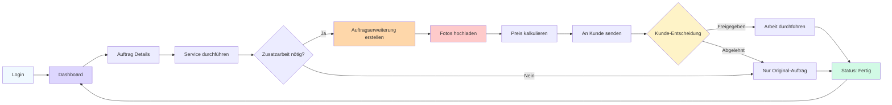

# Werkstatt Portal Wireframes - B2C Autowartungs-App

**Version:** 1.0
**Datum:** 2026-02-01
**Status:** Design Specification Ready for Implementation

---

## Inhaltsverzeichnis

1. [Werkstatt Journey Overview](#werkstatt-journey-overview)
2. [Screen 1: Login](#screen-1-login)
3. [Screen 2: Dashboard - Auftragsübersicht](#screen-2-dashboard---auftragsübersicht)
4. [Screen 3: Auftrags-Details](#screen-3-auftrags-details)
5. [Screen 4: Auftragserweiterung erstellen](#screen-4-auftragserweiterung-erstellen)
6. [Screen 5: Status-Tracking](#screen-5-status-tracking)

---

## Werkstatt Journey Overview



### Key Design Principles
- **Tablet-Optimized**: Werkstatt nutzt primär Tablets (iPad-Größe)
- **Large Touch Targets**: Minimum 56x56px für Handschuh-freundliche Bedienung
- **Photo-First**: Bildupload als zentrale Funktion
- **Quick Actions**: Häufige Aktionen prominent platziert
- **Status-Driven**: Klare visuelle Status-Indikatoren

---

## Screen 1: Login

### Purpose
Secure login for workshop staff with username/password.

### Layout (Tablet 1024px)

```
+---------------------------------------------------+
|                                                   |
|                                                   |
|              [Logo: AutoCare]                     |
|                                                   |
|            WERKSTATT-LOGIN                        |
|                                                   |
|        +-------------------------------+          |
|        | Werkstatt-Standort            |          |
|        | [Witten Zentrum      ▼]      |          |
|        +-------------------------------+          |
|                                                   |
|        +-------------------------------+          |
|        | Benutzername                  |          |
|        | [                      ]      |          |
|        +-------------------------------+          |
|                                                   |
|        +-------------------------------+          |
|        | Passwort                      |          |
|        | [                      ] 👁   |          |
|        +-------------------------------+          |
|                                                   |
|        ☑️ Angemeldet bleiben                     |
|                                                   |
|        [ANMELDEN]                                 |
|                                                   |
|        Passwort vergessen?                        |
|                                                   |
+---------------------------------------------------+
```

### Login Component

```jsx
const WorkshopLogin = () => {
  const [workshop, setWorkshop] = useState('');
  const [username, setUsername] = useState('');
  const [password, setPassword] = useState('');
  const [showPassword, setShowPassword] = useState(false);
  const [rememberMe, setRememberMe] = useState(false);
  const [loading, setLoading] = useState(false);

  const handleLogin = async (e) => {
    e.preventDefault();
    setLoading(true);

    try {
      const response = await fetch('/api/auth/workshop-login', {
        method: 'POST',
        headers: { 'Content-Type': 'application/json' },
        body: JSON.stringify({ workshop, username, password, rememberMe })
      });

      if (response.ok) {
        const data = await response.json();
        localStorage.setItem('workshop_token', data.token);
        localStorage.setItem('workshop_id', data.workshopId);
        window.location.href = '/workshop/dashboard';
      } else {
        alert('Login fehlgeschlagen. Bitte Zugangsdaten prüfen.');
      }
    } catch (error) {
      console.error('Login error:', error);
    } finally {
      setLoading(false);
    }
  };

  return (
    <div className="min-h-screen bg-gradient-to-br from-gray-100 to-gray-200 flex items-center justify-center px-4">
      <div className="w-full max-w-lg">

        {/* Logo */}
        <div className="text-center mb-10">
          
          <h1 className="text-3xl font-bold text-gray-900">Werkstatt-Login</h1>
        </div>

        {/* Login Form */}
        <form onSubmit={handleLogin} className="bg-white rounded-2xl shadow-2xl p-10">

          {/* Workshop Selection */}
          <div className="mb-6">
            <label className="block text-sm font-semibold text-gray-900 mb-2">
              Werkstatt-Standort
            </label>
            <select
              value={workshop}
              onChange={(e) => setWorkshop(e.target.value)}
              required
              className="w-full px-4 py-4 text-lg border-2 border-gray-300 rounded-xl focus:border-primary-500 focus:ring-4 focus:ring-primary-200 transition-all"
            >
              <option value="">Bitte wählen...</option>
              <option value="witten-zentrum">Witten Zentrum</option>
              <option value="witten-sued">Witten Süd</option>
            </select>
          </div>

          {/* Username */}
          <div className="mb-6">
            <label className="block text-sm font-semibold text-gray-900 mb-2">
              Benutzername
            </label>
            <input
              type="text"
              value={username}
              onChange={(e) => setUsername(e.target.value)}
              required
              autoComplete="username"
              placeholder="werkstatt01"
              className="w-full px-4 py-4 text-lg border-2 border-gray-300 rounded-xl focus:border-primary-500 focus:ring-4 focus:ring-primary-200 transition-all"
            />
          </div>

          {/* Password */}
          <div className="mb-6">
            <label className="block text-sm font-semibold text-gray-900 mb-2">
              Passwort
            </label>
            <div className="relative">
              <input
                type={showPassword ? 'text' : 'password'}
                value={password}
                onChange={(e) => setPassword(e.target.value)}
                required
                autoComplete="current-password"
                placeholder="••••••••"
                className="w-full px-4 py-4 pr-14 text-lg border-2 border-gray-300 rounded-xl focus:border-primary-500 focus:ring-4 focus:ring-primary-200 transition-all"
              />
              <button
                type="button"
                onClick={() => setShowPassword(!showPassword)}
                className="absolute right-4 top-4 text-2xl text-gray-500 hover:text-gray-700"
              >
                {showPassword ? '👁' : '👁‍🗨'}
              </button>
            </div>
          </div>

          {/* Remember Me */}
          <label className="flex items-center gap-3 mb-8 cursor-pointer">
            <input
              type="checkbox"
              checked={rememberMe}
              onChange={(e) => setRememberMe(e.target.checked)}
              className="w-6 h-6 rounded border-gray-300 text-primary-600 focus:ring-primary-500"
            />
            <span className="text-base text-gray-700">Angemeldet bleiben</span>
          </label>

          {/* Submit Button */}
          <button
            type="submit"
            disabled={loading}
            className="w-full bg-primary-600 hover:bg-primary-700 text-white font-bold py-5 px-6 rounded-xl shadow-lg hover:shadow-xl transition-all text-lg disabled:opacity-50 disabled:cursor-not-allowed"
          >
            {loading ? 'Anmeldung läuft...' : 'ANMELDEN'}
          </button>

          {/* Forgot Password */}
          <div className="mt-6 text-center">
            <a href="/workshop/forgot-password" className="text-primary-600 hover:text-primary-700 font-medium">
              Passwort vergessen?
            </a>
          </div>

        </form>

      </div>
    </div>
  );
};
```

---

## Screen 2: Dashboard - Auftragsübersicht

### Purpose
Overview of all orders with status filtering and quick actions.

### Layout (Tablet 1024px)

```
+-------------------------------------------------------------------+
| [☰] Aufträge                              [🔔] [👤 Werkstatt 01] |
+-------------------------------------------------------------------+
|                                                                   |
| Guten Morgen! 👋                                                  |
| 8 Aufträge heute • 3 in Arbeit • 2 warten auf Freigabe          |
|                                                                   |
| [ALLE] [IN ARBEIT] [WARTEND] [FERTIG] [ARCHIV]                  |
|                                                                   |
| +---------------------------------------------------------------+ |
| | 🔴 DRINGEND • #BK-2026-0215-1234                              | |
| |                                                               | |
| | Max Mustermann • VW Golf (2018)                               | |
| | Inspektion/Wartung • 60.000 km                                | |
| | Abgeholt: Heute 09:30 • Rückgabe: Heute 18:00                | |
| |                                                               | |
| | Status: WARTEND AUF FREIGABE                                  | |
| | Bremsbeläge vorgeschlagen (189 EUR) • Noch keine Antwort     | |
| |                                                               | |
| | [DETAILS ÖFFNEN]  [ANRUF] [STATUS ÄNDERN]                    | |
| +---------------------------------------------------------------+ |
|                                                                   |
| +---------------------------------------------------------------+ |
| | ○  #BK-2026-0215-1235                                         | |
| |                                                               | |
| | Lisa Schmidt • BMW 3er (2020)                                 | |
| | Ölservice                                                     | |
| | Abgeholt: Heute 10:15                                         | |
| |                                                               | |
| | Status: IN ARBEIT                                             | |
| |                                                               | |
| | [DETAILS ÖFFNEN]  [FERTIG MELDEN]                            | |
| +---------------------------------------------------------------+ |
|                                                                   |
| +---------------------------------------------------------------+ |
| | ✅ #BK-2026-0214-1198                                         | |
| |                                                               | |
| | Thomas Becker • Mercedes C-Klasse (2019)                      | |
| | Inspektion/Wartung + Bremsservice                             | |
| |                                                               | |
| | Status: FERTIG (bereit zur Rückgabe)                          | |
| |                                                               | |
| | [DETAILS ÖFFNEN]                                              | |
| +---------------------------------------------------------------+ |
|                                                                   |
+-------------------------------------------------------------------+
```

### Dashboard Component

```jsx
const WorkshopDashboard = () => {
  const [orders, setOrders] = useState([]);
  const [filter, setFilter] = useState('all');
  const [stats, setStats] = useState({
    total: 0,
    inProgress: 0,
    waiting: 0,
    completed: 0
  });

  useEffect(() => {
    fetchOrders();
    fetchStats();

    // Poll for updates every 30 seconds
    const interval = setInterval(fetchOrders, 30000);
    return () => clearInterval(interval);
  }, []);

  const filteredOrders = orders.filter(order => {
    if (filter === 'all') return true;
    if (filter === 'in-progress') return order.status === 'in_progress';
    if (filter === 'waiting') return order.status === 'waiting_approval';
    if (filter === 'completed') return order.status === 'completed';
    return true;
  });

  return (
    <div className="min-h-screen bg-gray-50">

      {/* Header */}
      <header className="bg-white border-b border-gray-200 sticky top-0 z-50">
        <div className="max-w-7xl mx-auto px-6 py-5">
          <div className="flex justify-between items-center">
            <div className="flex items-center gap-4">
              <button className="p-2 hover:bg-gray-100 rounded-lg">
                <svg className="w-7 h-7" /* menu icon */ />
              </button>
              <div>
                <h1 className="text-2xl font-bold text-gray-900">Aufträge</h1>
                <p className="text-sm text-gray-600">Witten Zentrum</p>
              </div>
            </div>
            <div className="flex items-center gap-4">
              <button className="relative p-3 hover:bg-gray-100 rounded-lg">
                <svg className="w-7 h-7" /* bell icon */ />
                <span className="absolute top-2 right-2 w-3 h-3 bg-red-500 rounded-full" />
              </button>
              <button className="flex items-center gap-3 p-2 hover:bg-gray-100 rounded-lg">
                <div className="w-10 h-10 bg-gray-200 rounded-full flex items-center justify-center">
                  👤
                </div>
                <span className="font-medium text-gray-900">Werkstatt 01</span>
              </button>
            </div>
          </div>
        </div>
      </header>

      {/* Main Content */}
      <main className="max-w-7xl mx-auto px-6 py-8">

        {/* Welcome & Stats */}
        <div className="mb-8">
          <h2 className="text-3xl font-bold text-gray-900 mb-2">
            Guten Morgen! 👋
          </h2>
          <p className="text-lg text-gray-700">
            {stats.total} Aufträge heute • {stats.inProgress} in Arbeit • {stats.waiting} warten auf Freigabe
          </p>
        </div>

        {/* Filter Tabs */}
        <div className="flex gap-3 mb-8 overflow-x-auto">
          <FilterTab
            label="ALLE"
            count={stats.total}
            active={filter === 'all'}
            onClick={() => setFilter('all')}
          />
          <FilterTab
            label="IN ARBEIT"
            count={stats.inProgress}
            active={filter === 'in-progress'}
            onClick={() => setFilter('in-progress')}
            color="blue"
          />
          <FilterTab
            label="WARTEND"
            count={stats.waiting}
            active={filter === 'waiting'}
            onClick={() => setFilter('waiting')}
            color="yellow"
          />
          <FilterTab
            label="FERTIG"
            count={stats.completed}
            active={filter === 'completed'}
            onClick={() => setFilter('completed')}
            color="green"
          />
          <FilterTab
            label="ARCHIV"
            count={0}
            active={filter === 'archive'}
            onClick={() => setFilter('archive')}
            color="gray"
          />
        </div>

        {/* Orders List */}
        <div className="space-y-6">
          {filteredOrders.map(order => (
            <OrderCard key={order.id} order={order} />
          ))}
        </div>

      </main>

    </div>
  );
};
```

### Filter Tab Component

```jsx
const FilterTab = ({ label, count, active, onClick, color = 'primary' }) => {
  const colorClasses = {
    primary: active ? 'bg-primary-600 text-white' : 'bg-white text-gray-700 border-gray-300',
    blue: active ? 'bg-blue-600 text-white' : 'bg-white text-gray-700 border-gray-300',
    yellow: active ? 'bg-yellow-600 text-white' : 'bg-white text-gray-700 border-gray-300',
    green: active ? 'bg-green-600 text-white' : 'bg-white text-gray-700 border-gray-300',
    gray: active ? 'bg-gray-600 text-white' : 'bg-white text-gray-700 border-gray-300'
  };

  return (
    <button
      onClick={onClick}
      className={`
        px-6 py-3 rounded-xl border-2 font-semibold text-base transition-all whitespace-nowrap
        ${colorClasses[color]}
        ${active ? 'shadow-lg' : 'hover:bg-gray-50'}
      `}
    >
      {label}
      {count > 0 && (
        <span className={`ml-2 px-2 py-0.5 rounded-full text-sm ${active ? 'bg-white/20' : 'bg-gray-200 text-gray-700'}`}>
          {count}
        </span>
      )}
    </button>
  );
};
```

### Order Card Component

```jsx
const OrderCard = ({ order }) => {
  const getStatusBadge = (status) => {
    const badges = {
      in_progress: { text: 'IN ARBEIT', color: 'bg-blue-100 text-blue-800' },
      waiting_approval: { text: 'WARTEND AUF FREIGABE', color: 'bg-yellow-100 text-yellow-800' },
      completed: { text: 'FERTIG', color: 'bg-green-100 text-green-800' },
      ready_for_return: { text: 'BEREIT ZUR RÜCKGABE', color: 'bg-green-100 text-green-800' }
    };
    return badges[status] || { text: status, color: 'bg-gray-100 text-gray-800' };
  };

  const statusBadge = getStatusBadge(order.status);
  const isUrgent = order.priority === 'urgent';

  return (
    <div className={`
      bg-white rounded-2xl border-2 p-6 shadow-md hover:shadow-lg transition-all
      ${isUrgent ? 'border-red-500 bg-red-50' : 'border-gray-300'}
    `}>

      {/* Header */}
      <div className="flex items-start justify-between mb-4">
        <div className="flex items-center gap-3">
          {isUrgent && (
            <span className="text-2xl">🔴</span>
          )}
          <div>
            <h3 className="text-xl font-bold text-gray-900">
              {order.bookingNumber}
            </h3>
            <p className="text-sm text-gray-600">
              {isUrgent && <span className="text-red-600 font-semibold">DRINGEND • </span>}
              Erstellt: {formatDate(order.createdAt)}
            </p>
          </div>
        </div>
        <span className={`px-4 py-2 rounded-full text-sm font-semibold ${statusBadge.color}`}>
          {statusBadge.text}
        </span>
      </div>

      {/* Customer & Vehicle Info */}
      <div className="mb-4">
        <h4 className="text-lg font-bold text-gray-900 mb-1">
          {order.customerName}
        </h4>
        <p className="text-gray-700">
          {order.vehicleMake} {order.vehicleModel} ({order.vehicleYear})
        </p>
        <p className="text-gray-600">
          {order.serviceType} {order.mileage && `• ${order.mileage} km`}
        </p>
      </div>

      {/* Timeline */}
      <div className="flex items-center gap-4 text-sm text-gray-700 mb-4">
        <div className="flex items-center gap-2">
          <svg className="w-5 h-5 text-gray-600" /* clock icon */ />
          <span>Abgeholt: {formatDateTime(order.pickupTime)}</span>
        </div>
        {order.returnTime && (
          <>
            <span className="text-gray-400">→</span>
            <div className="flex items-center gap-2">
              <svg className="w-5 h-5 text-gray-600" /* clock icon */ />
              <span>Rückgabe: {formatDateTime(order.returnTime)}</span>
            </div>
          </>
        )}
      </div>

      {/* Extension Info (if waiting) */}
      {order.status === 'waiting_approval' && order.pendingExtension && (
        <div className="bg-yellow-50 border border-yellow-300 rounded-lg p-4 mb-4">
          <p className="text-yellow-900 font-semibold mb-1">
            ⏳ Auftragserweiterung vorgeschlagen
          </p>
          <p className="text-yellow-800 text-sm">
            {order.pendingExtension.description} ({order.pendingExtension.price} EUR) • Noch keine Antwort vom Kunden
          </p>
        </div>
      )}

      {/* Actions */}
      <div className="flex gap-3">
        <button
          onClick={() => window.location.href = `/workshop/order/${order.id}`}
          className="flex-1 bg-primary-600 hover:bg-primary-700 text-white font-semibold py-3 px-6 rounded-xl transition-all"
        >
          DETAILS ÖFFNEN
        </button>
        {order.status === 'in_progress' && (
          <button
            onClick={() => markAsComplete(order.id)}
            className="bg-green-600 hover:bg-green-700 text-white font-semibold py-3 px-6 rounded-xl transition-all"
          >
            FERTIG MELDEN
          </button>
        )}
        <button
          onClick={() => window.location.href = `tel:${order.customerPhone}`}
          className="bg-white hover:bg-gray-50 border-2 border-gray-300 text-gray-900 font-semibold py-3 px-6 rounded-xl transition-all"
        >
          📞 ANRUF
        </button>
      </div>

    </div>
  );
};
```

---

## Screen 3: Auftrags-Details

### Purpose
Detailed view of order with vehicle info, service details, and history.

### Layout (Tablet 1024px)

```
+-------------------------------------------------------------------+
| [←] Auftrag #BK-2026-0215-1234                          [☰]      |
+-------------------------------------------------------------------+
|                                                                   |
| Max Mustermann                                [IN ARBEIT]         |
| 📱 0172 1234567 | ✉️ max@beispiel.de                             |
|                                                                   |
| +---------------------------------------------------------------+ |
| | 🚗 FAHRZEUG                                                   | |
| |                                                               | |
| | VW Golf • Baujahr: 2018 • Farbe: Silber                      | |
| | Kennzeichen: WIT-AB 1234                                      | |
| | Kilometerstand: 85.234 km                                     | |
| |                                                               | |
| | [Fahrzeugfotos ansehen] [Fahrzeugschein ansehen]             | |
| +---------------------------------------------------------------+ |
|                                                                   |
| +---------------------------------------------------------------+ |
| | 🔧 GEBUCHTER SERVICE                                          | |
| |                                                               | |
| | Inspektion/Wartung (60.000 km)                                | |
| | • Motoröl ablassen & Ölfilter wechseln                        | |
| | • Service-Intervall zurücksetzen                              | |
| | • Fahrzeugprüfung nach Kilometerstand                         | |
| | • Eintrag ins Serviceheft                                     | |
| |                                                               | |
| | Festpreis: 219,00 EUR (bereits bezahlt ✅)                    | |
| +---------------------------------------------------------------+ |
|                                                                   |
| +---------------------------------------------------------------+ |
| | ⏱ ZEITPLAN                                                    | |
| |                                                               | |
| | Abgeholt: Di, 15. Feb 2026 • 09:30 Uhr                       | |
| | Wunsch-Rückgabe: Heute, 18:00 Uhr                             | |
| |                                                               | |
| | ⚠️ Noch 5 Stunden bis Rückgabe!                               | |
| +---------------------------------------------------------------+ |
|                                                                   |
| +---------------------------------------------------------------+ |
| | 📸 ÜBERGABE-FOTOS                                             | |
| |                                                               | |
| | [Foto 1] [Foto 2] [Foto 3] [Foto 4]                          | |
| +---------------------------------------------------------------+ |
|                                                                   |
| [AUFTRAGSERWEITERUNG ERSTELLEN] [STATUS ÄNDERN] [FERTIG MELDEN] |
|                                                                   |
+-------------------------------------------------------------------+
```

### Order Details Component

```jsx
const OrderDetails = ({ orderId }) => {
  const [order, setOrder] = useState(null);
  const [showPhotos, setShowPhotos] = useState(false);

  useEffect(() => {
    fetchOrderDetails(orderId);
  }, [orderId]);

  if (!order) return <LoadingSpinner />;

  const timeUntilReturn = getTimeUntil(order.returnTime);
  const isUrgent = timeUntilReturn < 6; // Less than 6 hours

  return (
    <div className="min-h-screen bg-gray-50">

      {/* Header */}
      <header className="bg-white border-b border-gray-200 sticky top-0 z-50">
        <div className="max-w-7xl mx-auto px-6 py-5">
          <div className="flex justify-between items-center">
            <div className="flex items-center gap-4">
              <button
                onClick={() => window.history.back()}
                className="p-2 hover:bg-gray-100 rounded-lg"
              >
                <svg className="w-7 h-7" /* back arrow */ />
              </button>
              <div>
                <h1 className="text-2xl font-bold text-gray-900">
                  Auftrag {order.bookingNumber}
                </h1>
                <p className="text-sm text-gray-600">
                  Erstellt: {formatDate(order.createdAt)}
                </p>
              </div>
            </div>
            <button className="p-2 hover:bg-gray-100 rounded-lg">
              <svg className="w-7 h-7" /* menu icon */ />
            </button>
          </div>
        </div>
      </header>

      {/* Main Content */}
      <main className="max-w-7xl mx-auto px-6 py-8">

        {/* Customer Info Header */}
        <div className="bg-white rounded-2xl border-2 border-gray-300 p-6 shadow-md mb-6">
          <div className="flex items-start justify-between mb-4">
            <div>
              <h2 className="text-2xl font-bold text-gray-900 mb-2">
                {order.customerName}
              </h2>
              <div className="flex flex-wrap gap-4 text-gray-700">
                <a href={`tel:${order.customerPhone}`} className="flex items-center gap-2 hover:text-primary-600">
                  <svg className="w-5 h-5" /* phone icon */ />
                  {order.customerPhone}
                </a>
                <a href={`mailto:${order.customerEmail}`} className="flex items-center gap-2 hover:text-primary-600">
                  <svg className="w-5 h-5" /* email icon */ />
                  {order.customerEmail}
                </a>
              </div>
            </div>
            <span className={`px-4 py-2 rounded-full text-sm font-semibold ${
              order.status === 'in_progress' ? 'bg-blue-100 text-blue-800' :
              order.status === 'completed' ? 'bg-green-100 text-green-800' :
              'bg-gray-100 text-gray-800'
            }`}>
              {order.statusLabel}
            </span>
          </div>
        </div>

        {/* Vehicle Info */}
        <div className="bg-white rounded-2xl border-2 border-gray-300 p-6 shadow-md mb-6">
          <h3 className="text-xl font-bold text-gray-900 mb-4 flex items-center gap-2">
            🚗 FAHRZEUG
          </h3>
          <div className="grid grid-cols-2 gap-4 mb-6">
            <div>
              <p className="text-sm text-gray-600 mb-1">Marke & Modell</p>
              <p className="font-semibold text-lg text-gray-900">
                {order.vehicleMake} {order.vehicleModel}
              </p>
            </div>
            <div>
              <p className="text-sm text-gray-600 mb-1">Baujahr</p>
              <p className="font-semibold text-lg text-gray-900">{order.vehicleYear}</p>
            </div>
            <div>
              <p className="text-sm text-gray-600 mb-1">Farbe</p>
              <p className="font-semibold text-lg text-gray-900">{order.vehicleColor || 'Silber'}</p>
            </div>
            <div>
              <p className="text-sm text-gray-600 mb-1">Kennzeichen</p>
              <p className="font-mono font-bold text-lg text-gray-900">
                {order.licensePlate || 'WIT-AB 1234'}
              </p>
            </div>
            <div>
              <p className="text-sm text-gray-600 mb-1">Kilometerstand</p>
              <p className="font-semibold text-lg text-gray-900">
                {order.mileage.toLocaleString()} km
              </p>
            </div>
            <div>
              <p className="text-sm text-gray-600 mb-1">Tankfüllung</p>
              <p className="font-semibold text-lg text-gray-900">{order.fuelLevel}%</p>
            </div>
          </div>
          <div className="flex gap-3">
            <button
              onClick={() => setShowPhotos(true)}
              className="flex-1 bg-primary-600 hover:bg-primary-700 text-white font-semibold py-3 px-6 rounded-xl"
            >
              Fahrzeugfotos ansehen
            </button>
            {order.registrationPhoto && (
              <button className="flex-1 bg-white hover:bg-gray-50 border-2 border-gray-300 text-gray-900 font-semibold py-3 px-6 rounded-xl">
                Fahrzeugschein ansehen
              </button>
            )}
          </div>
        </div>

        {/* Service Info */}
        <div className="bg-white rounded-2xl border-2 border-gray-300 p-6 shadow-md mb-6">
          <h3 className="text-xl font-bold text-gray-900 mb-4 flex items-center gap-2">
            🔧 GEBUCHTER SERVICE
          </h3>
          <h4 className="text-lg font-semibold text-gray-900 mb-3">
            {order.serviceType} ({order.mileage.toLocaleString()} km)
          </h4>
          <ul className="space-y-2 mb-6">
            {order.serviceIncludes.map((item, index) => (
              <li key={index} className="flex items-start gap-2">
                <svg className="w-5 h-5 text-green-500 flex-shrink-0 mt-0.5" /* check icon */ />
                <span className="text-gray-700">{item}</span>
              </li>
            ))}
          </ul>
          <div className="bg-green-50 border border-green-200 rounded-lg p-4">
            <p className="text-green-900 font-semibold">
              Festpreis: {order.price.toFixed(2)} EUR (bereits bezahlt ✅)
            </p>
          </div>
        </div>

        {/* Timeline */}
        <div className="bg-white rounded-2xl border-2 border-gray-300 p-6 shadow-md mb-6">
          <h3 className="text-xl font-bold text-gray-900 mb-4 flex items-center gap-2">
            ⏱ ZEITPLAN
          </h3>
          <div className="space-y-3 mb-4">
            <div className="flex items-center gap-3">
              <svg className="w-6 h-6 text-gray-600" /* clock icon */ />
              <div>
                <p className="text-sm text-gray-600">Abgeholt</p>
                <p className="font-semibold text-gray-900">
                  {formatDateTime(order.pickupTime)}
                </p>
              </div>
            </div>
            <div className="flex items-center gap-3">
              <svg className="w-6 h-6 text-gray-600" /* clock icon */ />
              <div>
                <p className="text-sm text-gray-600">Wunsch-Rückgabe</p>
                <p className="font-semibold text-gray-900">
                  {formatDateTime(order.returnTime)}
                </p>
              </div>
            </div>
          </div>
          {isUrgent && (
            <div className="bg-red-50 border border-red-300 rounded-lg p-4">
              <p className="text-red-900 font-semibold flex items-center gap-2">
                ⚠️ Noch {timeUntilReturn} Stunden bis Rückgabe!
              </p>
            </div>
          )}
        </div>

        {/* Handover Photos */}
        <div className="bg-white rounded-2xl border-2 border-gray-300 p-6 shadow-md mb-6">
          <h3 className="text-xl font-bold text-gray-900 mb-4 flex items-center gap-2">
            📸 ÜBERGABE-FOTOS
          </h3>
          <div className="grid grid-cols-4 gap-4">
            {order.handoverPhotos.map((photo, index) => (
              <button
                key={index}
                onClick={() => openPhotoGallery(index)}
                className="aspect-square rounded-lg overflow-hidden border-2 border-gray-300 hover:border-primary-500 transition-colors"
              >
                
              </button>
            ))}
          </div>
        </div>

        {/* Action Buttons */}
        <div className="grid grid-cols-3 gap-4">
          <button
            onClick={() => window.location.href = `/workshop/extension/create/${orderId}`}
            className="bg-orange-600 hover:bg-orange-700 text-white font-bold py-4 px-6 rounded-xl shadow-lg text-lg"
          >
            AUFTRAGSERWEITERUNG ERSTELLEN
          </button>
          <button
            onClick={() => changeStatus(orderId)}
            className="bg-blue-600 hover:bg-blue-700 text-white font-bold py-4 px-6 rounded-xl shadow-lg text-lg"
          >
            STATUS ÄNDERN
          </button>
          <button
            onClick={() => markAsComplete(orderId)}
            className="bg-green-600 hover:bg-green-700 text-white font-bold py-4 px-6 rounded-xl shadow-lg text-lg"
          >
            FERTIG MELDEN
          </button>
        </div>

      </main>

    </div>
  );
};
```

---

## Screen 4: Auftragserweiterung erstellen

### Purpose
Create additional work proposal with photos, description, and fixed price.

### Layout (Tablet 1024px)

```
+-------------------------------------------------------------------+
| [←] Auftragserweiterung erstellen • #BK-2026-0215-1234          |
+-------------------------------------------------------------------+
|                                                                   |
| Max Mustermann • VW Golf (2018)                                   |
|                                                                   |
| +---------------------------------------------------------------+ |
| | MANGEL-BESCHREIBUNG                                           | |
| |                                                               | |
| | [Bremsbeläge vorne abgefahren                         ]       | |
| | [                                                     ]       | |
| | [Unsere Werkstatt hat festgestellt, dass Ihre         ]       | |
| | [Bremsbeläge vorne nur noch 2mm Restdicke haben...    ]       | |
| |                                                               | |
| | Tipp: Beschreiben Sie das Problem verständlich für den Kunden | |
| +---------------------------------------------------------------+ |
|                                                                   |
| +---------------------------------------------------------------+ |
| | FOTOS HOCHLADEN                                               | |
| |                                                               | |
| | [Foto 1: Bremsbelag]  [+ FOTO]  [+ FOTO]  [+ VIDEO]         | |
| |                                                               | |
| | Tipp: Zeigen Sie das Problem deutlich (min. 1 Foto)          | |
| +---------------------------------------------------------------+ |
|                                                                   |
| +---------------------------------------------------------------+ |
| | PREISKALKULATION                                              | |
| |                                                               | |
| | Bremsbeläge vorne (Satz):        [119,00] EUR                | |
| | Arbeitszeit (1,5 Std à 70 EUR):  [105,00] EUR                | |
| |                                                               | |
| | ────────────────────────────────────────                      | |
| | GESAMT-FESTPREIS:                224,00 EUR                   | |
| |                                                               | |
| | [VORLAGE VERWENDEN ▼] [RABATT HINZUFÜGEN]                    | |
| +---------------------------------------------------------------+ |
|                                                                   |
| ℹ️ Der Kunde erhält eine Push-Benachrichtigung und kann digital |
| freigeben oder ablehnen.                                          |
|                                                                   |
| [VORSCHAU]                     [AN KUNDE SENDEN]                 |
|                                                                   |
+-------------------------------------------------------------------+
```

### Extension Creation Component

```jsx
const CreateExtension = ({ orderId }) => {
  const [formData, setFormData] = useState({
    title: '',
    description: '',
    photos: [],
    materials: [],
    laborHours: 0,
    laborRate: 70,
    discount: 0
  });

  const [errors, setErrors] = useState({});
  const [submitting, setSubmitting] = useState(false);
  const fileInputRef = useRef(null);

  const calculateTotal = () => {
    const materialsTotal = formData.materials.reduce((sum, m) => sum + parseFloat(m.price || 0), 0);
    const laborTotal = formData.laborHours * formData.laborRate;
    const subtotal = materialsTotal + laborTotal;
    return subtotal - formData.discount;
  };

  const handlePhotoUpload = async (e) => {
    const files = Array.from(e.target.files);
    const compressed = await Promise.all(files.map(f => compressImage(f)));
    setFormData({
      ...formData,
      photos: [...formData.photos, ...compressed]
    });
  };

  const validateForm = () => {
    const newErrors = {};

    if (!formData.title.trim()) {
      newErrors.title = 'Bitte Titel eingeben';
    }

    if (!formData.description.trim()) {
      newErrors.description = 'Bitte Beschreibung eingeben';
    }

    if (formData.photos.length === 0) {
      newErrors.photos = 'Bitte mindestens ein Foto hochladen';
    }

    if (formData.materials.length === 0 && formData.laborHours === 0) {
      newErrors.price = 'Bitte Materialien oder Arbeitszeit angeben';
    }

    setErrors(newErrors);
    return Object.keys(newErrors).length === 0;
  };

  const handleSubmit = async () => {
    if (!validateForm()) return;

    setSubmitting(true);

    try {
      // Upload photos
      const photoUrls = await uploadPhotos(formData.photos);

      // Create extension
      await createExtension(orderId, {
        title: formData.title,
        description: formData.description,
        photos: photoUrls,
        materials: formData.materials,
        laborHours: formData.laborHours,
        laborRate: formData.laborRate,
        discount: formData.discount,
        total: calculateTotal()
      });

      alert('✅ Auftragserweiterung erfolgreich an Kunden gesendet!');
      window.location.href = `/workshop/order/${orderId}`;
    } catch (error) {
      console.error('Error:', error);
      alert('Fehler beim Erstellen. Bitte erneut versuchen.');
      setSubmitting(false);
    }
  };

  return (
    <div className="min-h-screen bg-gray-50">

      {/* Header */}
      <header className="bg-white border-b border-gray-200 sticky top-0 z-50">
        <div className="max-w-7xl mx-auto px-6 py-5">
          <div className="flex items-center gap-4">
            <button
              onClick={() => window.history.back()}
              className="p-2 hover:bg-gray-100 rounded-lg"
            >
              <svg className="w-7 h-7" /* back arrow */ />
            </button>
            <div>
              <h1 className="text-2xl font-bold text-gray-900">
                Auftragserweiterung erstellen
              </h1>
              <p className="text-sm text-gray-600">
                Auftrag #{order.bookingNumber}
              </p>
            </div>
          </div>
        </div>
      </header>

      {/* Main Content */}
      <main className="max-w-5xl mx-auto px-6 py-8">

        {/* Customer Info */}
        <div className="mb-6">
          <p className="text-lg text-gray-700">
            Kunde: <span className="font-semibold">{order.customerName}</span> •
            Fahrzeug: <span className="font-semibold">{order.vehicleMake} {order.vehicleModel} ({order.vehicleYear})</span>
          </p>
        </div>

        {/* Title */}
        <div className="bg-white rounded-2xl border-2 border-gray-300 p-6 shadow-md mb-6">
          <h3 className="text-xl font-bold text-gray-900 mb-4">TITEL DER ARBEIT</h3>
          <input
            type="text"
            value={formData.title}
            onChange={(e) => setFormData({...formData, title: e.target.value})}
            placeholder="z.B. Bremsbeläge vorne austauschen"
            className="w-full px-4 py-4 text-lg border-2 border-gray-300 rounded-xl focus:border-primary-500 focus:ring-4 focus:ring-primary-200"
          />
          {errors.title && <p className="text-red-600 text-sm mt-2">{errors.title}</p>}
        </div>

        {/* Description */}
        <div className="bg-white rounded-2xl border-2 border-gray-300 p-6 shadow-md mb-6">
          <h3 className="text-xl font-bold text-gray-900 mb-4">MANGEL-BESCHREIBUNG</h3>
          <textarea
            value={formData.description}
            onChange={(e) => setFormData({...formData, description: e.target.value})}
            placeholder="Beschreiben Sie das Problem verständlich für den Kunden.&#10;Beispiel: Unsere Werkstatt hat festgestellt, dass Ihre Bremsbeläge vorne nur noch 2mm Restdicke haben (kritisch). Wir empfehlen dringend den Austausch aus Sicherheitsgründen."
            rows={6}
            className="w-full px-4 py-4 text-lg border-2 border-gray-300 rounded-xl focus:border-primary-500 focus:ring-4 focus:ring-primary-200 resize-none"
          />
          {errors.description && <p className="text-red-600 text-sm mt-2">{errors.description}</p>}
          <p className="text-sm text-gray-600 mt-3">
            💡 Tipp: Beschreiben Sie das Problem verständlich und begründen Sie, warum die Arbeit notwendig ist.
          </p>
        </div>

        {/* Photos */}
        <div className="bg-white rounded-2xl border-2 border-gray-300 p-6 shadow-md mb-6">
          <h3 className="text-xl font-bold text-gray-900 mb-4">FOTOS HOCHLADEN</h3>

          <div className="grid grid-cols-4 gap-4 mb-4">
            {formData.photos.map((photo, index) => (
              <div key={index} className="relative aspect-square">
                
                <button
                  onClick={() => {
                    const newPhotos = formData.photos.filter((_, i) => i !== index);
                    setFormData({...formData, photos: newPhotos});
                  }}
                  className="absolute top-2 right-2 w-8 h-8 bg-red-600 hover:bg-red-700 text-white rounded-full flex items-center justify-center shadow-lg"
                >
                  ×
                </button>
              </div>
            ))}

            {formData.photos.length < 6 && (
              <>
                <button
                  onClick={() => fileInputRef.current.click()}
                  className="aspect-square border-2 border-dashed border-gray-400 rounded-lg flex flex-col items-center justify-center gap-2 hover:border-primary-500 hover:bg-primary-50 transition-all"
                >
                  <span className="text-4xl">📷</span>
                  <span className="text-sm font-medium text-gray-700">FOTO</span>
                </button>
                <button
                  className="aspect-square border-2 border-dashed border-gray-400 rounded-lg flex flex-col items-center justify-center gap-2 hover:border-primary-500 hover:bg-primary-50 transition-all"
                >
                  <span className="text-4xl">🎥</span>
                  <span className="text-sm font-medium text-gray-700">VIDEO</span>
                </button>
              </>
            )}
          </div>

          {errors.photos && <p className="text-red-600 text-sm mb-3">{errors.photos}</p>}

          <p className="text-sm text-gray-600">
            💡 Tipp: Zeigen Sie das Problem deutlich. Mindestens 1 Foto erforderlich, max. 6 Fotos.
          </p>

          <input
            ref={fileInputRef}
            type="file"
            accept="image/*"
            multiple
            onChange={handlePhotoUpload}
            className="hidden"
          />
        </div>

        {/* Price Calculation */}
        <div className="bg-white rounded-2xl border-2 border-gray-300 p-6 shadow-md mb-6">
          <h3 className="text-xl font-bold text-gray-900 mb-6">PREISKALKULATION</h3>

          {/* Materials */}
          <div className="mb-6">
            <h4 className="font-semibold text-gray-900 mb-3">Materialien</h4>
            {formData.materials.map((material, index) => (
              <div key={index} className="flex gap-3 mb-3">
                <input
                  type="text"
                  value={material.name}
                  onChange={(e) => {
                    const newMaterials = [...formData.materials];
                    newMaterials[index].name = e.target.value;
                    setFormData({...formData, materials: newMaterials});
                  }}
                  placeholder="z.B. Bremsbeläge vorne (Satz)"
                  className="flex-1 px-4 py-3 border-2 border-gray-300 rounded-xl focus:border-primary-500"
                />
                <input
                  type="number"
                  value={material.price}
                  onChange={(e) => {
                    const newMaterials = [...formData.materials];
                    newMaterials[index].price = e.target.value;
                    setFormData({...formData, materials: newMaterials});
                  }}
                  placeholder="0,00"
                  step="0.01"
                  className="w-32 px-4 py-3 border-2 border-gray-300 rounded-xl focus:border-primary-500"
                />
                <button
                  onClick={() => {
                    const newMaterials = formData.materials.filter((_, i) => i !== index);
                    setFormData({...formData, materials: newMaterials});
                  }}
                  className="w-12 h-12 bg-red-600 hover:bg-red-700 text-white rounded-xl"
                >
                  ×
                </button>
              </div>
            ))}
            <button
              onClick={() => {
                setFormData({
                  ...formData,
                  materials: [...formData.materials, { name: '', price: 0 }]
                });
              }}
              className="text-primary-600 hover:text-primary-700 font-medium text-sm"
            >
              + Material hinzufügen
            </button>
          </div>

          {/* Labor */}
          <div className="mb-6">
            <h4 className="font-semibold text-gray-900 mb-3">Arbeitszeit</h4>
            <div className="flex gap-4 items-center">
              <div className="flex-1">
                <label className="block text-sm text-gray-700 mb-2">Stunden</label>
                <input
                  type="number"
                  value={formData.laborHours}
                  onChange={(e) => setFormData({...formData, laborHours: parseFloat(e.target.value)})}
                  step="0.5"
                  min="0"
                  className="w-full px-4 py-3 border-2 border-gray-300 rounded-xl focus:border-primary-500"
                />
              </div>
              <span className="text-2xl text-gray-400 mt-6">×</span>
              <div className="flex-1">
                <label className="block text-sm text-gray-700 mb-2">Stundensatz (EUR)</label>
                <input
                  type="number"
                  value={formData.laborRate}
                  onChange={(e) => setFormData({...formData, laborRate: parseFloat(e.target.value)})}
                  step="1"
                  className="w-full px-4 py-3 border-2 border-gray-300 rounded-xl focus:border-primary-500"
                />
              </div>
              <span className="text-2xl text-gray-400 mt-6">=</span>
              <div className="flex-1">
                <label className="block text-sm text-gray-700 mb-2">Gesamt</label>
                <div className="px-4 py-3 bg-gray-100 rounded-xl font-bold text-gray-900">
                  {(formData.laborHours * formData.laborRate).toFixed(2)} EUR
                </div>
              </div>
            </div>
          </div>

          {/* Total */}
          <div className="border-t-2 border-gray-300 pt-6">
            <div className="flex justify-between items-center text-2xl font-bold text-gray-900 mb-4">
              <span>GESAMT-FESTPREIS:</span>
              <span>{calculateTotal().toFixed(2)} EUR</span>
            </div>
            <div className="flex gap-3">
              <button className="flex-1 bg-gray-100 hover:bg-gray-200 text-gray-900 font-medium py-3 px-4 rounded-xl">
                VORLAGE VERWENDEN ▼
              </button>
              <button className="flex-1 bg-gray-100 hover:bg-gray-200 text-gray-900 font-medium py-3 px-4 rounded-xl">
                RABATT HINZUFÜGEN
              </button>
            </div>
          </div>
        </div>

        {/* Info Box */}
        <div className="bg-blue-50 border border-blue-200 rounded-xl p-6 mb-6">
          <p className="text-blue-900 flex items-start gap-3">
            <svg className="w-6 h-6 flex-shrink-0 mt-0.5" /* info icon */ />
            <span>
              Der Kunde erhält eine Push-Benachrichtigung und E-Mail mit Ihrer Auftragserweiterung.
              Er kann digital freigeben oder ablehnen. Bei Freigabe wird die Zahlung automatisch verarbeitet.
            </span>
          </p>
        </div>

        {/* Action Buttons */}
        <div className="grid grid-cols-2 gap-4">
          <button
            onClick={() => {/* Show preview modal */}}
            className="bg-white hover:bg-gray-50 border-2 border-gray-300 text-gray-900 font-bold py-5 px-6 rounded-xl text-lg"
          >
            VORSCHAU
          </button>
          <button
            onClick={handleSubmit}
            disabled={submitting}
            className="bg-green-600 hover:bg-green-700 text-white font-bold py-5 px-6 rounded-xl shadow-lg text-lg disabled:opacity-50 disabled:cursor-not-allowed"
          >
            {submitting ? 'Wird gesendet...' : 'AN KUNDE SENDEN'}
          </button>
        </div>

      </main>

    </div>
  );
};
```

---

## Screen 5: Status-Tracking

### Purpose
Update order status and add internal notes.

### Layout (Tablet 1024px)

```
+-------------------------------------------------------------------+
| [×] Status ändern • #BK-2026-0215-1234                           |
+-------------------------------------------------------------------+
|                                                                   |
| AKTUELLER STATUS: IN ARBEIT                                       |
|                                                                   |
| +---------------------------------------------------------------+ |
| | NEUER STATUS                                                  | |
| |                                                               | |
| | ○  Annahme ausstehend                                         | |
| | ⭕ In Arbeit                                                   | |
| | ○  Wartend auf Freigabe (Auftragserweiterung)                | |
| | ○  Fertig (Service abgeschlossen)                             | |
| | ○  Bereit zur Rückgabe                                        | |
| | ○  Zurückgegeben (abgeschlossen)                              | |
| +---------------------------------------------------------------+ |
|                                                                   |
| +---------------------------------------------------------------+ |
| | INTERNE NOTIZEN                                               | |
| |                                                               | |
| | [                                                     ]       | |
| | [                                                     ]       | |
| | [                                                     ]       | |
| |                                                               | |
| | (Sichtbar nur für Werkstatt, nicht für Kunde)                | |
| +---------------------------------------------------------------+ |
|                                                                   |
| [ABBRECHEN]                              [STATUS AKTUALISIEREN]  |
|                                                                   |
+-------------------------------------------------------------------+
```

---

**Document Owner:** UX/UI Design Team
**Last Updated:** 2026-02-01
**Status:** Ready for Implementation
